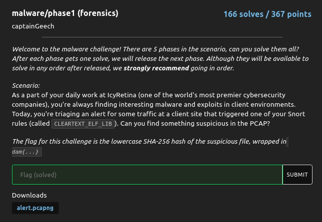
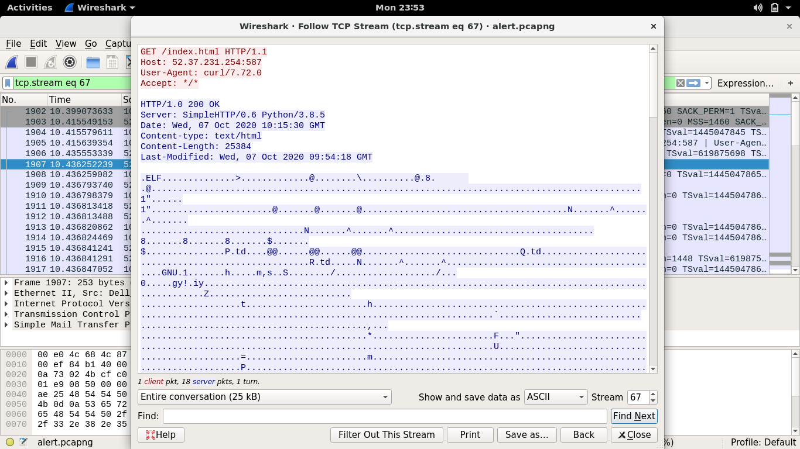
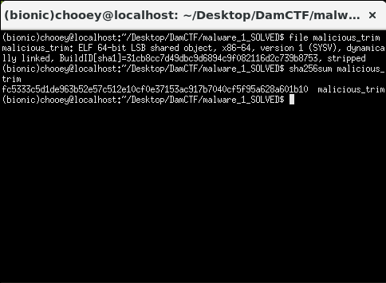

## DamCTF: Malware Phase 1 [malware/forensics]

#### Although this was the easiest (and the only one I solved) among the malware category, I had fun solving and learning from it. My past experience with malware challenges (EKOPARTY and now this) is fueling my passion for malware analysis, though I'll have to learn it later on since I'm focusing on learning exploit dev. 

#### Anyways, we were given a packet capture which triggered a Snort rule called CLEARTEXT_ELF_LIB. Upon reading ELF, I thought maybe a ELF binary was being transffered through the network. I examined each packet in WireShark until I found the packet/s which contain the ELF header.

#### Apparently the file was being transferred through the SMTP protocol (I dunno what I'm saying here). I extracted the the stream as raw data and cut out the preceding bytes until the ELF header. The file utility verifies that we have an ELF binary, so what's left is to get the sha256sum of it then wrap the results with `dam{}` to get the flag.

#### Flag: `dam{fc5333c5d1de963b52e57c512e10cf0e37153ac917b7040cf5f95a628a601b10}`
