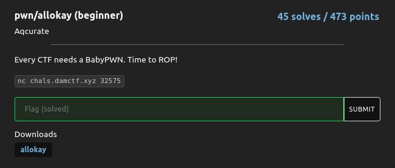
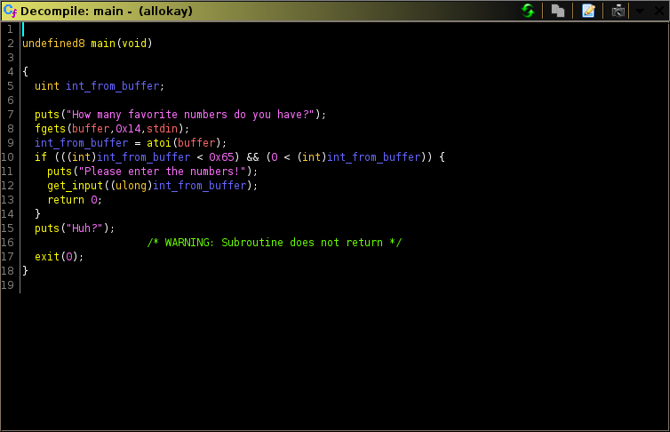
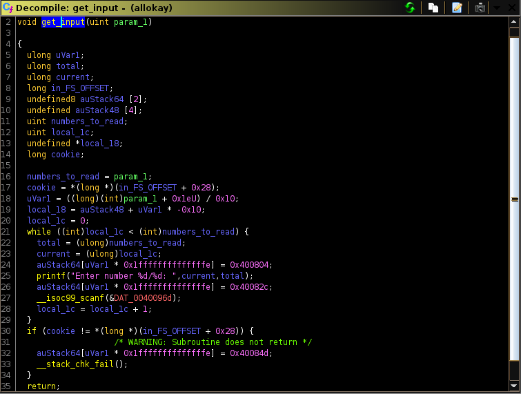
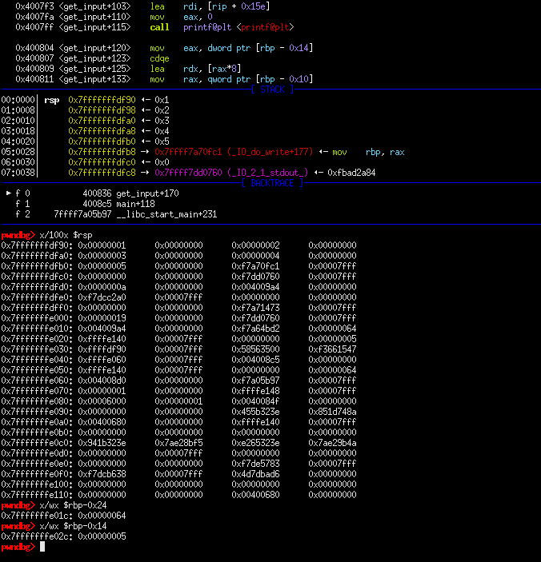
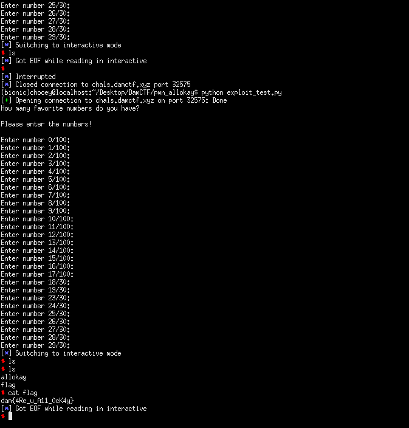

## DamCTF: allokay [pwn]

#### As the description says, it was the baby pwn for the ctf. We are given a binary which when input into GHIDRA results into the following decompilation:

#### From what we can see, we know that it takes input from the user, turns it into an integer representation. In user_input is a valid integer, it calls get_input which loops user_input times, else it will exit. The vulnerability isn't clear by static analysis alone so I went and played around with it in gdb to which I found out it writes our input into the stack using the current position it is reading as indexes (Enter number 0/10 writes our input to stack[0]). Below is how the stack looks when we input five numbers:

#### We can easily see our input (1,2,3,4,5), the variable for how many numbers we need to read (`rbp-0x24`) and the variables to which index our input will be written to (`rbp-0x14`). The plan is to overwrite them in a way that makes sure that the while loop condition from the decompilation is satisfied so that we can continue providing values to the stack. We want to overwrite the return address (`0x4008c5`) to gain control of execution, but we need to not overwrite the stack canary. How do we do this?

#### Simply by changing `rbp-0x14` to a value that skips over the location of the canary. The way I did this was through trial and error. Now after we control where we return to, there is a handy function `win` which executes execve for us; the catch is we need to provide the /bin/sh string. Since the get_input loop only accepts integer input, the logical move would be to place it on the buffer during the start of the program then determine the address of the buffer (which doesn't change because PIE is disabled).

#### Since we will pass the string as an argument, it would be on the stack. Thus I decided to jump after `win`'s function prologue to not mess up the stack. After we have placed the values that we need, we can continue providing values until such condition that the loop terminates and returns. Might be a complicated process but it got me a shell nonetheless. 

