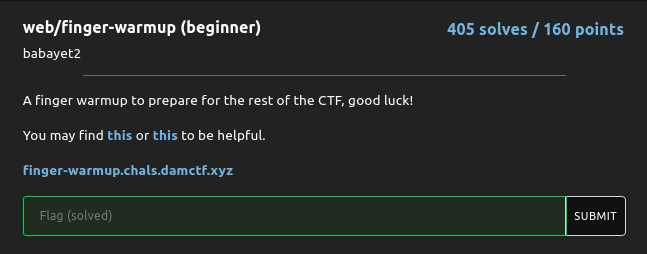
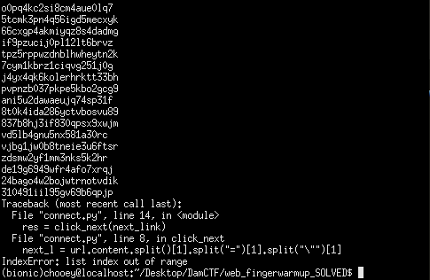
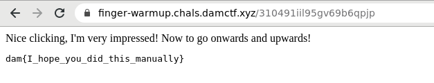

## DamCTF: finger-warmup [web]


#### It was just a beginner challenge for the web category, the website provided has a hyperlink to which upon clicking it sends us to another webpage with another hyperlink and it goes on and on. The solution was simply to automate the task of going to where the hyperlink goes and repeating the process - which is doable using python requests.

```python
import requests

def click_next(link):

	challenge_url = "https://finger-warmup.chals.damctf.xyz"

	url = requests.get(challenge_url + link)
	next_l = url.content.split()[1].split("=")[1].split("\"")[1]
	print(next_l)
	return next_l

next_link = '/'
while True:	
	res = click_next(next_link)
	next_link = '/' + res
```

#### It's gonna take a while and when it stops, it's because we have reached the last webpage. We simply take note of the url then append it to the challenge website's url to get the flag.

