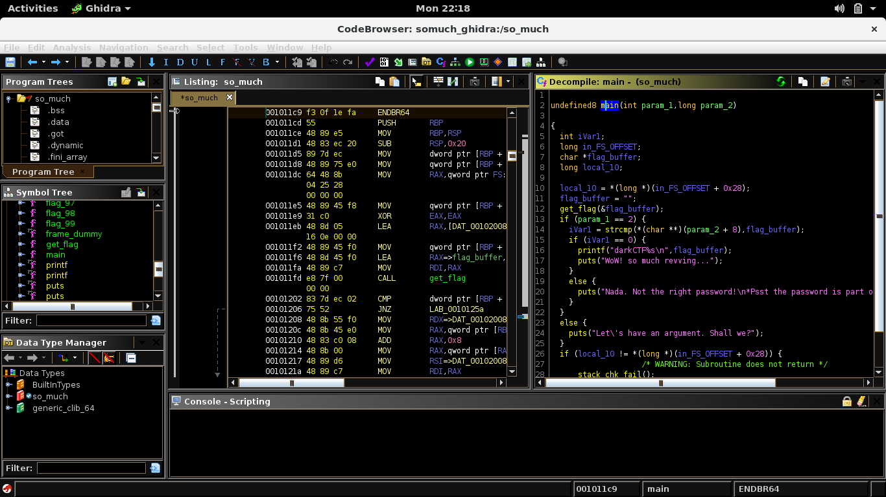
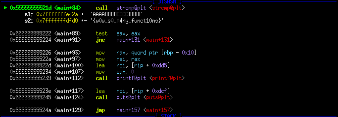

## DarkCTF: so_much [rev]
> strcmp printf

#### We immediately throw the binary into ghidra for easier analysis. The program takes a command line argument, then proceeds to call the getflag function. getflag() consists of many subroutines, calls other flag functions then stores the result into a buffer. We don't need to fully analyze it as we can just set a breakpoint before the strcmp call and check the arguments for the flag.

#### Flag: `darkCTF{w0w_s0_m4ny_funct10ns}`