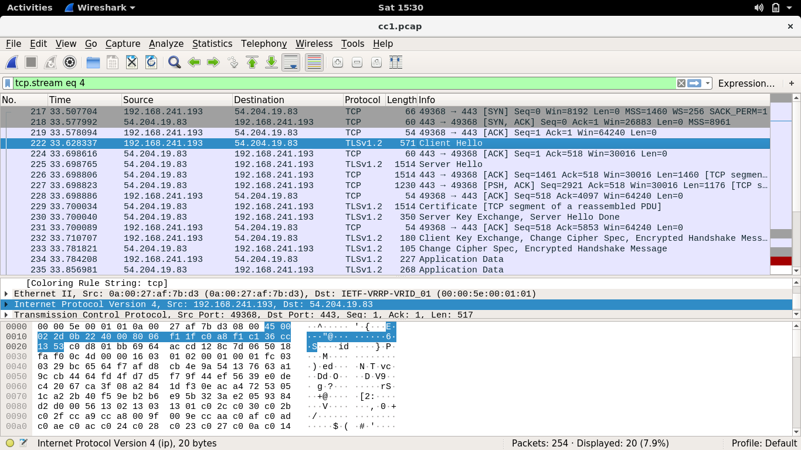
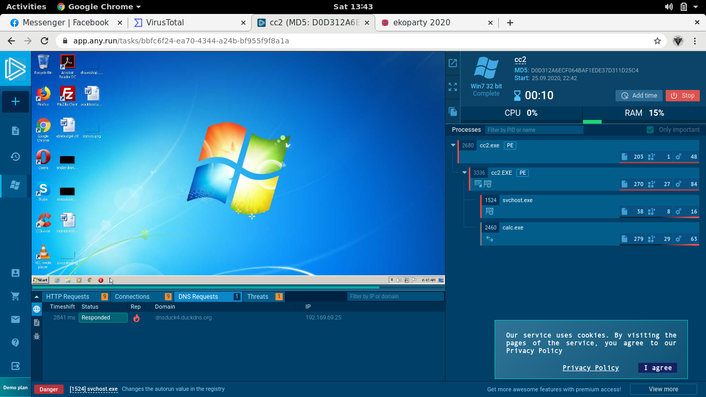
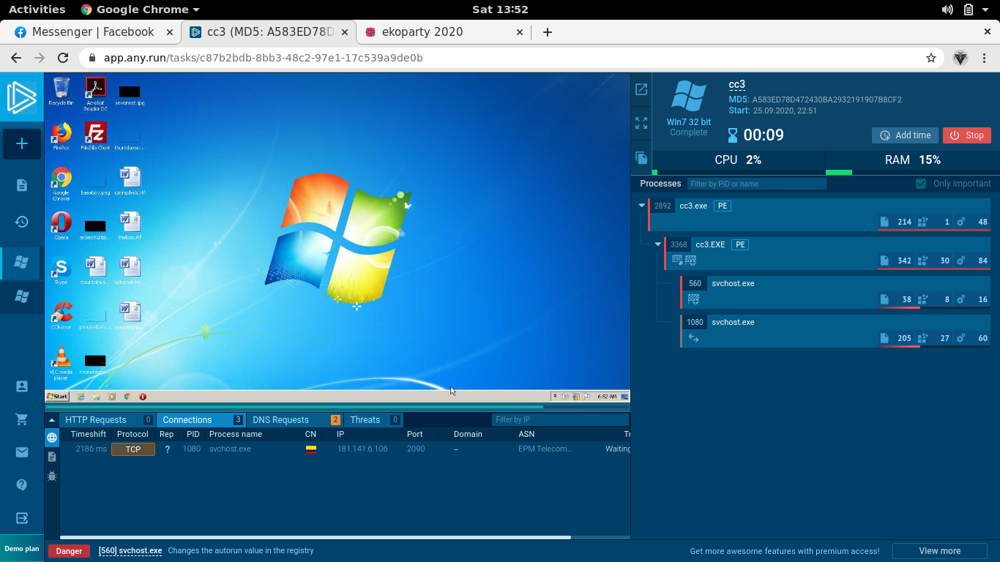

## EKOPARY: C&C [1-3]

#### Initially, I thought I wouldn't be able to solve these (C&C) challenges since I haven't set up an analysis vm yet (chromebook problems). But then I found an online malware analysis sandbox called any.run which I used to solve some of the C&C challenges.

## C&C 1
> This is a network capture of a generic trojan sample, may you please tell us the IP address of the C&C?

#### After skimming through some malware reports, I opened the provided .pcap file in wireshark and followed the TCP packets. Then we see that it connects to an IP address, then has this Client Hello and Server Hello information (i dunno yet how to properly use and analyze with wireshark, but i'll learn tho) which hints at a server-client communication. We take note of the destination IP address to which the malware connects to and submit it. 

#### Flag: `EKO{54.204.19.83}`

## C&C 2
> What is the domain name used by this malware to stablish the connection with the C&C?

#### The challenges from this point forward will need dynamic analysis to be solved, so I started an any run instance. Since the challenge asks us the domain name to which the malware connects to, we just take note of DNS, HTTP, and TCP connections that are established.

#### Flag: `EKO{dnsduck4.duckdns.org}`

## C&C 3
> Attackers usually use social engineering to engage on victims, this malware sample was sent on behalf of a government institution, you will need to find C&C IP address and port.

#### Similar to the previous challenge, but this time we need to submit an ip and port. We can repeat the previous process in order to get the flag.

#### Flag: `EKO{181.141.6.106:2090}`

#### I didn't manage to solve the last two challenges (C&C4 I couldn't run for some reason, C&C5 requires a 64-bit architecture which the free plans on any.run doesn't support), but I am sure that I will be able to in the next year :) 