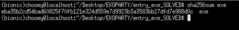
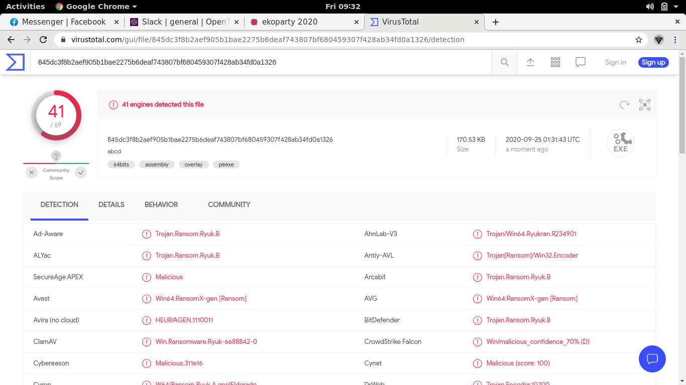
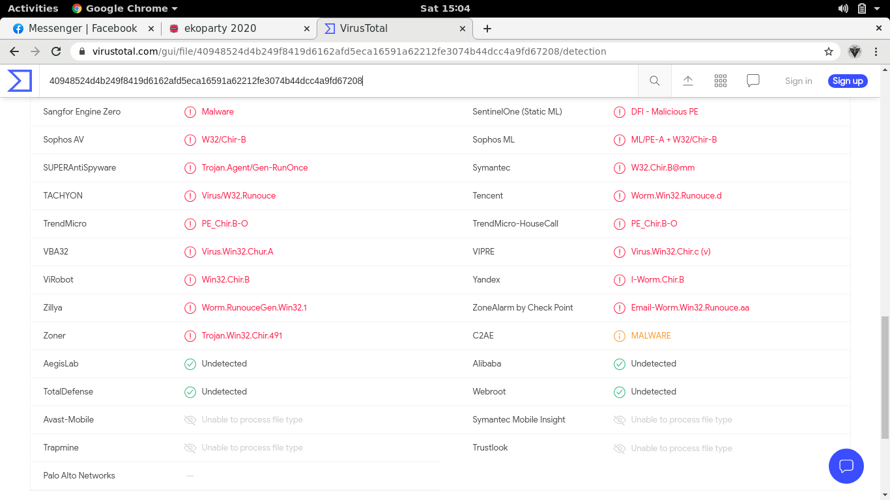
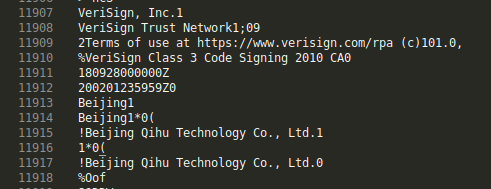
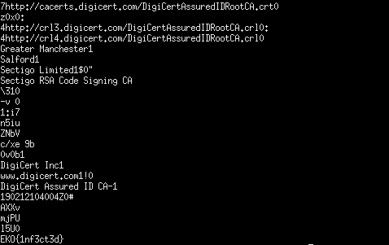
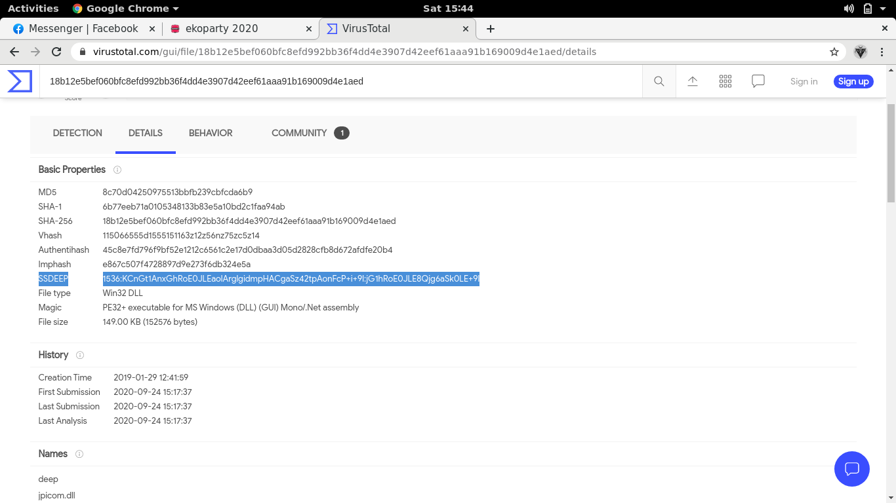

## EKOPARTY: entry [1-5], trivia [1]
#### These are the some of the challenges I solved during the ctf. This was a new experience for me as I got to somehow experience challenges catered for malware analysts. I need to learn more about reversing and malware analysis to be able to solve more challenges in this event in the next editions.

## Entry 1: exe
> A common hash function used to identify malware is SHA256, may you please tell us what is the value of the hash for this malware sample?

#### Pretty straightforward, we just need to get the sha356 sum of the provided malware sample, then convert it to uppercase letters.

#### Flag: `EKO{EBA35B2CD54BAD60825F70FB121E324D559E7D9923B3A3583BB27DFD7E988D0C}`

## Entry 2: ABCD
> What's the name of this famous malware?

#### Again we are provided with another malware sample, which our goal is to find its name. For this, we can upload the sample to virustotal and scan it against its database.

#### Flag: `EKO{ryuk}`

## Entry 3: Run
> There are some antivirus products that cannot detect the following malware samples, can you name one of them?

#### Here our task is to figure out which AV software don't detect the provided malware sample. At this point, I noted that virustotal is a good friend for initial analysis.

#### There are four AV software that are marked undetected, we can just pick one and use it as the flag.
#### Flag: `EKO{AegisLab}`

## Entry 4: Cert
> A malicious technique used by bad actors is to sign binaries with stolen certificates, this malware sample is signed by a chinesse company, the answer is the name of this company.

#### The signatures will be with the binary itself and the actor who signed it. We can simply run strings for this program and check for a chinese-related name (as hinted by the description)

#### Flag: `EKO{Beijing Qihu Technology Co., Ltd.}`

## Entry 5: Clop
> This is one of the most dangerous malware sample, researchers usually protect these samples with a common password, extract the file and you will find the answer inside the sample.

#### We get into a bit of a problem extracting the file at first, but can be solved using this [fix](https://unix.stackexchange.com/questions/183452/error-trying-to-unzip-file-need-pk-compat-v6-1-can-do-v4-6). During the process we get prompted with a password, to which we need to enter `infected`, as it is the most common password used when sharing malware samples. After we have extracted the binary, we can simply run strings on it again to get the flag.

#### Flag: `EKO{1nf3ct3d}`

## Trivia 1: Deep
> What's the ssdeep value of this malware sample?

#### I saw an ssdeep parameter when reading through the virustotal results of the previous challenges, so I used it again for the malware sample provided. We head to the details section of the result then simply copy the ssdeep value.

#### Flag: `EKO{1536:KCnGt1AnxGhRoE0JLEaolArglgidmpHACgaSz42tpAonFcP+i+9l:jG1hRoE0JLE8Qjg6aSk0LE+9l}`