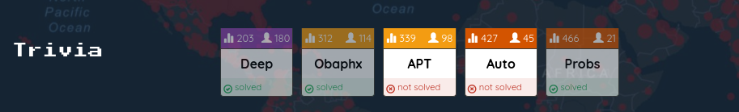
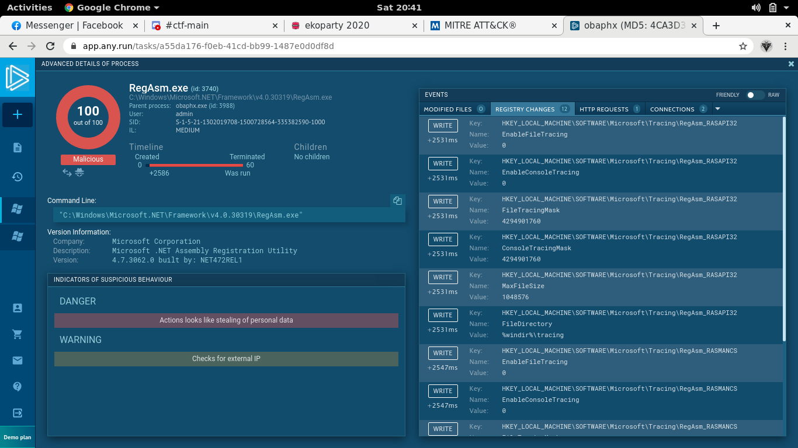

## EKOPARTY: trivia [1,2,5]	

#### Just some of the trivia challenges I managed to solve.

## Trivia 1: Deep
> What's the ssdeep value of this malware sample?

#### I saw an ssdeep parameter when reading through the virustotal results of the entry challenges, so I used it again for the malware sample provided. We head to the details section of the result then simply copy the ssdeep value.

#### Flag: `EKO{1536:KCnGt1AnxGhRoE0JLEaolArglgidmpHACgaSz42tpAonFcP+i+9l:jG1hRoE0JLE8Qjg6aSk0LE+9l}`

## Trivia 2: Obaphx
> Name a suspicious or malicious MITRE technique used by the following malware.

#### Our goal is to figure out which techinique from the [MITRE ATT&CK FRAMEWORK](https://attack.mitre.org/). First I examined the behavior of the malware through any.run, we can see that it executes RegAsm.exe and establish a connection.

#### RegAsm.exe changes a number of registry values. We check if there is such attack techniques in the framework (and there is) to which we use as the flag.

#### Flag: `EKO{modify registry}`

## Trivia 5: Probs
> Use a known tool based on Statistically Improbable Features to obtain the percentage of similarity of the malware samples provided.

#### Solving this was a collaborative effort, some discord friends assisted me in finding the tool and installing/running it since I had no storage in my laptop anymore (chromebook problems). The tool that was needed to solve the challenge is [sdhash](https://github.com/sdhash/sdhash), a similarity digest hacking tool. Simply input the samples provided and you get the value.
#### Flag: `EKO{sdhash_55%}`