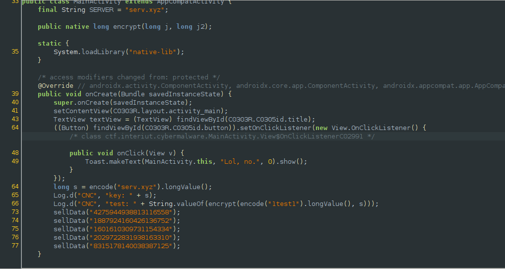
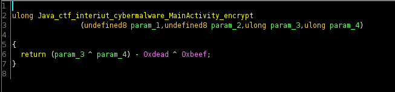
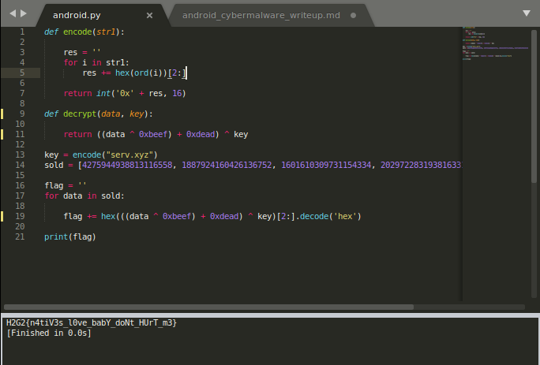

## InterIUT CTF: cybermalware [rev | 50 pts]
> Christouffe a encore besoin de vous ! Il n'arrive pas à comprendre comment cette application reçoit des informations de son CnC.
Déchiffrez les échanges que l'application réalise.

## Some background
#### While reversing the first version of the binary, I noticed the native function wasn't called/referenced anywhere in the code. I then proceeded to bother the challenge creator until I finally managed to force him to take a double check on the binary. It turns out he forgot to add one line which was the key to solving the challenge. 

## Yet another baby rev for native libraries
#### After skimming through the decompiled result from jadx, we can analyze that the application is supposed to act like a malicious apk which sends (sells) data to its command and control server. 

#### From the test logs, we can see that the data being sent is actually the result of `encode(data)` and is being passed to the encrypt method with the key `encode("serv.xyz")`. After using apktool to get the apk resources, I opened the native library in ghidra.

#### It's a fairly simple chain of xor operations which is easily reversible. We can then proceed to rewrite some of the java methods into a python script and create a decrypt function to retrieve the flag.

