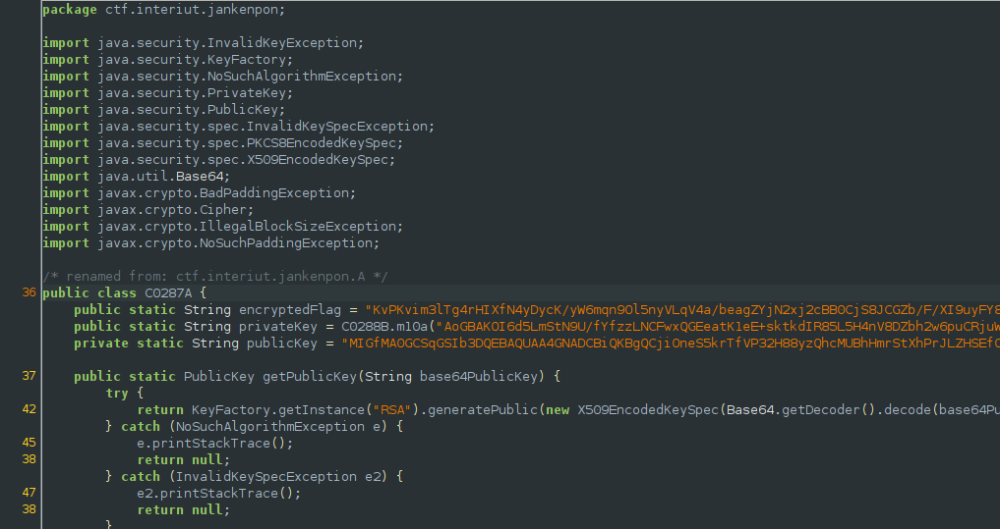

## InterIUT CTF: jankenpon [android | 100 pts]
> korewajankendesu!

## Hooking with Frida (intended solution)
#### The intended solution of this challenge (based from the given hint) was to hook to the checkWin method and control its arguments in order to have a win condition and print the flag. Basically, the game is rigged in a way that the player never wins. 

## The problems of having an unrooted phone
#### I installed frida and all the tools and python bindings needed to make it work, but read that I needed a rooted phone. I have no phone (uncle if ur reading this sponsor me hehehe), so I borrowed my sibling's but it wasn't rooted. I found some resources online to make frida work even on an unrooted phone but didn't so I just did the unintended way of solving the challenge. I'll try to play around with FRIDA when I buy a phone for development purposes.

## Never hardcode and obfuscate important stuff
#### The win() method actually calls another class in order to decrypt and print out the flag, so that is what I reversed instead. Looking at the class and its methods being called, we see another set of hardcoded encryptedflag and public/private keys similar to the quepasse challenge.



#### These values go through various de-obfuscation methods, but we can simply borrow them again and let it decrypt the flag for us. 

```java

import java.util.ArrayList;
import java.security.InvalidKeyException;
import java.security.KeyFactory;
import java.security.NoSuchAlgorithmException;
import java.security.PrivateKey;
import java.security.PublicKey;
import java.security.spec.InvalidKeySpecException;
import java.security.spec.PKCS8EncodedKeySpec;
import java.security.spec.X509EncodedKeySpec;
import java.util.Base64;
import javax.crypto.BadPaddingException;
import javax.crypto.Cipher;
import javax.crypto.IllegalBlockSizeException;
import javax.crypto.NoSuchPaddingException;

/* renamed from: ctf.interiut.jankenpon.A */
public class android_rev {

    
    public static String encryptedFlag = "KvPKvim3lTg4rHIXfN4yDycK/yW6mqn9Ol5nyVLqV4a/beagZYjN2xj2cBB0CjS8JCGZb/F/XI9uyFY8Gucyto9qF483gEhRjb9DksFtwJx+irhgEVehrx8TbC3MJ1E2S56eAacJkNGoPpBrKVXj4dz+SReBX3A2935QxN08Bcg=";
    public static String privateKey = b_method("AoGBAKOI6d5LmStN9U/fYfzzLNCFwxQGEeatK1eE+sktkdIR85L5H4nV8DZbh2w6puCRjuWRa9U3J0iH", "cJAgMBAAECgYAcS1UDZBsVNgDKmACxLjXDwlD1RvOT8MQ9+UEWy66eJQL6m+XMCFruXLm6jQ9QbX7G03lPw6I", "aommvsICiEYi/H53G9aP8xfIr207UQJAe4/rJ35rRXC+hUljo6gLQ2OCGNoJMeoM+wT9dQNZEurdPZGBz1ij+LFFdHkeKvcS/MT+G7QbGpZQfnZDUgeojg==", "yKizuHpAkEA4GqH0htOFrIMTUMdpamd6X9OP+r9hakd5gymmcWc6lmP14DKkwTw5Gchqs0ZfTZebjrGJuVbaCRtDAMZ6Z13IQJAWfCl5nLjzo5FDVdsbXN8Dc53TLW+r43Ei1inuPNEw3bYrBN4aIRmwCBg", "fd7dMBF8KjsjfK3MxV10ojNzfPwvd8yokrFC59vit4ym0KXy61e/ZpgTu7cUAUdmganH7m7K0vrN+cR9siOMiTY3mBGt0G", "MIICdgIBADANBgkqhkiG9w0BAQEFAASCAmAwggJcAgEA", "qBpVt+M8+68zIdtbICU3LmNly8tYIYqMwsZEgtHyZkCdSV1rzBLq9cpx+or2naLzzADONj5AZUBLWmCCECQQCnN45oya3UPL1uDttyhxAPLqWxdRSIcxD80+kP/AhbaplCEw9htuBw/y0QCTBimZhHwepgiuIrEE9RS", "lV2P8ylJFxDDeEE7qBXObET7d4sKkj49hc2kh3Q8/Cs6SB1bb7vA8k2wgoNZXZgOWrGstoCZZ3nFCvBasuPTCTUo/XBcKHEifAQJBAPpc3b");
    private static String publicKey = "MIGfMA0GCSqGSIb3DQEBAQUAA4GNADCBiQKBgQCjiOneS5krTfVP32H88yzQhcMUBhHmrStXhPrJLZHSEfOS+R+J1fA2W4dsOqbgkY7lkWvVNydIh33e3TARfCo7I3ytzMVddKIzc3z8L3fMqJKxQufb4reMptCl8utXv2aYE7u3FAFHZoGpx+5uytL6zfnEfbIjjIk2N5gRrdBnCQIDAQAB";

    public static ArrayList<String> c_method(String a, String b, String c, String d) {
        ArrayList<String> aa = new ArrayList<>();
        aa.add("Bh6ZriuhZ===".concat(a));
        aa.add(b.concat("niDAZe8="));
        aa.add("BoazBIQZD89N+QZOINnqzdnnQZBBa");
        aa.add(d.concat(c));
        return aa;
    }

    public static String b_method(String a, String b, String c, String d, String e, String f, String g, String h) {
    
        ArrayList<String> aa = c_method(f, a, g, "");
        aa.get(0);
        aa.get(3);
        aa.get(1);
        aa.get(2);
        String v = "".concat(f);
        String y = a.concat(e);
        return "".concat(v.concat(y)).concat(b.concat(h).concat(g.concat(d))).concat(c);
    }
    public static PublicKey getPublicKey(String base64PublicKey) {
        try {
            return KeyFactory.getInstance("RSA").generatePublic(new X509EncodedKeySpec(Base64.getDecoder().decode(base64PublicKey.getBytes())));
        } catch (NoSuchAlgorithmException e) {
            return null;
        } catch (InvalidKeySpecException e2) {
            return null;
        }
    }

    public static PrivateKey getPrivateKey(String base64PrivateKey) {
        PKCS8EncodedKeySpec keySpec = new PKCS8EncodedKeySpec(Base64.getDecoder().decode(base64PrivateKey.getBytes()));
        KeyFactory keyFactory = null;
        try {
            keyFactory = KeyFactory.getInstance("RSA");
        } catch (NoSuchAlgorithmException e) {
            //e.printStackTrace();
        }
        try {
            return keyFactory.generatePrivate(keySpec);
        } catch (InvalidKeySpecException e2) {
            //e2.printStackTrace();
            return null;
        }
    }

    public static byte[] encrypt(String data, String publicKey2) throws BadPaddingException, IllegalBlockSizeException, InvalidKeyException, NoSuchPaddingException, NoSuchAlgorithmException {
        Cipher cipher = Cipher.getInstance("RSA/ECB/PKCS1Padding");
        cipher.init(1, getPublicKey(publicKey2));
        return cipher.doFinal(data.getBytes());
    }

    public static String decrypt(byte[] data, PrivateKey privateKey2) throws NoSuchPaddingException, NoSuchAlgorithmException, InvalidKeyException, BadPaddingException, IllegalBlockSizeException {
        Cipher cipher = Cipher.getInstance("RSA/ECB/PKCS1Padding");
        cipher.init(2, privateKey2);
        return new String(cipher.doFinal(data));
    }

    public static String decrypt(String data, String base64PrivateKey) throws IllegalBlockSizeException, InvalidKeyException, BadPaddingException, NoSuchAlgorithmException, NoSuchPaddingException {
        return decrypt(Base64.getDecoder().decode(data.getBytes()), getPrivateKey(base64PrivateKey));
    }

    public static void main(String[] args) {

        try {
        System.out.println(decrypt(encryptedFlag, privateKey));
        }
        catch(Exception e) {            
        }
    }
}
```

