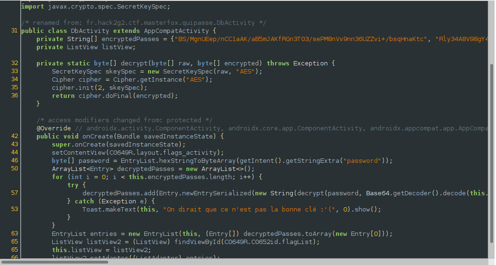
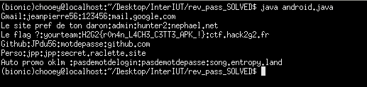

## InterIUT CTF: Qui Passe [android | 20 pts]
> Breizen vient de développer son propre gestionnaire de mot de passe.
Avant de l'uploader sur le playstore il vous demande de vérifier la sécurité de son produit.
Récupérez le contenu de ses mots de passe

#### This challenge is a prime example on why it is never a good idea to hardcode cryptographic keys no matter how hard you try to obfuscate them. Basically we are given an application which asks for a hex string which serves as a key for decryption. If we pass the regex check, the DbActivity intent gets started. From the DbActivity source code, we can see the following:


#### From this block right here which isn't clearly seen in the screenshot, we iterate through each encryptedPasses element and decrypt them using the password we provided. 
```java
for (int i = 0; i < this.encryptedPasses.length; i++) {
	try {
		decryptedPasses.add(Entry.newEntrySerialized(new String(decrypt(password, Base64.getDecoder().decode(this.encryptedPasses[i].getBytes())), StandardCharsets.UTF_8)));
	} catch (Exception e) {
		Toast.makeText(this, "On dirait que ce n'est pas la bonne clé :'(", 0).show();
	}
}
```

#### After this block gets completed, another activity gets started which is the EntryList activity. It is from this entry list source code that we are able to determine what password to use for decryption.


#### What I did next was to retrieve the secret_key from strings.xml, reused the provided decryption methods and provided the encryptedPasses and secret_key as its arguments.

```java
import java.util.Base64;
import javax.crypto.Cipher;
import javax.crypto.spec.SecretKeySpec;

public class android {

	private static byte[] decrypt(byte[] raw, byte[] encrypted) throws Exception {
	        SecretKeySpec skeySpec = new SecretKeySpec(raw, "AES");
	        Cipher cipher = Cipher.getInstance("AES");
	        cipher.init(2, skeySpec);
	        return cipher.doFinal(encrypted);
    	}

	public static byte[] hexStringToByteArray(String s) {
        int len = s.length();
        byte[] data = new byte[(len / 2)];
        for (int i = 0; i < len; i += 2) {
            data[i / 2] = (byte) ((Character.digit(s.charAt(i), 16) << 4) + Character.digit(s.charAt(i + 1), 16));
        }
        return data;
    }

	public static void main (String[] args) { 

		String[] encryptedPasses = {"BS/MgnUEep/nCC1aAK/aB5mJAKfRGn3T03/sePM8nVv9nn36UZZvi+/bsqHnaKtc", "Rly34A8V98gY467cQy6JfLZa/PNjtEXyxdyGva6pScZmEtMKsaaHv88wxvKDB44OoSqO0HPcbUpvp8tD2rCSlw==", "U+HaCImq6DmIKc+9rzhf41tbcPuXg0UCrEGPdmzMBdFRMC/mbVg+ITC+zvkJZi4PO2dhIg0PcnSPIlSt1VJzWw==", "YIY1M4r5M9cy1EgmB9WGB6ULTopi+b7MuJKsl82JCLr+P6FAJhwr4XDxbTL6Qw2m", "1NJxkx1uM5X6feZaCWa0nluQwrc0NF4xo69I2Uw0aJ0au4o0KfrzUPpQynxQB+nU", "szQ1W/w93pvU4wk3WXMkLYG7tuUsP55f2r915PmOkHJI9LVuAXMEFKhS+7Vl/HllZx+Mb2ILzjDSW1xqvdPg/fwidsy+WWpHatPnDDEToy8="};
		String password = "B224589A65B8E5BF5C36ABF3DC48CFA2607044BEA72C796104087AEF576503BC";
    	for (int i = 0; i < encryptedPasses.length; i++) {

    		try {
                System.out.println(new String(decrypt(hexStringToByteArray(password), Base64.getDecoder().decode(encryptedPasses[i].getBytes()))));
    		}
    		catch (Exception e) {
    			
    		}
        }
	}
}
```
