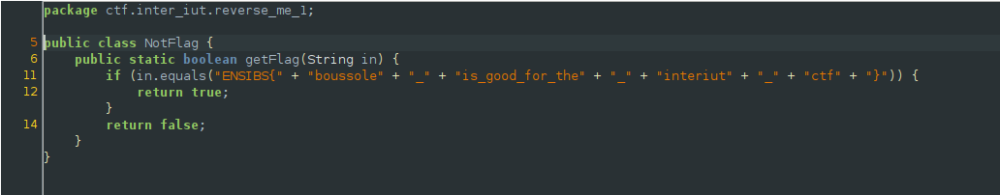

## InterIUT CTF: reverse me 1 [android | 10 pts]
> Trouvez le flag de validation de cette application.
Ce flag est **exceptionnellement** au format ENSIBS{}

## Short statement
#### I teamed up with r3dact3d during the recently held InterIUT CTF competition this past weekend. I don't remember which place we got, but I'll update it when the platform is up again. r3dact0r did most of the heavy lifting, scoring points across all categories while I focused (and solved) all of the android challs. The android reversing challs in this ctf were pretty fun to solve. 

## Static reversing
#### Since this was a warmup challenge, all we needed to do was examine the decompiled source code where the flag was hardcoded and used as a check condition. The announcement from the discord server also states that we needed to change the flag format from ENSIBS{...} to H2G2{...} 

