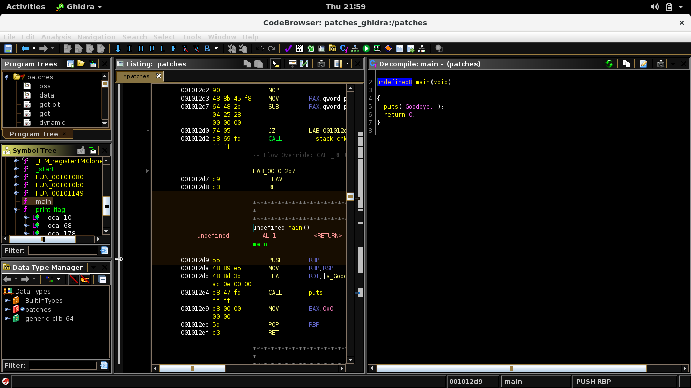

## NACTF: patches [rev]
> Description to be added later

#### I liked this challenge as I was able to learn how to patch binaries using GHIDRA, a skill that will prove very useful in future reversing endeavours. First thing I did was to run the program (which only prints out 'Goodbye.'), perform simple recon, then opened it using GHIDRA.


#### From what we can see, the main function just calls puts with 'Goodbye.' as its argument, but what's interesting is there is a print_flag function that isn't called. The challenge now becomes clear, we need to patch the puts call in a way that it calls print_flag instead (reversing print_flag will just be tedious). A resource that I used to solve this challenge and learn how to patch is [this](https://materials.rangeforce.com/tutorial/2020/04/12/Patching-Binaries/).

#### I then proceeded to nop out the instructions before the call and the part where it loads the argument into the register, then retrieved print_flag's address from gdb and switched it on the call instruction. Below is a screenshot of how the assembly listing looks after the patch, we can compare it with the previous screenshot to see the difference.


#### Afterwhich I just continued doing the steps mentioned in the linked article, which then provided me with a patched version of the binary. Simply running the program prints out the flag for us.
```
$ ./patched_binary
nactf{unl0ck_s3cr3t_funct10n4l1ty_w1th_b1n4ry_p4tch1ng_L9fcKhyPupGVfCMZ}
```