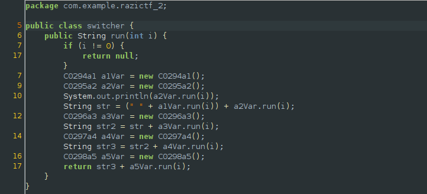
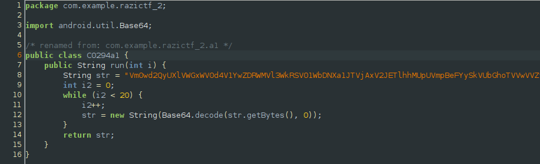
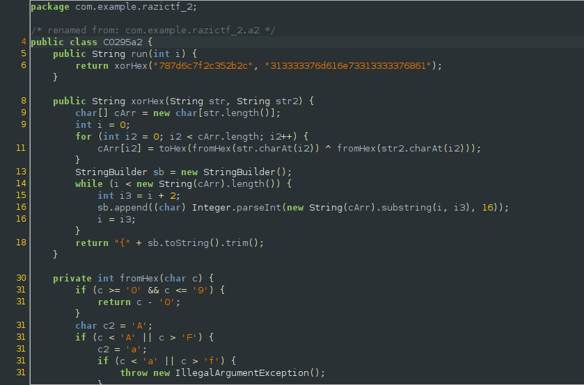
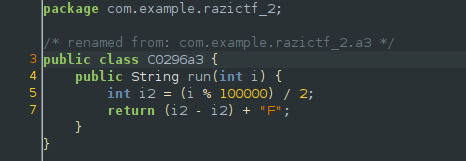
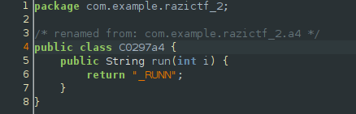
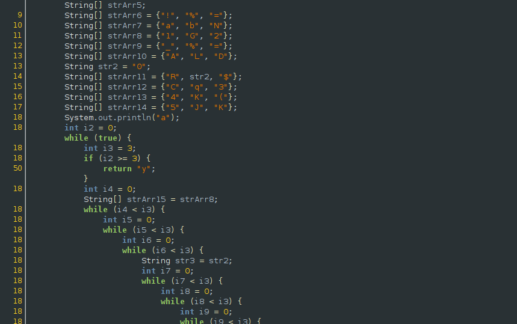

## RaziCTF: chasing a lock [android]
> as locks are so popular many will chase them but why? maybe a flag :)

#### Similar as other baby android reversing challenges, this one was a phase-oriented challenge where you need to pass each phase in order to get the flag. Reversing this challenge was quite straightforward.

## Basics

#### The main method creates an instance of this class and calls the run method in order to construct the flag.

## Phase 1


#### Pretty basic base64 decode loop to give us the first part of the flag.
```python
phase1 = 'redacted for the sake of readability'
for i in range(20):
	phase1 = base64.b64decode(phase1)

#: flag [1/5]: RaziCTF
```

## Phase 2


#### This stage performs an xor operation between two hardcoded values, but comes with an additional twist. It's not worthwhile to reverse the algorithm as we can just patch out the unnecessary android library methods and just run the java code.
```
$ java stage2.java
{IN_HATE_ 

#: flag [2/5]: {IN_HATE_
```

## Phase 3


#### No matter what the argument provided for the function is, it will still result to the same number: 0. Since the return value of the method is a string, it will treat 0 as a string and add it with 'F'.
```
#: flag [3/5]: 0F
```

## Phase 4


#### Just gives us the fourth part of the flag, ez.
```
#: flag [4/5]: _RUNN
```

## Phase 5


#### The algorithm seems intimidating at first (nested operations in nested while loops), but like phase 2 we can simply patch the code and run it to give us the last part of the flag.
```
$ java stage5.java
[...]
!NG_L0CK5}
```

#### `Flag: RaziCTF{IN_HATE_0F_RUNN!NG_L0CK5}`
