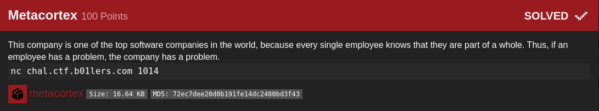
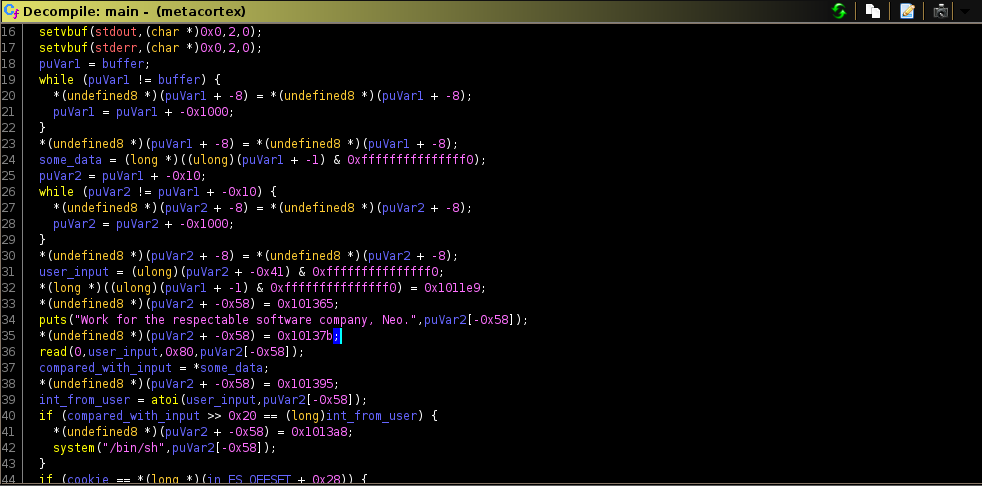
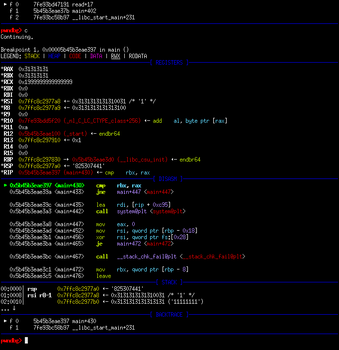

## b01lers bootcamp: metacortex [pwn]


#### Since we were only given a binary, my first move was to open it with GHIDRA. The decompilation presents us this code, which is very daunting at first since it does a lot of calculations which I didn't bother to reverse engineer.


#### I did understand however that it takes user input, transforms it into an integer representation then compares it with the computed value. If both the computed value and input are equal then we get a shell, easy. There is a buffer overflow vulnerability since the initialized buffer is only 8 bytes and we are able to read 0x80. Since the input and calculated number are in the stack, it is possible to overwrite it.

#### My approach then was this, to enter a number then terminate it with a null byte (since atoi will transform a string to an int, then it will stop reading at the null) next proceed to overwrite the stack until we reach the location at which the original calculated number is stored then overwrite it with the value in hex of the input that we provided. We can verify that this works with gdb. We input 825307441 (0x31313131), null terminate it then overwrite the stack with 1's (since they will be in string form, each 1 character will be 0x31 in the stack).


#### Simply send the exploit to the remote server to get the flag.
```python
from pwn import *

#p = process('./metacortex')
p = remote('chal.ctf.b01lers.com', 1014)
#gdb.attach(p.pid, 'break *main + 430')
print(p.recv())

exploit = '825307441\x00'
exploit += '1' * (100 - len(exploit))
p.sendline(exploit)
p.interactive()

#: flag{Ne0_y0uAre_d0ing_well}
```