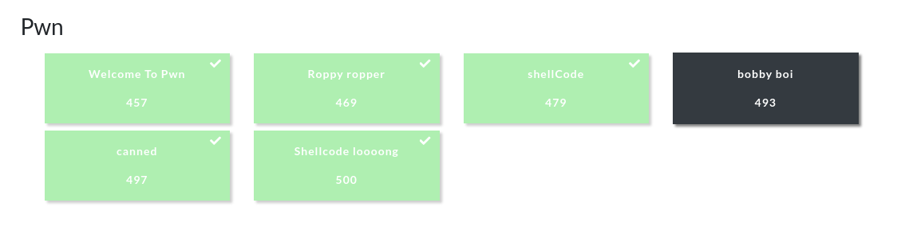

## boot2root CTF: prologue

#### I played this ctf solo and accumulated some points to land me on the top 20 of the rankings. I almost solved all of the pwn challenges, the only one I wasn't able to solve was `bobby_boi` and I'll work on it later since it was an interesting concept which revolves around the idea of using program crash as an oracle to obtain the server-side canary. 

#### I'll only be posting writeups for canned and bobby boi since I have already covered the concepts for solving the other tasks in my other writeups.

