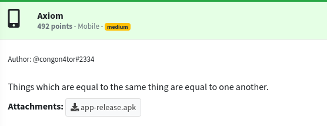
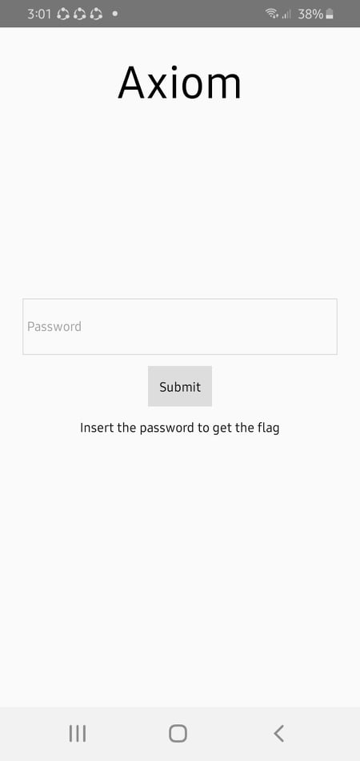
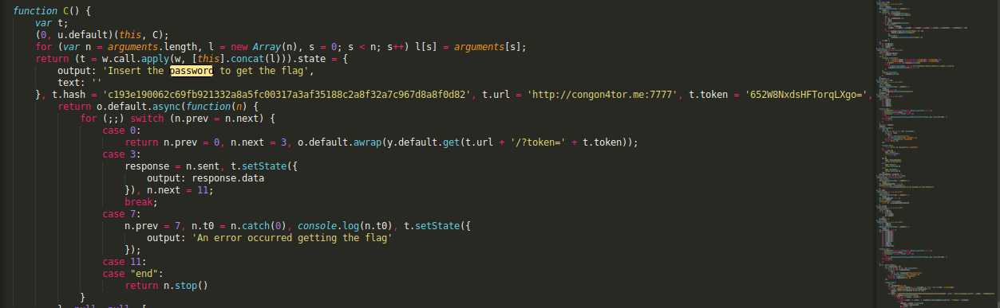

## GRIMMCON CTF: axiom [android]

#### Decompiling the apk using jadx reveals that it is a react-native application. Since I have little knowledge regarding apps made with react-native/javascript, I will read more regarding the topic and maybe update this writeup when I understand it better.

#### What I did was to install the app into a physical device then explore what it does. Afterwhich, I extracted the app resources using apktool and took interest of the `index.android.bundle` bundle in the assets directory. Opening it with sublime text shows lots of javascript code which I beautified to make it easier to read. 

#### I didn't need to read all of the (thousands) lines to understand what it does, instead I searched for the string displayed from the app menu and found the password check logic.

#### Basically it connects to an endpoint and passes some hardcoded token. When we try to make a request to this endpoint and supply the same token, we can retrieve the flag.
