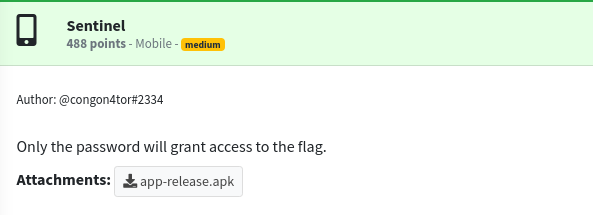
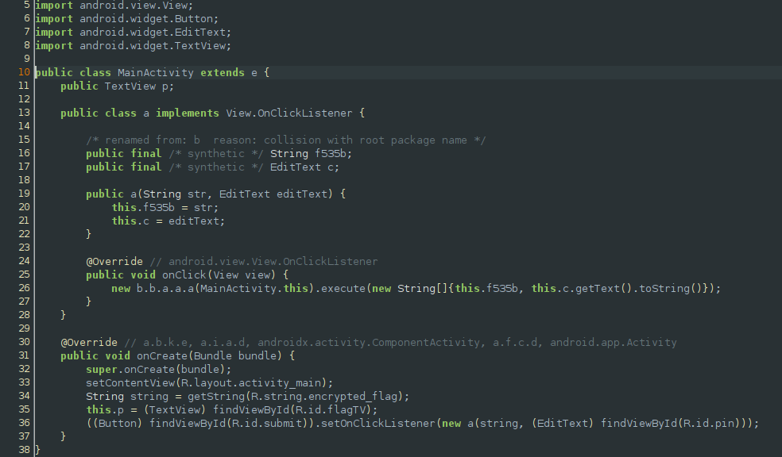
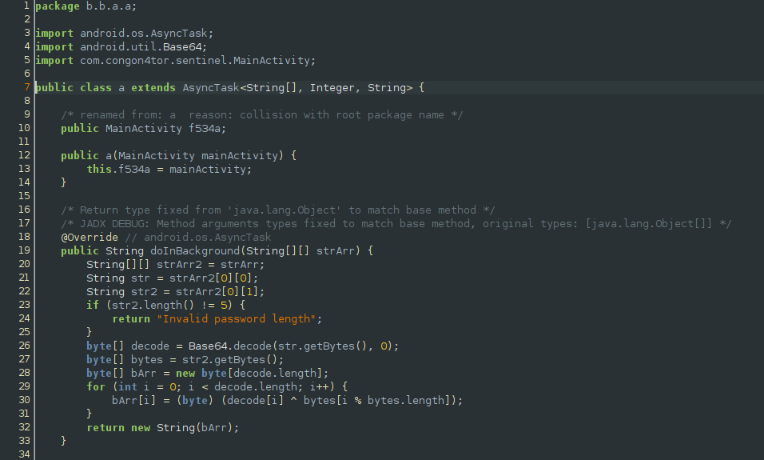
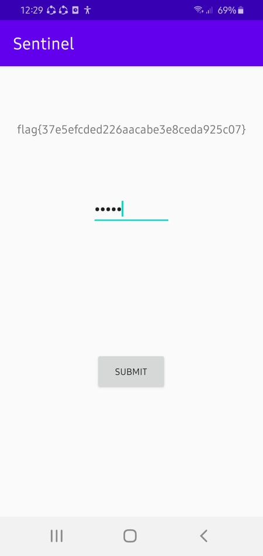

## GRIMMCON CTF: sentinel [android]


## a little background
#### Since the ctf started late in my timezone (12:45 am) and lasted only for a few hours, I solved these challenges after the ctf ended. 

## static reversing

#### I decompiled the apk using jadx-gui and upon examination of the main activity, we see that the app loads the encrypted flag and some user provided input then passes these into another method.

#### From this we know that the input we provide should be of length 5 and it is used as a pin to decrypt the base64encoded flag. Since we know that the first 5 characters of the flag format is `flag{`, we can simply bruteforce the possible pin values and provide it to the app to get the full flag. 
```python
import base64

decrypted_flag = base64.b64decode('CVtQFwJcAFRFHAlUVRUdXQUHERgMVlMVSgoPUhUdDg4DRRpfAEw=')

j = 0
fformat = ['f', 'l', 'a', 'g', '{']
pin = []
for ch in decrypted_flag[:5]:
	for i in range(256):
		if chr(ord(ch) ^ i) == fformat[j]:
			pin.append(i)
			j += 1
			break

print(''.join([chr(x) for x in pin]))
#: pin: o71py
```
