## ROOTCON 15 Capture The Flag


I finally got to participate playing in the country's most grueling CTF competition! Together with @r3dact0r and @chrislaconsay, we (`Queen Anne's Revenge`) dominated the scoreboard for most of the competition, until the last moments where `THEOS Offense` closed out the lead and secured the top spot(kudos to them!). It has been a very challenging and competitive experience, I stepped out of my pwn/rev comfort zone to solve web challs, got to learn some OSINT and forensics techniques. Now that I've gotten a glimpse of the challenges, categories, and level of difficulty offered, I'll continue enhancing my skillset , on what I lack and will definitely come back stronger on the next editions. 

Here are some brief writeups on some of the challenges I solved. 

-------------------------------------------------------
#### Web
- [Web 200: You can't see me!](#web200)
- [Web 300: See Secret in Rootcon File](#web300)
- [Web 400: PwnDeManila's Files](#web400)
- [Web 500: Guess The Number](#web500)

#### OSINT
- [OSINT 100: Hide and Seek](#osint100)

------------------------------------------------------

## Web200
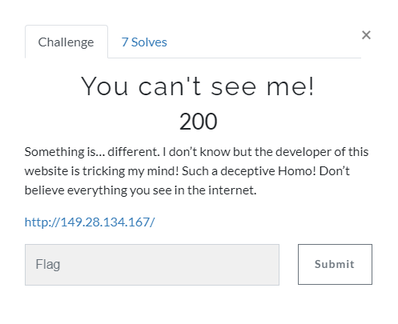

#### Challenge Information
Pretty neat challenge with different possible ways on how it can be approached. Navigating to the URL provided provides us with the source code of the challenge: 


From the looks of it, it seems to be one of those `PHP Type Juggling` web challs which is common in ctfs given the fact that loose comparison is used when comparing md5 hashes. But before we do that, we need to analyze first what the code does:

#### Code Analysis
From highlight 1 in the above photo, we know that it gets two parameters sent in the GET request and checks to see if they contain different values before proceeding. At first, it seems confusing as it seems impossible to use different values for the same parameter, unless this means we can use `HTTP Parameter Pollution` to solve it - but when you take a closer look, the parameter names aren't quite the same:

```python
    >>> [ord(x) for x in "rootcon"]
	[114, 111, 111, 116, 99, 111, 110]
	>>> [ord(x) for x in "rootсon"]
	[114, 111, 111, 116, 1089, 111, 110]
```

This has something to do with unicode encodings/homograph techniques (commonly used by malicious actors to mimic legit websites/domains for phishing). Now that we have this info, we can proceed with the inner if statement. 

#### Too lazy for type juggling
```php
if (md5('pwndemanila' . $_GET['rootcon']) == md5('pwndemanila' . $_GET['rootсon'])) {  
	echo $flag;  
}
```

The statement checks if the md5 hashes for both of the inputs that we provide are the same, only then can we retrieve the flag. At this point, it really seems like the way to solve it is by taking advantage of the loose comparison. 

But there is an easier way which attacks a rather weird behavior on PHP string concatenation: when we concatenate an array to a string, the array gets casted to a string; `When an array is casted to a string in PHP the resulting string won't be about the content of the flattened array but the "Array" word.` 

To test, we can write some simple php code which concatenates the string `pwndemanila` to an array:
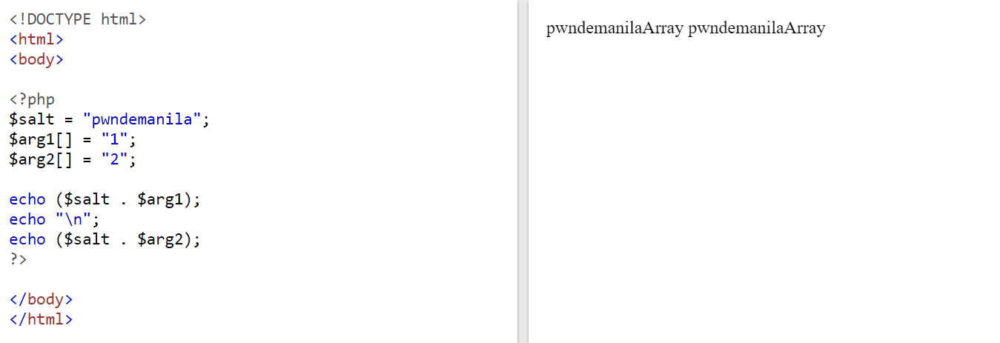

We see that they both return the same value (`pwndemanilaArray`) and will easily pass the hash check. So the final payload to retrieve the flag can be as simple as: `http://149.28.134.167/?rootcon[]=1&root%D1%81on[]=2`

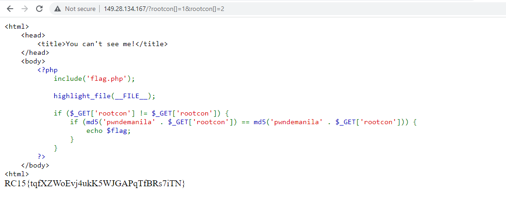

Related Writeups:

https://rawsec.ml/en/angstromCTF-2018-write-ups/#140-md5-web
https://tilak.tech/4/null-ahmedabad-ctf-prove-yourself-1337
https://jaimelightfoot.com/blog/b00t2root-ctf-easyphp/

-------------------------------------------------------

## Web300
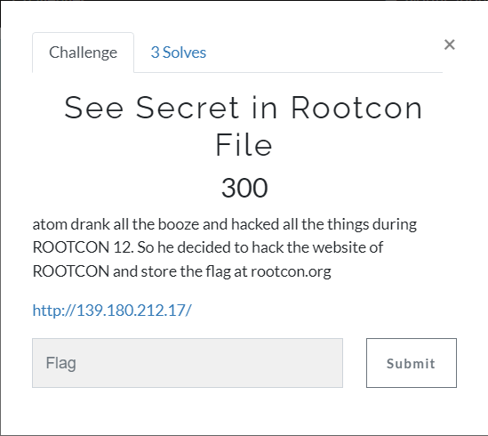

#### Challenge Information
Sometimes challenge titles serve as a hint as to the nature of the challenge. Here, the capitalized letters of the challenge title are `SSRF` which hints at server side request forgery. 

#### Website Recon
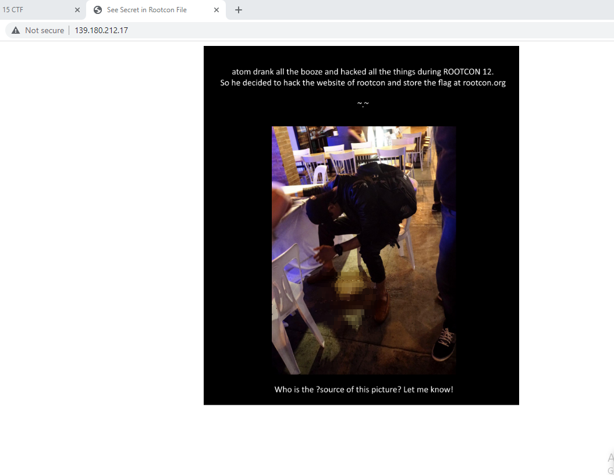

The website presents us with a pretty funny image of sir atom who `drank all the booze and hacked all the things during ROOTCON12`; it also hints at a `?source` parameter, so we try making another GET request with it included:

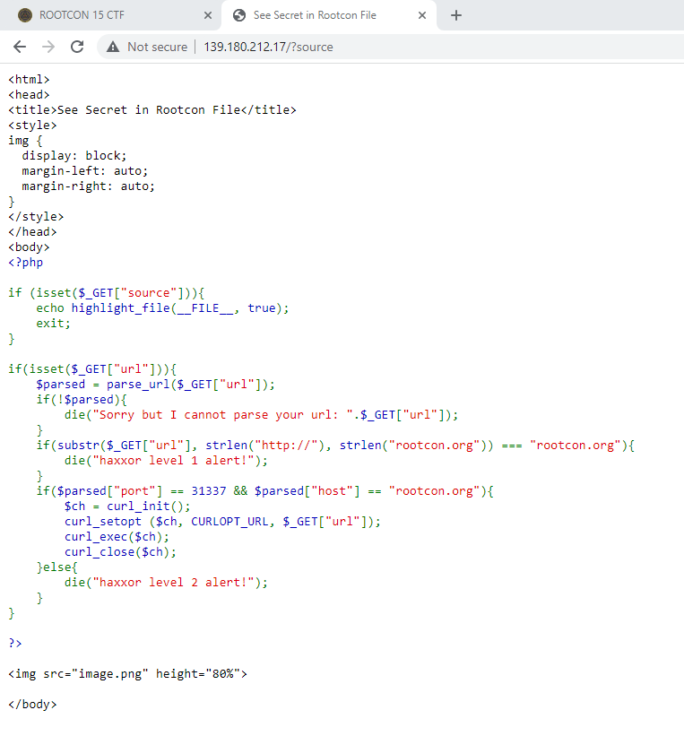

Now we can review the source code. What striked my interest immediately are the following functions used with the `url` parameter that we provide: `parse_url` and `curl_exec`. But first, we need to properly analyze the code:

```php
1 if(isset($_GET["url"])) { /* so we need to provide some url */
2 	$parsed = parse_url($_GET["url"]);  /* runs the url against the parse_url function then stores the result in the variable $parsed */
3    if(!$parsed) {  /* error handling if we somehow f this up */
4        die("Sorry but I cannot parse your url: ".$_GET["url"]);  
5    }  
6    if(substr($_GET["url"], strlen("http://"), strlen("rootcon.org")) === "rootcon.org") {  /* checks if the url[7:11](domain) is rootcon.org; need to bypass this*/
7        die("haxxor level 1 alert!");  
8    }  
9    if($parsed["port"] == 31337 && $parsed["host"] == "rootcon.org") {  /* we need the parsed url to pass these checks */
10		$ch = curl_init(); 
11		curl_setopt ($ch, CURLOPT_URL, $_GET["url"]); 
12		curl_exec($ch); /* basically, curl $url : this might be a possible vector for ssrf */
13		curl_close($ch);  
14    }else{  
15        die("haxxor level 2 alert!");  
16    }  
17 }
```

The plan is clear, we need curl to retrieve an internal file which in this case would be the flag. Keep the following things in mind:
1. We can easily bypass the level 1 check (lines 6-7) by adding something before `rootcon.org`. Since we'll be retrieving a file, we will be using the `file://` protocol. 
2. In addition to #1, we also need the url to have a host of `rootcon.org`, so an idea was to use credential format, e.g. `file://user@rootcon.org:31337`. When this is passed to `parse_url`, it identifies `rootcon.org` as the host then 31337 as the port which allows us to enter the block where curl is called. 

```php
php > $url = "file://user@rootcon.org:31337";
php > var_dump(parse_url($url));
array(4) {
  ["scheme"]=>
  string(4) "file"
  ["host"]=>
  string(11) "rootcon.org"
  ["port"]=>
  int(31337)
  ["user"]=>
  string(4) "user"
}
```
3. At this point, the payload isn't complete yet bc we haven't provided a file to retrieve. To test it out, I tried to read `/etc/passwd`. Hence the payload would be `file://user@rootcon.org:31337/etc/passwd`. Theoretically, it should be able to pass the needed checks and curl would return the file to us:
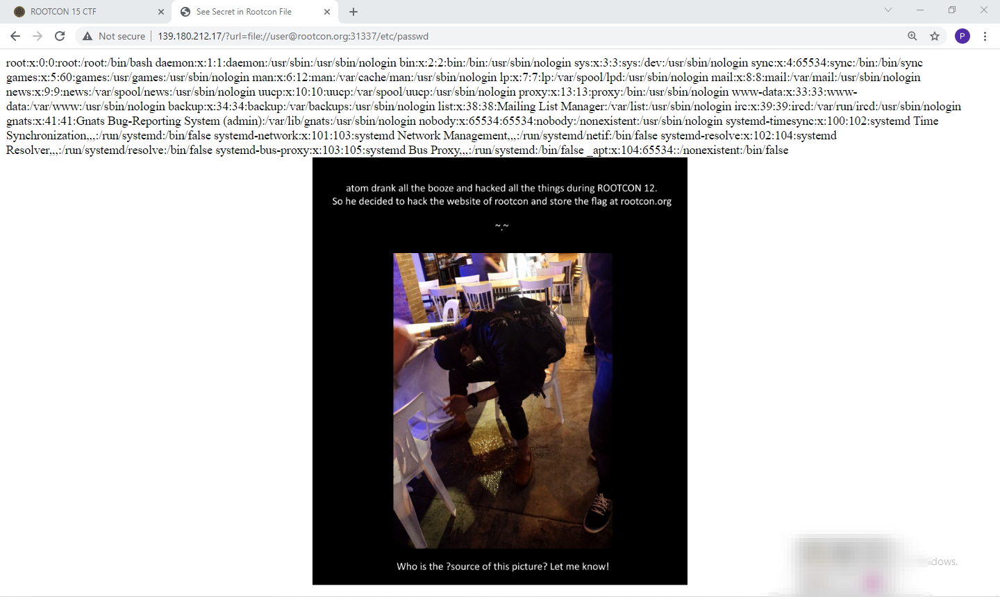

Now that we have successfully read the passwd file, we can retrieve the flag file which I guessed to be at `/flag` and it turned out to be correct (+ first blood):
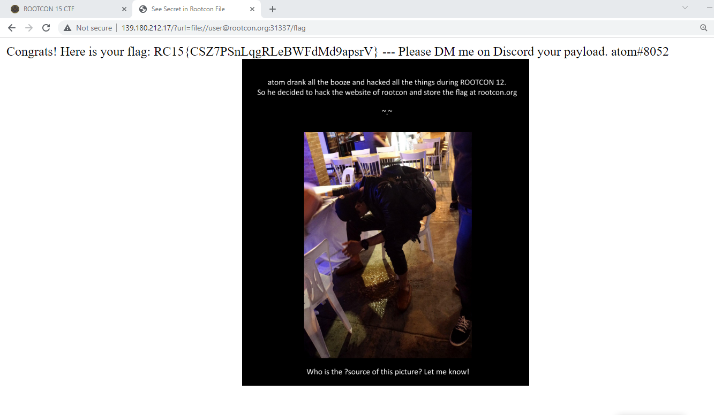

Reference writeup:
https://fireshellsecurity.team/sunshinectf-search-box/

---------------------------------------------------

## Web400
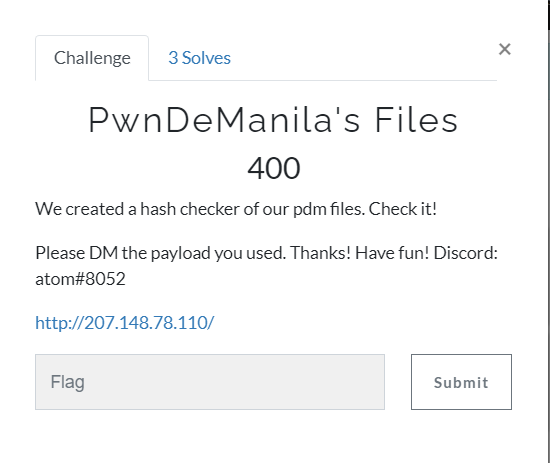

This challenge was a lot easier compared to the rest. We were given a link to a website which asks us for files that end with `.pdm` and it returns the md5 hash of the file. 

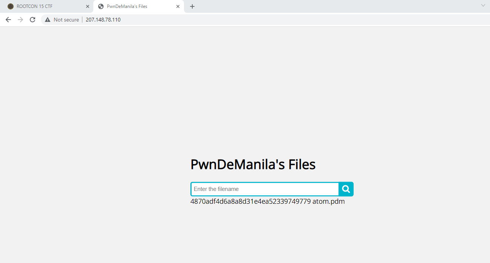

We were able to quickly recognize that it was the result of the `md5sum` command and deduced that if the input is not properly sanitized, then it could lead to arbitrary code injection. It did have some sort of sanitation mechanism, as we were only allowed to provide strings that ended with `.pdm`, however it was easily bypassed by Sir Chris (one of our team mates) by terminating the string with `%0A` then adding an arbitrary command afterwards:

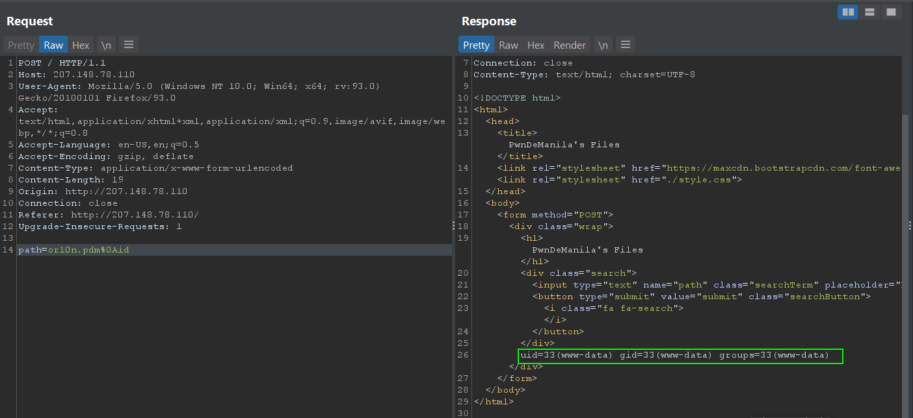

However, it was not over as there were other checks in place to filter out which words we were using. For example, trying to use the following payload: `path=or10n.pdm%0Afind+/+-type+f+-name+"flag.*"+2>/dev/null` would result to the following "error" message: `Oh c'mon! Really?!`. Sir Chris suggested that a bypass to this was to add backslashes `\` which worked.

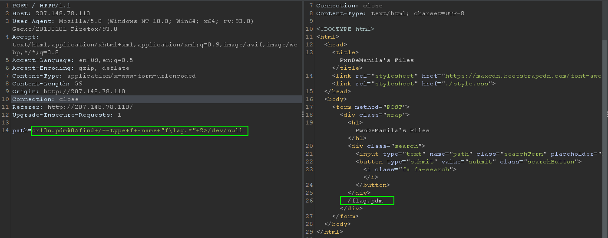

From there, it was just a matter of retrieving the flag:

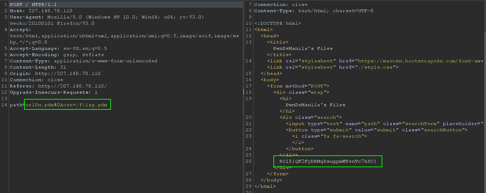

---------------------------------------------------

## Web500
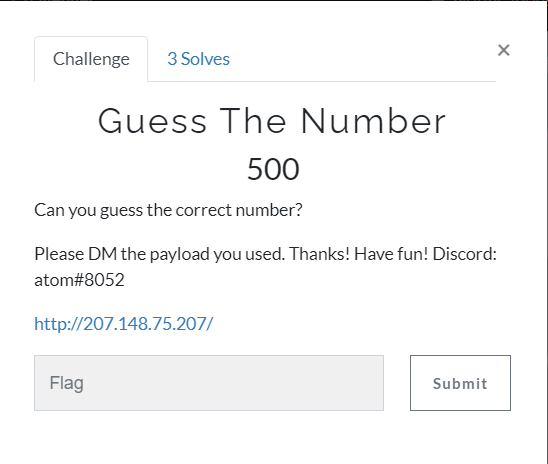

Highest point challenge in the CTF. Was pretty satisfying to draw first blood on it. We were given a website which had a guessing game theme:

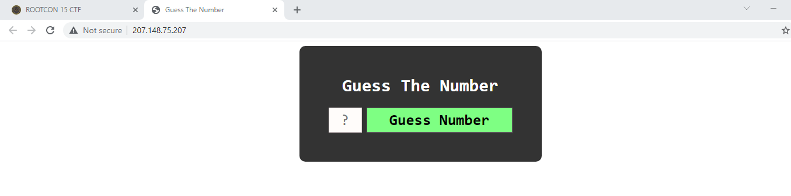

The mechanics were pretty easy. We needed to guess a number between 0-9 to win but nothing really happens when we win the game (which we can win everytime bc the correct answer is logged through the console before the game starts). We can review the script used for the game, but it is irrelevant:
```javascript
var correctAnswer = Math.ceil(Math.random() * 10)
var form = document.querySelector('#guess')
var input = document.querySelector('input')
var response = document.querySelector('.response')

console.log(correctAnswer)

form.addEventListener('submit', guess)

function guess(e) {
  e.preventDefault()
  var theirAnswer = input.value
  
  if (theirAnswer == correctAnswer) {
    response.innerHTML = 'Yay! You did it!'
    correctAnswer = Math.ceil(Math.random() * 10)
    var interval = setInterval(function(){
      var red = Math.floor(Math.random() * 255)
      var green = Math.floor(Math.random() * 255)
      var blue = Math.floor(Math.random() * 255)
      document.body.style.background = `rgb(${red}, ${green}, ${blue})`
    }, 20)
    setTimeout(function(){
      clearInterval(interval)
      document.body.style.background = '#fff'
      response.innerHTML = ''
      input.value = ''
      console.log(correctAnswer)
    }, 5000)
  } else if (theirAnswer > correctAnswer) {
    response.innerHTML = 'Too Big'
  } else if (theirAnswer < correctAnswer) {
    response.innerHTML = 'Too Small'
  } else {
    response.innerHTML = "That's not a number dummy!"
  }
}
```

Next step was to figure out how the request was sent. We inspect the source on the page and see the following:

```html
<!doctype html>
<html>
<head>
<title>Guess The Number</title>
<link rel='stylesheet' href='[https://punchcode.org/codepen.css](https://punchcode.org/codepen.css)'>
<link rel="stylesheet" href="[./static/style.css](http://207.148.75.207/static/style.css)">
</head>
<body>

<div id="container">
	<form method="GET" id="guess" action="/process">
		<h3 class="message">Guess the number</h3>
		<div class="form">
			<input type="text" name="num" placeholder="?" />
			<button type="submit" value="submit">Guess Number</button>
		</div>
	</form>
	<p class="response"></p>
</div>


<script src='[https://code.jquery.com/jquery-2.2.4.min.js](https://code.jquery.com/jquery-2.2.4.min.js)'></script>
<script src="[./static/script.js](http://207.148.75.207/static/script.js)"></script>

</body>
</html>
```

It sends a GET request to `/process?num=input` where input is a number that we have provided. We follow the request and see a different page from the guessing game:

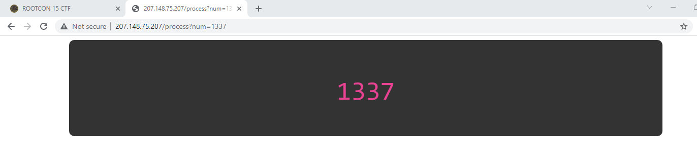

Very suspicious that our input gets reflected into the page. Examining the response headers reveal a key information

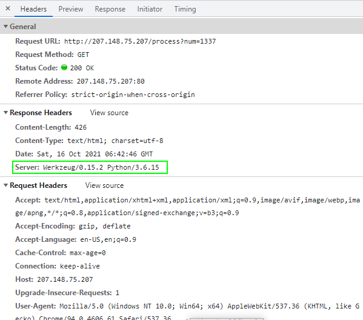

The backend uses python! Python backend + reflected value is an indicator that the web application may be vulnerable to server side template injection (SSTI). We can try to test out this hypothesis by providing `{{7*7}}`:

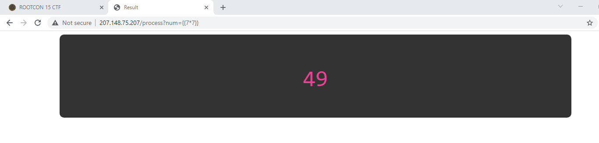

It worked! Next step I did was to try the following payload `{{'7' * 7}}` which returned `'7777777'` -> both of the positive results indicate that the Jinja2 framework is (most likely) in use. We can confirm this by triggering a known exception:

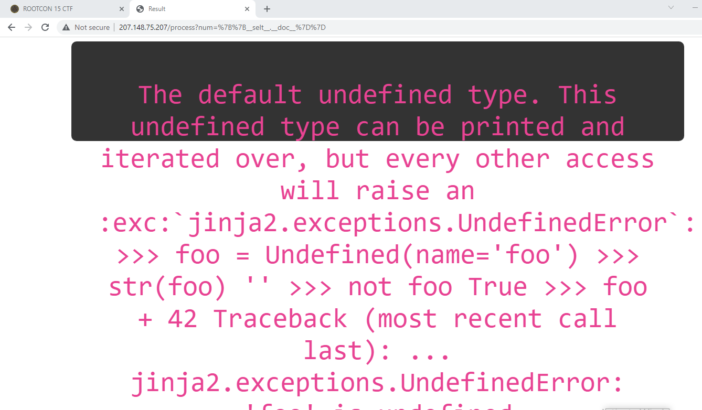

Yep, definitely Jinja2. The next step when exploiting (python) SSTI is to get a handle on the `__builtins__` module so that we can use/import other python modules. It is worth noting that there was a heavy filtering system in place, important characters such as ``'[', ']', '.'`` would throw exceptions, thus needed to be bypassed.

In order to get to `__builtins__`, I used the cycler class -> accessed the `__init__` dunder method --> accessed its `__globals__` then used `__getitem__`. 

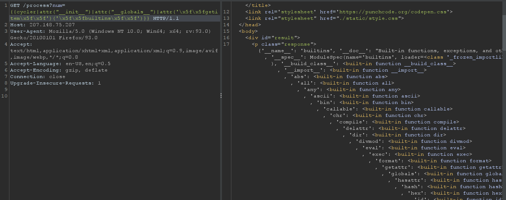

Bingo! We have access to the built-in functions/classes/objects. Next thing we have to do is to use the `__import__` method so that we can import `os`. 

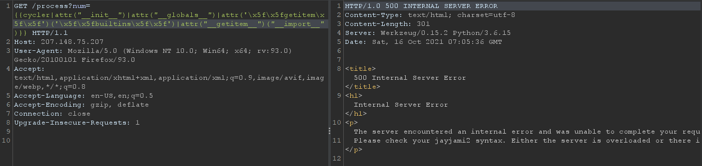

Hmm, it throws an `Internal Server Error` response which means something must be wrong with our request. How about we access another function, like `abs`?

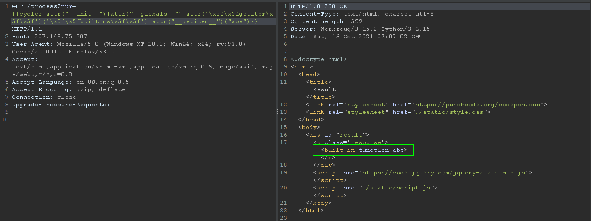

It becomes evident that certain functions are also filtered. Those that give us easy access to code execution isn't allowed, e.g import, exec, eval. But the detection system can be easily defeated by using string concatenation:

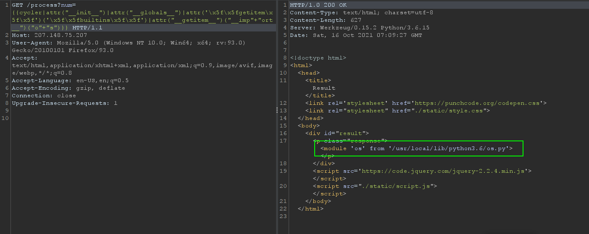

We're getting close to completing the payload now that we have access to the `os` module; we now have a way to execute commands on the server itself by using `os.popen('insert command here').read()`

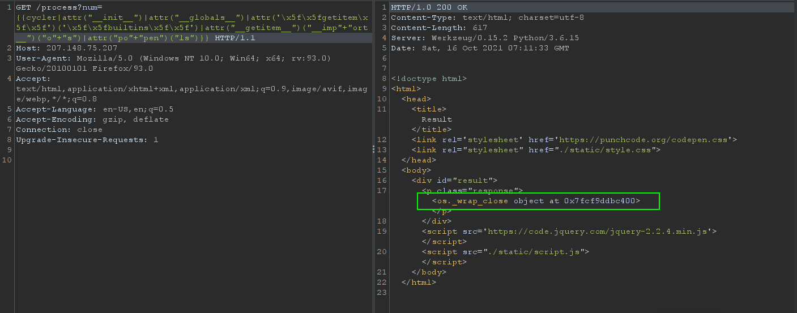

`<os._wrap_close object at 0x7fcf9ddbc400>` is a file object connected to the pipe that we opened, meaning that we successfully executed the command and we need to read the result of the command next. 

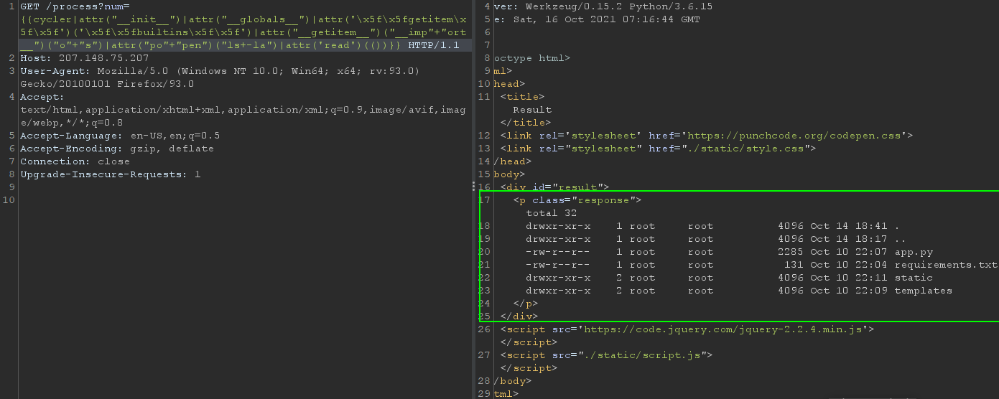

In the above payload, I used `(())` to call the read function bc `()` will be filtered and not execute the read call. From this point, we can proceed to where the flag file is, submit, record another first blood. 

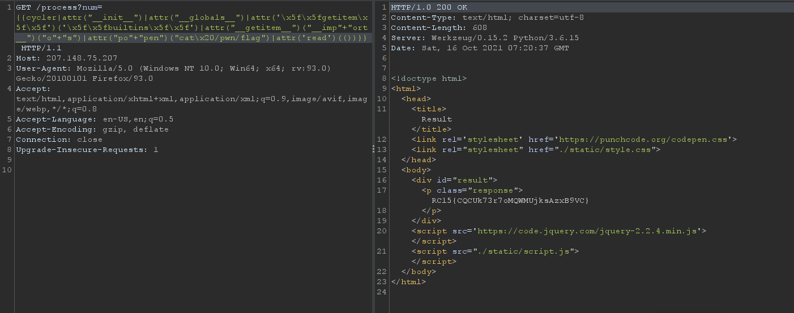

---------------------------------------------------

## OSINT100
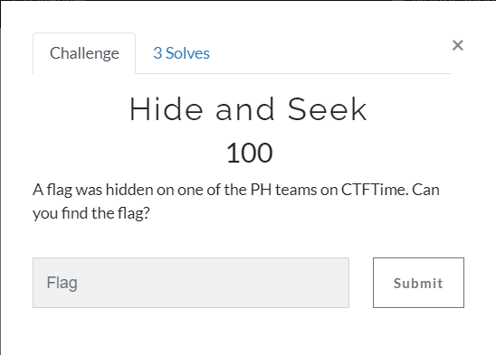

Simply browse through the CTFTime PH leaderboard. My approach was to list the teams that hackstreetboys were a part of. My initial thoughts was to visit `Antivirus`'s profile which was actually Sir Ameer. 

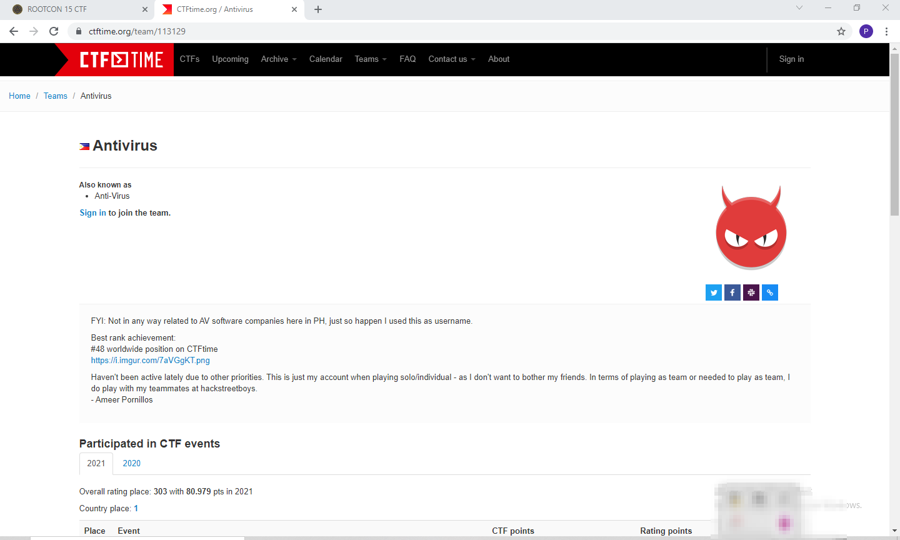

From here, the only way things could be hidden was through his profile descriptions/links and writeups. But none were found. So I decided to browse wayback machine to see if there were changes made beforehand. 

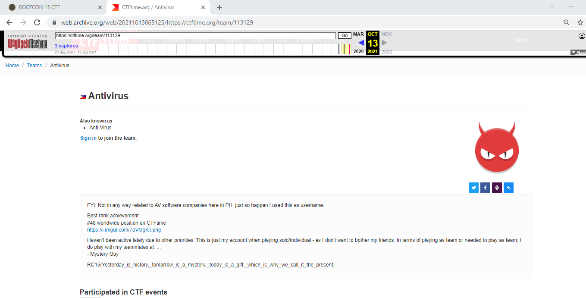