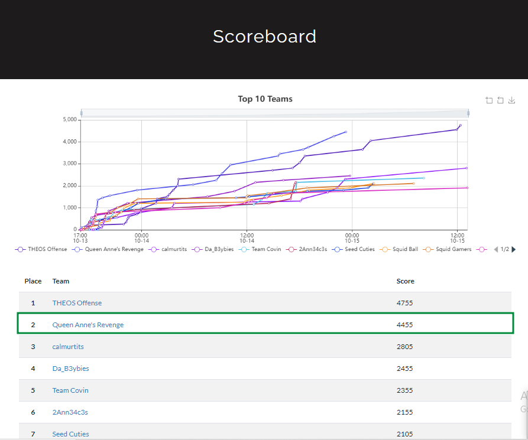
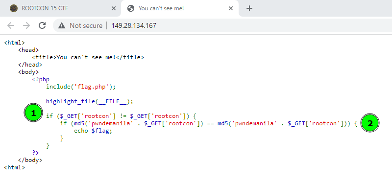

## ROOTCON 15 Capture The Flag



-------------------------------------------------------
#### Web
- [Web 200: You can't see me!](##Web200)
- [Web 300: See Secret in Rootcon File](##Web300)
- Web 400: PwnDeManila's Files
- Web 500: Guess The Number

#### Misc
- Misc 50: Boy XSS
- Misc 50: Kill Switch
- Misc 50: Black Badge Holder

#### OSINT
- OSINT 100: Hide and Seek

------------------------------------------------------

## Web200


#### Challenge Information
Pretty neat challenge with different possible ways on how it can be approached. Navigating to the URL provided provides us with the source code of the challenge: 



From the looks of it, it seems to be one of those `PHP Type Juggling` web challs which is common in ctfs given the fact that loose comparison is used when comparing md5 hashes. But before we do that, we need to analyze first what the code does:

#### Code Analysis
From highlight 1 in the above photo, we know that it gets two parameters sent in the GET request and checks to see if they contain different values before proceeding. At first, it seems confusing as it seems impossible to use different values for the same parameter, unless this means we can use `HTTP Parameter Pollution` to solve it - but when you take a closer look, the parameter names aren't quite the same:

```python
    >>> [ord(x) for x in "rootcon"]
	[114, 111, 111, 116, 99, 111, 110]
	>>> [ord(x) for x in "rootсon"]
	[114, 111, 111, 116, 1089, 111, 110]
```

This has something to do with unicode encodings/homograph techniques (commonly used by malicious actors to mimic legit websites/domains for phishing). Now that we have this info, we can proceed with the inner if statement. 

#### Too lazy for type juggling
```php
if (md5('pwndemanila' . $_GET['rootcon']) == md5('pwndemanila' . $_GET['rootсon'])) {  
	echo $flag;  
}
```

The statement checks if the md5 hashes for both of the inputs that we provide are the same, only then can we retrieve the flag. At this point, it really seems like the way to solve it is by taking advantage of the loose comparison. 

But there is an easier way which attacks a rather weird behavior on PHP string concatenation: when we concatenate an array to a string, the array gets casted to a string; `When an array is casted to a string in PHP the resulting string won't be about the content of the flattened array but the "Array" word.` 

To test, we can write some simple php code which concatenates the string `pwndemanila` to an array:


We see that they both return the same value (`pwndemanilaArray`) and will easily pass the hash check. So the final payload to retrieve the flag can be as simple as: `http://149.28.134.167/?rootcon[]=1&root%D1%81on[]=2`


Related Writeups:
https://rawsec.ml/en/angstromCTF-2018-write-ups/#140-md5-web
https://tilak.tech/4/null-ahmedabad-ctf-prove-yourself-1337
https://jaimelightfoot.com/blog/b00t2root-ctf-easyphp/
-------------------------------------------------------
## Web300


#### Challenge Information
Sometimes challenge titles serve as a hint as to the nature of the challenge. Here, the capitalized letters of the challenge title are `SSRF` which hints at server side request forgery. 

#### Website Recon


The website presents us with a pretty funny image of sir atom who `drank all the booze and hacked all the things during ROOTCON12`; it also hints at a `?source` parameter, so we try making another GET request with it included:


Now we can review the source code. What striked my interest immediately are the following functions used with the `url` parameter that we provide: `parse_url` and `curl_exec`. But first, we need to properly analyze the code:

```php
if(isset($_GET["url"])) { /* so we need to provide some url */
	$parsed = parse_url($_GET["url"]);  /* runs the url against the parse_url function then stores the result in the variable $parsed */
    if(!$parsed) {  /* error handling if we somehow f this up */
        die("Sorry but I cannot parse your url: ".$_GET["url"]);  
    }  
    if(substr($_GET["url"], strlen("http://"), strlen("rootcon.org")) === "rootcon.org") {  /* checks if the domain is rootcon.org */
        die("haxxor level 1 alert!");  
    }  
    if($parsed["port"] == 31337 && $parsed["host"] == "rootcon.org") { /* we need the parsed url to pass these checks */
		$ch = curl_init(); 
		curl_setopt ($ch, CURLOPT_URL, $_GET["url"]); 
		curl_exec($ch); /* basically, curl $url : this might be a possible vector for ssrf */
		curl_close($ch);  
    }else{  
        die("haxxor level 2 alert!");  
    }  
}
```