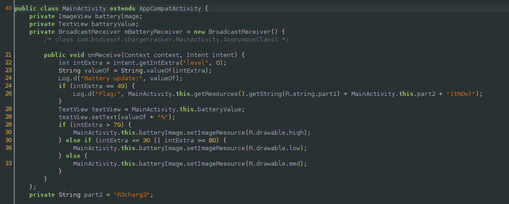
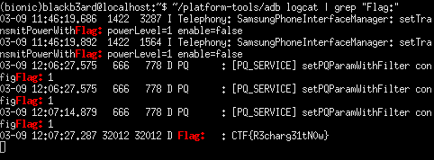

## BsidesSF CTF: chargetracker [android | rev]

#### This challenge was a simple reversing challenge where the flag is hardcoded into the app's string resources. We can simply decompile the apk to retrieve the xml files and submit the flag.


#### However, looking through the code, we see that a broadcast receiver is registered and if it receives an intent that states that the battery level is at 49%, it logs the flag. I then proceeded to find ways on how to send a broadcast intent using adb, which failed because the action `android.intent.action.BATTERY_CHANGED` is protected and can only be sent by the system.

#### An alternative is to use the dumpsys command to set the battery level on the device. I learned this after asking the challenge author, Ms. Corgi. `dumpsys` is a tool that runs on Android devices and provides information about system services.

```
(bionic) blackb3ard@localhost: ~/platform-tools/adb shell
a10s:/ $ dumpsys battery set level 49
```

#### Running the above command changes the battery level on the device and activates the onreceive method of the receiver. 


