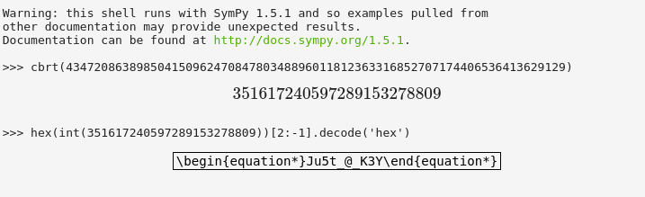

## DarkCON CTF: Take it Easy [crypto]
#### I was a bit stumped on this during the ctf. It turns out, I completely misunderstood the encryption algorithm for the second part when it was, in fact, much more simpler than I thought it was. Lesson learned is to fully understand source code and not be a dumdum. 

## Low Exponent Attack
#### First off, we were given a zip file, which upon unzipping provides us with a getkey.txt file and a protected TRYME.zip file. THe getkey.txt file contains RSA prime, ciphertext, and the public key:

```python
p = 147310848610710067833452759772211595299756697892124273309283511558003008852730467644332450478086759935097628336530735607168904129699752266056721879451840506481443745340509935333411835837548485362030793140972434873394072578851922470507387225635362369992377666988296887264210876834248525673247346510754984183551
ct = 43472086389850415096247084780348896011812363316852707174406536413629129
e = 3
```

#### The vulnerability here is pretty simple. With a small public exponent value, the modulus doesn't come into play no matter how large the primes are. I don't know how to add math symbols here so I'll just be using python

```python
#: normally, the RSA cryptosystem works such that
ciphertext = plaintext ** public_exponent % modulus
#: but with the given problem that the public exponent is small, the modulus can just be ignored
#: the reason for this is that plaintext ** public_exponent < modulus
#: therefore, the ciphertext is just:
ciphertext = plaintext ** public_exponent
#: or in the getkey.txt file
ciphertext = plaintext ** 3
```

#### From this, we can simply just get the cuberoot of the given ciphertext to retrieve the encrypted plaintext. Since I didn't have any library installed that can handle precision very well, I used the online version of sympy.



## Second Phase
#### We use the result to unlock the protected zip file, which gives us a list of ciphers and the python source code.

##### cipher.txt
```
B0 : b'\nQ&4'
B1 : b"\x17'\x0e\x0f"
B2 : b'1X5\r'
B3 : b'072E'
B4 : b'\x18\x00\x15/'
```
##### chall.py
```python
#!/usr/bin/env python3

from struct import pack, unpack
flag = b'darkCON{XXXXXXXXXXXXXXXXXXX}'

def Tup_Int(chunk):
	return unpack("I",chunk)[0]

chunks = [flag[i*4:(i+1)*4] for i in range(len(flag)//4)]
ciphertext = ""

f = open('cipher.txt','w')
for i in range(len(chunks) - 2):
	block = pack("I", Tup_Int(chunks[i]) ^ Tup_Int(chunks[i+2]))
	ciphertext = 'B' + str(i) + ' : ' + str(block) + '\n'
	f.write(ciphertext)
```

#### Upon inspection, we see that the flag is split into chunks of 4 and encrypted with the next (+2) chunk. This part is where I got stumped, because for some reason I was thinking that the only ones being encrypted are the +2 chunks, when in fact it was all first five chunks. Since the chunks were just xored, we can simply reverse the operations. But what chunk should we xor with what chunk? The mapping below illustrates the process easier

```python
#: we know that the first two flag chunks would be the flag format
cipher = [
		b'\nQ&4',
		b"\x17'\x0e\x0f",
		b'1X5\r', 
		b'072E',
		b'\x18\x00\x15/'
		]

chunks = [
		b'dark',
		b'CON{'
		] 
#: when we use the encryption algorithm:
cipher[0] = chunks[0] ^ chunks[2]
#: chunks[2] is not in the list, but with the reverseability of the xor operation, we can easily retrieve it.
chunks[2] = chunks[0] ^ cipher[0]
#: we do this for the next chunk
chunks[3] = chunks[1] ^ cipher[1]
#: the chunks array will now have the following contents
chunks = [u'dark', u'CON{', u'n0T_', u'Th@t']
#: now since cipher[2] = chunks[2] ^ chunks[4], we can reverse the operation again to get the fourth flag chunk
chunks[4] = cipher[2] ^ chunks[2]
```

#### We then repeat the process, adding the resulting decrypted blocks to the chunks array and using them to decrypt the remaining chunks of the cipher.

```python
from struct import pack, unpack

def Tup_Int(chunk):
	return unpack("I",chunk)[0]

cipher = [
		b'\nQ&4',
		b"\x17'\x0e\x0f",
		b'1X5\r', 
		b'072E',
		b'\x18\x00\x15/'
		]

chunks = [
		b'dark',
		b'CON{'
		] 

flag = ''

for i in range(len(cipher)):
	block = pack("I", Tup_Int(chunks[i]) ^ Tup_Int(cipher[i]))
	chunks.append(block)

for x in chunks:
	flag += x.decode()

print(flag)
#: prints darkCON{n0T_Th@t_haRd_r1Ght}
```