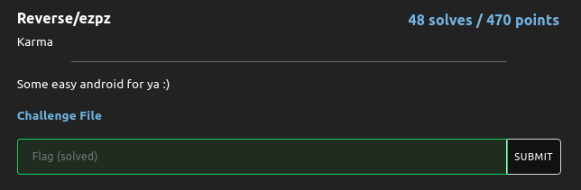
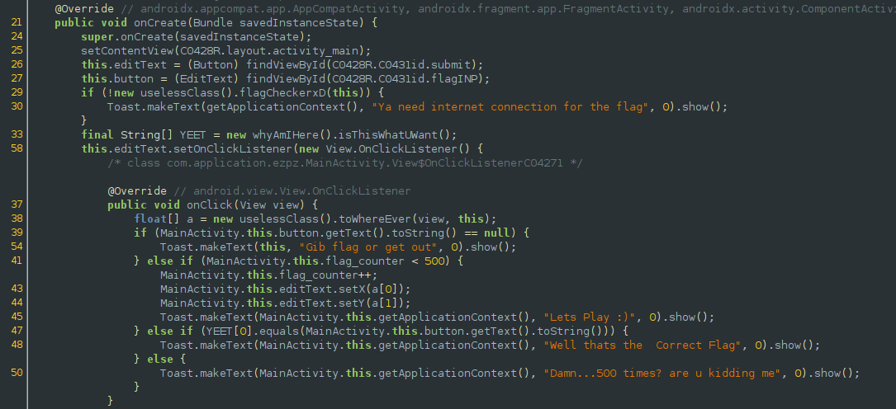
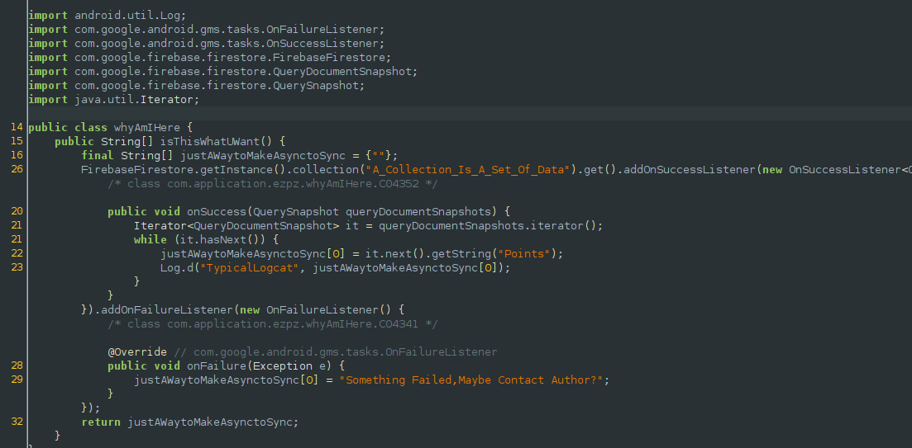
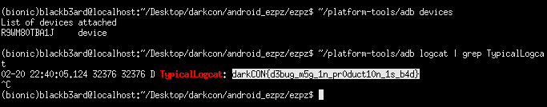

## DarkCON CTF: ezpz [android | rev]
##### *tl;dr: secret leak through unsecured logs*

#### Looking at the main activity file, the program 'plays' with us by moving the submit button all around the screen if our input does not match the string at index 0 of YEET.

#### Upon further skimming of the function that YEET gets its data from, we see that the application connects to a remote firebase instance and retrieves something from it. The data retrieved then gets passed to a log function, and when we check the logcat output we see that the flag actually gets leaked.

